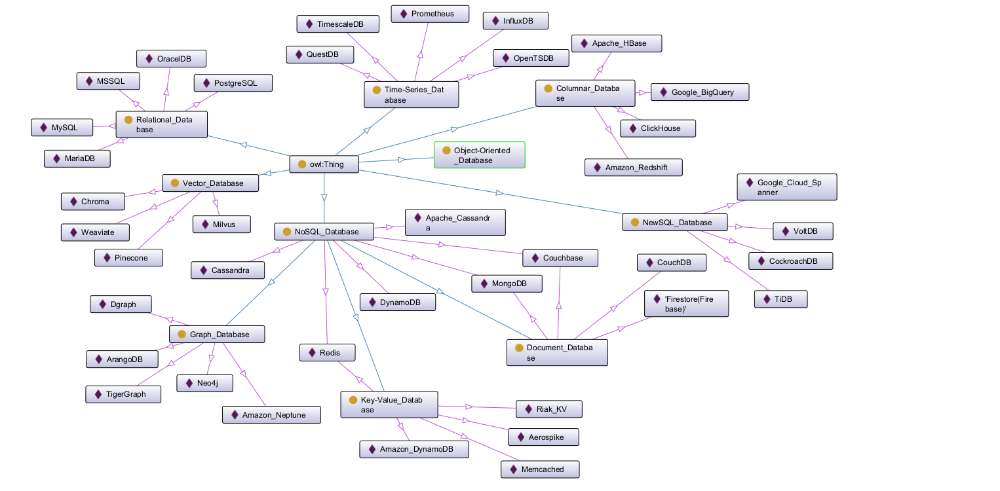

# Learn Graph and Graph Database

- [Learn Graph and Graph Database](#learn-graph-and-graph-database)
  - [Classification of Databases](#classification-of-databases)
  - [Graph Technology Landscape 2024](#graph-technology-landscape-2024)
  - [Information on Graph](#information-on-graph)
  - [My Learnings on Graph](#my-learnings-on-graph)

## Classification of Databases

Check the source [RDF ontology here](./database.rdf).

## Graph Technology Landscape 2024

Thanks for posting by [Linkurious](https://www.linkedin.com/company/linkurious/), below is a nice landscape for a whole picture on the players in this graph area:

## Information on Graph

- [Everything is Connected: Graph Neural Networks](https://arxiv.org/abs/2301.08210), see [localfile](./graph_kb/2301.08210.pdf)
- arrow.app: https://arrows.app/ is the tool that you can design the data model.

## My Learnings on Graph

- Neo4j Graph Database
  - [Neo4j Fundamentals (English)](neo4j/neo4j_fundamentals/)
  - [Neo4j Fundamentals (Chinese)](neo4j/neo4j_fundamentals_c/)
  - [Cypher Fundamentals (English)](neo4j/cypher/cypher_fundamentals/)
  - [Graph Data Modeling Fundamentals (English)](neo4j/graph_data_modeling/) - learning

---

Updated at: 2025-11-07