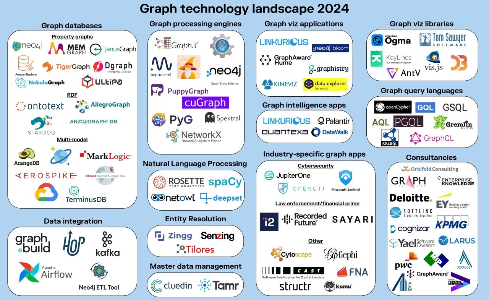

# Learn Graph and Graph Database

## Graph Technology Landscape 2024

Thanks for posting by [Linkurious](https://www.linkedin.com/company/linkurious/), below is a nice landscape for a whole picture on the players in this graph area:

## Information on Graph

- [Everything is Connected: Graph Neural Networks](https://arxiv.org/abs/2301.08210), see [localfile](./graph_kb/2301.08210.pdf)

## My Learnings on Graph

- Neo4j Graph Database
  - [Neo4j Fundamentals (English)](neo4j/neo4j_fundamentals/)
  - [Neo4j Fundamentals (Chinese)](neo4j/neo4j_fundamentals_c/)
  - [Cypher Fundamentals (English)](neo4j/cypher/cypher_fundamentals/)

---

Updated at: 2025-10-31