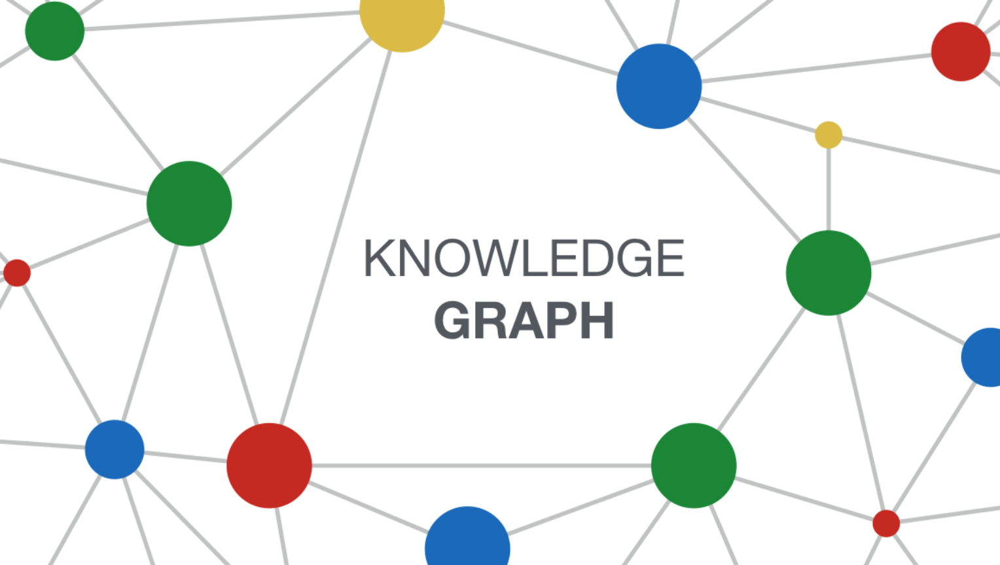

# KG = Knowledge Graph

## Useful resources

- TBox CBox ABox, by Dave McCome (Semantics Arts), [Video Link](https://youtu.be/0-j9nWFVoYc)

## Hands-on KG tools

- Draw mermaid graph in Markdown, [syntax page](https://mermaid-js.github.io/mermaid/#/)