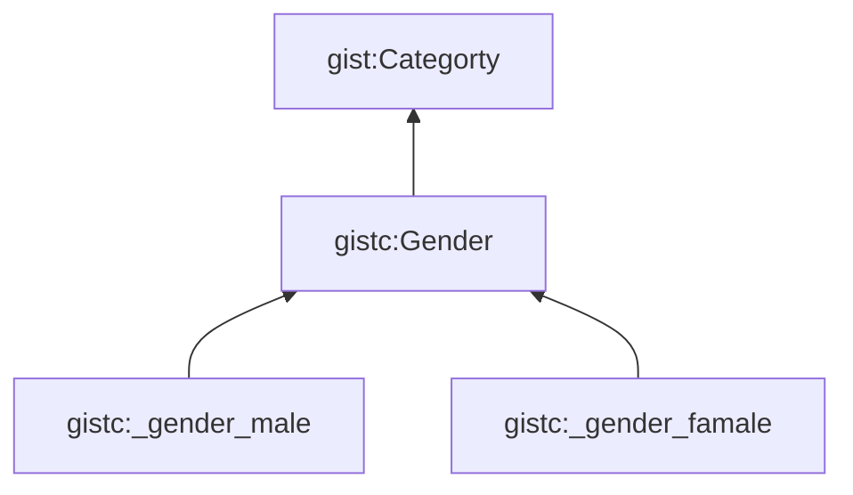
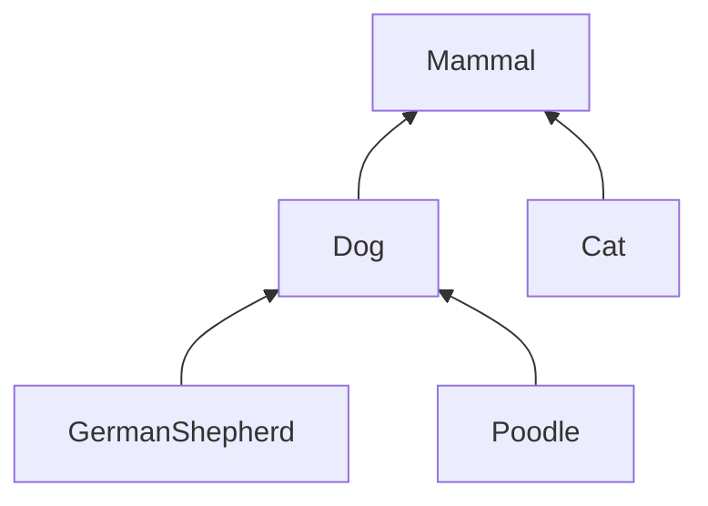
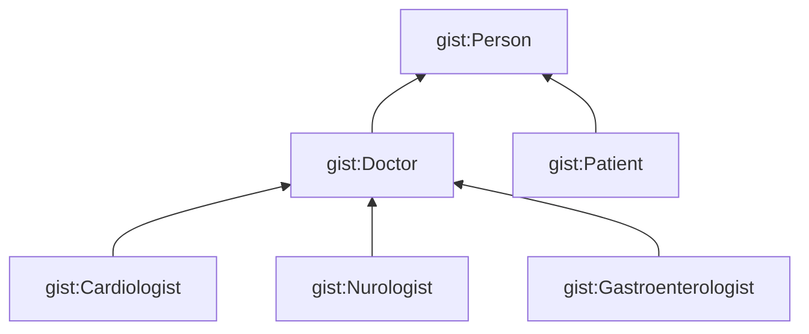
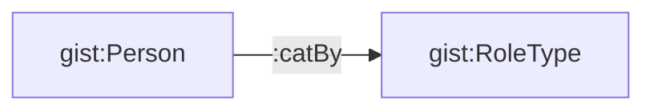

# TBox CBox ABox

_by Dave McCome, President of Semantic Arts, 2016_

## TBox and ABox

Original: "A Translation Approach to Portable Ontology Specification", by Thomas R. Gruber, 1993, Appeared in Knowledge Acquisition

- A __TBox__ is a set of "schema" axioms (sentences)
- A __ABox__ is a set of "data" axioms (ground facts)
- A Knowledge Base (KB) is just a TBox plus a ABox

Why discuss their separateness?

- In a traditional system, they are separate (DDL v. DML)
- But inseparable
- In semantics (语义) they are more similar than different (it's all triples)
- And they are separable
- You can apply a different world view (TBox) on the same ground facts (ABox), e.g. multiple TBoxes for one ABox

Gist: Mostly a TBox

## Start to have CBox

Categories

- We've been using gist:Category for over a decade
- Only recently started moving this into its own name space
- And taking about it differently
- Its mostly taxonomies (分类)
- We wanted to call it the TBox, but that was taken
- We now call it the "CBox" (for category)

Technically, the CBox is a TBox and an ABox

To scale:

- Top - TBox: Key Concepts (Hundreds)
- Middle - CBox: Categories / Taxonomies (Thousands ++)
- Bottome - ABox: Data (Millions ++)

Value in splitting in out --> Governance

Tools suited for managing vocabulary / taxonomy / governance:

- Smartlogic
- collibra
- TopBraid Enterprise Vocabulary Net

W3C SKOS:

- SEO
- Enterprise Search

If interested in adopting this design approach:

- Two traditional things should be avoid
  - Avoid: Taxo first design
  - Avoid: OO Design (create a subclass as you learn distinctions), like below diagram

- Instead
  - Start with simple model
  - As you find new distinctions, ask:
    - Will I be ab le to infer membership in this class based on information I'm likely to have in this domain, or
    - Am I highly likely to be enforcing different properties ont his specialization
  - Ask:
    - Would it be sufficient to make this distinction essentially as a tag, as below sample

The meta-model can be like below:

What if you get it wrong?

- Two ways to get it wrong
  - Make it a class when it should have been a category
  - Make it category when it should have been a class

Makt it a class when it should have been a category:

- You end up with an unnecessarily complex ontology
- And all the maintenance and governance needs to be done by ontologists, when 90% of it could have been done by taxonomists and subject matter experts

Make it category when it should have been a class:

- Don't even need to refactor

## Summary

- Ontologists have been distinguishing the Terminological Box (TBox) from the Assertional Box (ABox) for decades
- We have introduced the Categoray Box (CBox)
- By shifting taxonomic and some reference data to this middle level, we:
  - Greatly simplify our ontologies
  - Make governance manageable
  - Future proof our designs