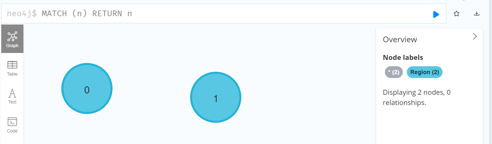

# Using CSV Files Importing to Build Graph DB in Neo4j

- [Using CSV Files Importing to Build Graph DB in Neo4j](#using-csv-files-importing-to-build-graph-db-in-neo4j)
  - [Introduction on the Approach](#introduction-on-the-approach)
  - [Testing Scenarios](#testing-scenarios)
  - [Initialize Project and Database in Neo4j](#initialize-project-and-database-in-neo4j)
  - [Load CSV to create new Node with some instances](#load-csv-to-create-new-node-with-some-instances)
  - [Load CSV to create both two Nodes and mapping relationships together](#load-csv-to-create-both-two-nodes-and-mapping-relationships-together)
  - [Load Larger CSV with Multiple Columns (Sample: Climate\_Group)](#load-larger-csv-with-multiple-columns-sample-climate_group)
  - [Load Multi-Columns CSV with "Foreign Key" to Other Node](#load-multi-columns-csv-with-foreign-key-to-other-node)
  - [Create Relationship via `MATCH`](#create-relationship-via-match)
  - [Change Property Key in an Object](#change-property-key-in-an-object)
  - [Load Country x Climate\_Zone Relationship into Group](#load-country-x-climate_zone-relationship-into-group)
  - [Add Country to Climate\_Zone Relationship](#add-country-to-climate_zone-relationship)
  - [Completion of Country x Climate Mapping Graph](#completion-of-country-x-climate-mapping-graph)

## Introduction on the Approach

Database is in Neo4j 1.6.3, target to create graph database from scratch, with following content and data model:

Database purpose: Geographical Region / Country and their Climate Zone Mapping

Node:
- Region: e.g. North America, Africa, Asia etc.
- Country: e.g. Italy, China, Canada etc.
- Climate Zone: 3-char code base on [Koppen Climate Classification](https://en.wikipedia.org/wiki/K%C3%B6ppen_climate_classification)

## Testing Scenarios

1. Load CSV to create new Node with some instances
2. Load CSV to create both two Nodes and mapping relationships together
3. Load CSV to merge more instances to existing Node
4. Load CSV to merge more instances and more relationships to existing Node

Primarily comparing the effect of `CREATE` and `MERGE` in Neo4j Cypher syntax.

## Initialize Project and Database in Neo4j

Create a project in Neo4j 1.6.3 called `Test`, then create one new local_dbms called `import_test`, leave version as 4.24.0, as below:


After database is created, click the three dots and choose Settings..., as below:


In order to be able to load CSV from local directory, you need to find this setting line and comment it:


Then `Apply` and `Close`.

## Load CSV to create new Node with some instances

Prepare initial [Region1.csv](csv/region1.csv), with 2 regions under Region header:

```csv
Region
Europe
Asia
```

Start the local dbsm `import_test`, once it's loaded, click `Open` with Neo4j Browser, you should see below home screen:


Use below `CREATE` query:

```SQL
LOAD CSV WITH HEADERS FROM 'file:///D:/GitHub/LEARN_GRAPHDB/neo4j/csv/region1.csv' AS row
CREATE (node:Region)
```


Result is `Added 2 labels, created 2 nodes`

Using `MATCH (n) RETURN n`, can see there're automatic `0` adn `1` as the label of the node `Region`:



This is not shown the value of regions, so we need to add property during CSV load, let's try to use `MERGE` first:

```SQL
LOAD CSV WITH HEADERS FROM 'file:///D:/GitHub/LEARN_GRAPHDB/neo4j/csv/region1.csv' AS row
MERGE (node:Region {Region: row.Region})
```


However, the two additional instances have been created so now you've 4 instance of `Region`:


From this comparison, we know that we should add every column as row property while first load, and the `merge` will create additional instances if not using certain match mechanism.

Using below query to clear database:

```SQL
MATCH (n) DETACH DELETE n
```


So, now the database is cleaned:


We can run the `CREATE` query with Property now, as below:

```SQL
LOAD CSV WITH HEADERS FROM 'file:///D:/GitHub/LEARN_GRAPHDB/neo4j/csv/region1.csv' AS row
CREATE (node:Region {Region: row.Region})
```


Result is now just 2 instances:


## Load CSV to create both two Nodes and mapping relationships together

Create two column CSV [region-country1.csv](csv/region-country1.csv) which include all new regions (and countries) that not in [region1.csv](csv/region1.csv), as below:

```CSV
Region,Country
North_America,USA
South_America,Brazil
South_America,Peru
```

The relation is `(Region)-[:INCLUDES]->(Country)`

Execute below `CREATE` query:

```SQL
LOAD CSV WITH HEADERS FROM 'file:///D:/GitHub/LEARN_GRAPHDB/neo4j/csv/region-country1.csv' AS row
MERGE (source:Region {Region: row.Region})
CREATE (target:Country {Country: row.Country})
CREATE (source)-[:INCLUDES]->(target)
```

Note: since we already have `Region` as Node which had been created in previous step's query, here we use `MERGE` on that node instead of `CREATE`.


Result is as below:


This step shows that you can use `MERGE` to add new instances to existing Node, and with combining using `CREATE` and `MERGE`, we can load the larger CSV dataset now, first, let's make one Climate Zone dictionary node

## Load Larger CSV with Multiple Columns (Sample: Climate_Group)

In above steps, our Node csv files only have one single column, the real dataset may have more columns, let below:

```CSV
Group_Code,Group_Name,Group_Description
A,Tropical climates,Tropical climates have an average temperature of 18 °C (64.4 °F) or higher every month of the year, with significant precipitation.
B,Desert and semi-arid climates,Desert and semi-arid climates are defined by low precipitation in a region that does not fit the polar (EF or ET) criteria of no month with an average temperature greater than 10 °C (50 °F).
C,Temperate climates,Temperate climates have the coldest month averaging between 0 °C (32 °F) (or −3 °C (26.6 °F)) and 18 °C (64.4 °F) and at least one month averaging above 10 °C (50 °F).
D,Continental climates,Continental climates have at least one month averaging below 0 °C (32 °F) (or −3 °C (26.6 °F)) and at least one month averaging above 10 °C (50 °F).
E,Polar and alpine climates,Polar and alpine climates has every month of the year with an average temperature below 10 °C (50 °F).
```

Shown as below:


Use below Cypher to load CSV:

```SQL
LOAD CSV WITH HEADERS FROM 'file:///D:/GitHub/LEARN_GRAPHDB/neo4j/csv/climategroup.csv' AS row
CREATE (node:Climate_Group {
    Climate_Group_Code: row.Group_Code,
    Climate_Group_Name: row.Group_Name,
    Climate_Group_Description: row.Group_Description
})
```


Using `MATCH (n:Climate_Group) RETURN n` to return first 10 instances of `Climate_Group`, as below and you may see properties in the right part when clicking one instance:


## Load Multi-Columns CSV with "Foreign Key" to Other Node

Refer to [ClimateZone.csv](csv/climatezone.csv), which have below structure:


First 2 columns create dictionary for Climate_Zone, the 3rd column refers to Climate_Group, we need to add one new relation:

`(Climate_Zone)-[:INGROUP]->(Climate_Group)`

Using below query to create Node `Climate_Zone`:

```SQL
LOAD CSV WITH HEADERS FROM 'file:///D:/GitHub/LEARN_GRAPHDB/neo4j/csv/climategzone.csv' AS row
CREATE (node: Climate_Zone {
    Climate_Zone_Code: row.Zone_Code,
    Climate_Zone_Name: row.Zone_Name,
    Climate_Group_code: row.Group
})
```


Result as below:


## Create Relationship via `MATCH`

Using below query to create the `:INGROUP` relation:

```SQL
MATCH (g:Climate_Group)
MATCH (z:Climate_Zone {Climate_Group_code: g.Climate_Group_Code})
CREATE (z)-[:INGROUP]->(g)
```


Note: in early step when creating `Climate_Zone` node, I've typo mistake to have `Climate_Group_code` with lower case `c` in `code`, have to align that since Cypher query is case sensitive.

Change `CREATE` line to `RETURN`, you can view the relationship creation result:


## Change Property Key in an Object

For node `Climate_Zone`, let's practice `SET` to rename the property key `Climate_Group_code`, using below query:

```SQL
MATCH (z:Climate_Zone)
WHERE z.Climate_Group_Code IS NULL
SET z.Climate_Group_Code = z.Climate_Group_code
REMOVE z.Climate_Group_code
```

Execute nad set 64 properties:


Result `MATCH (z:Climate_Zone) RETURN z` is now with corrected Property Key:


## Load Country x Climate_Zone Relationship into Group

Get Weather and Climate information from https://weatherandclimate.com/countries, save as CSV file - [country-climatezone.csv](csv/country-climatezone.csv), with following 4 columns:


Use below query to load this CSV file, merging to `Country` node:

```SQL
LOAD CSV WITH HEADERS FROM 'file:///D:/GitHub/LEARN_GRAPHDB/neo4j/csv/country-climatezone.csv' AS row
MERGE (c:Country {
    Country: row.Country
})
```


Result as below for `Country` node now:


Load `Climate_Zone` columns in `Country` node:

```SQL
LOAD CSV WITH HEADERS FROM 'file:///D:/GitHub/LEARN_GRAPHDB/neo4j/csv/country-climatezone.csv' AS row
MATCH (c:Country {Country: row.Country})
SET c.Climate_Zone = row.Climate_Zone
RETURN c
```

After executing, new column added as one property:


Now, add two new columns together (separated by `,` in `SET` clause):

```SQL
LOAD CSV WITH HEADERS FROM 'file:///D:/GitHub/LEARN_GRAPHDB/neo4j/csv/country-climatezone.csv' AS row
MATCH (c:Country {Country: row.Country})
SET c.Avg_F = row.Avg_F, c.Avg_C = row.Avg_C
RETURN c
```


## Add Country to Climate_Zone Relationship

Now we have complete `Country` node, the `Climate_Zone` column in this node plays the foreign-key role to link to the `Climate_Zone_Code` in `Climate_Zone` node.

Full graph is now looks like:


To create relationship `(Country)-[:CLIMATES]->(Climante_Zone)`, using below query:

```SQL
MATCH (z:Climate_Zone), (c:Country)
    WHERE c.Climate_Zone = z.Climate_Zone_Code
    MERGE (c)-[:CLIMATES]->(z)
RETURN c, z
```

Result is like below:


## Completion of Country x Climate Mapping Graph

Execute `MATCH (n) RETURN n`, get below full graph now:


We can see some countries with Region relation are not linked to the bigger group, those may due to the node `Region`, and will have further investigation.

After all, through above steps, we can build graph from numbers of CSV files, you can use this dumped database ([neo4j_import-test_20250925.dump](db_dump/neo4j_import-test_20250925.dump)) for exploring the result.

---

Date: 2025/09/25