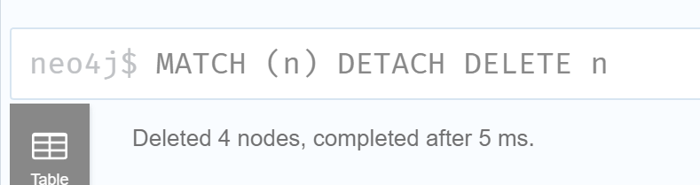
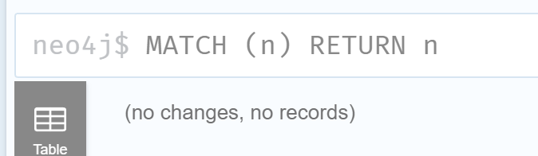

# Using CSV Files Importing to Build Graph DB in Neo4j

- [Using CSV Files Importing to Build Graph DB in Neo4j](#using-csv-files-importing-to-build-graph-db-in-neo4j)
  - [Introduction on the Approach](#introduction-on-the-approach)
  - [Testing Scenarios](#testing-scenarios)
  - [Initialize Project and Database in Neo4j](#initialize-project-and-database-in-neo4j)
  - [1. Load CSV to create new Node with some instances](#1-load-csv-to-create-new-node-with-some-instances)
  - [2. Load CSV to create both two Nodes and mapping relationships together](#2-load-csv-to-create-both-two-nodes-and-mapping-relationships-together)
  - [3. Load CSV to merge more instances to existing Node](#3-load-csv-to-merge-more-instances-to-existing-node)
  - [4. Load CSV to merge more instances and more relationships to existing Node](#4-load-csv-to-merge-more-instances-and-more-relationships-to-existing-node)

## Introduction on the Approach

Database is in Neo4j 1.6.3, target to create graph database from scratch, with following content and data model:

Database purpose: Geographical Region / Country and their Climate Zone Mapping

Node:
- Region: e.g. North America, Africa, Asia etc.
- Country: e.g. Italy, China, Canada etc.
- Climate Zone: 3-char code base on [Koppen Climate Classification](https://en.wikipedia.org/wiki/K%C3%B6ppen_climate_classification)

## Testing Scenarios

1. Load CSV to create new Node with some instances
2. Load CSV to create both two Nodes and mapping relationships together
3. Load CSV to merge more instances to existing Node
4. Load CSV to merge more instances and more relationships to existing Node

Primarily comparing the effect of `CREATE` and `MERGE` in Neo4j Cypher syntax.

## Initialize Project and Database in Neo4j

Create a project in Neo4j 1.6.3 called `Test`, then create one new local_dbms called `import_test`, leave version as 4.24.0, as below:


After database is created, click the three dots and choose Settings..., as below:


In order to be able to load CSV from local directory, you need to find this setting line and comment it:


Then `Apply` and `Close`.

## 1. Load CSV to create new Node with some instances

Prepare initial [Region1.csv](csv/region1.csv), with 2 regions under Region header:

```csv
Region
Europe
Asia
```

Start the local dbsm `import_test`, once it's loaded, click `Open` with Neo4j Browser, you should see below home screen:


Use below `CREATE` query:

```SQL
LOAD CSV WITH HEADERS FROM 'file:///D:/GitHub/LEARN_GRAPHDB/neo4j/csv/region1.csv' AS row
CREATE (node:Region)
```


Result is `Added 2 labels, created 2 nodes`

Using `MATCH (n) RETURN n`, can see there're automatic `0` adn `1` as the label of the node `Region`:


This is not shown the value of regions, so we need to add property during CSV load, let's try to use `MERGE` first:

```SQL
LOAD CSV WITH HEADERS FROM 'file:///D:/GitHub/LEARN_GRAPHDB/neo4j/csv/region1.csv' AS row
MERGE (node:Region {Region: row.Region})
```


However, the two additional instances have been created so now you've 4 instance of `Region`:


From this comparison, we know that we should add every column as row property while first load, and the `merge` will create additional instances if not using certain match mechanism.

Using below query to clear database:

```SQL
MATCH (n) DETACH DELETE n
```



So, now the database is cleaned:



We can run the `CREATE` query with Property now, as below:

```SQL
LOAD CSV WITH HEADERS FROM 'file:///D:/GitHub/LEARN_GRAPHDB/neo4j/csv/region1.csv' AS row
CREATE (node:Region {Region: row.Region})
```


Result is now just 2 instances:


## 2. Load CSV to create both two Nodes and mapping relationships together

Create two column CSV [region-country1.csv](csv/region-country1.csv) which include all new regions (and countries) that not in [region1.csv](csv/region1.csv), as below:

```CSV
Region,Country
North_America,USA
South_America,Brazil
South_America,Peru
```

The relation is `(Region)-[:INCLUDES]->(Country)`

Execute below `CREATE` query:

```SQL
LOAD CSV WITH HEADERS FROM 'file:///D:/GitHub/LEARN_GRAPHDB/neo4j/csv/region-country1.csv' AS row
MERGE (source:Region {Region: row.Region})
CREATE (target:Country {Country: row.Country})
CREATE (source)-[:INCLUDES]->(target)
```

Note: since we already have `Region` as Node which had been created in previous step's query, here we use `MERGE` on that node instead of `CREATE`.


Result is as below:


This step shows that you can use `MERGE` to add new instances to existing Node.

## 3. Load CSV to merge more instances to existing Node

## 4. Load CSV to merge more instances and more relationships to existing Node