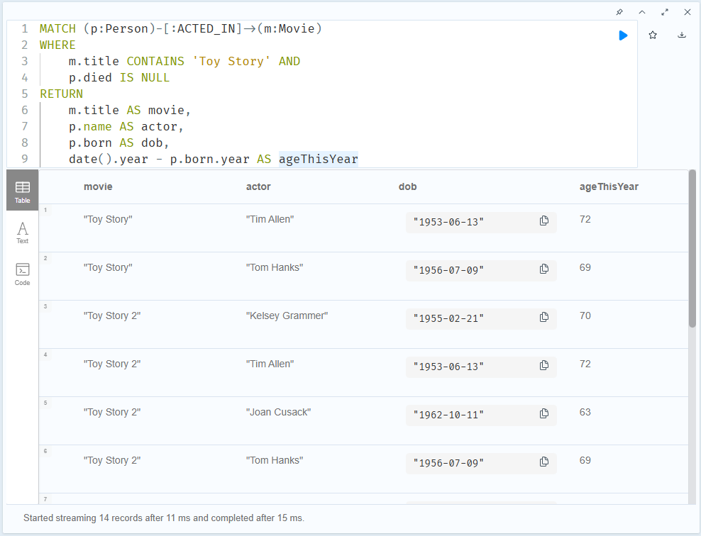
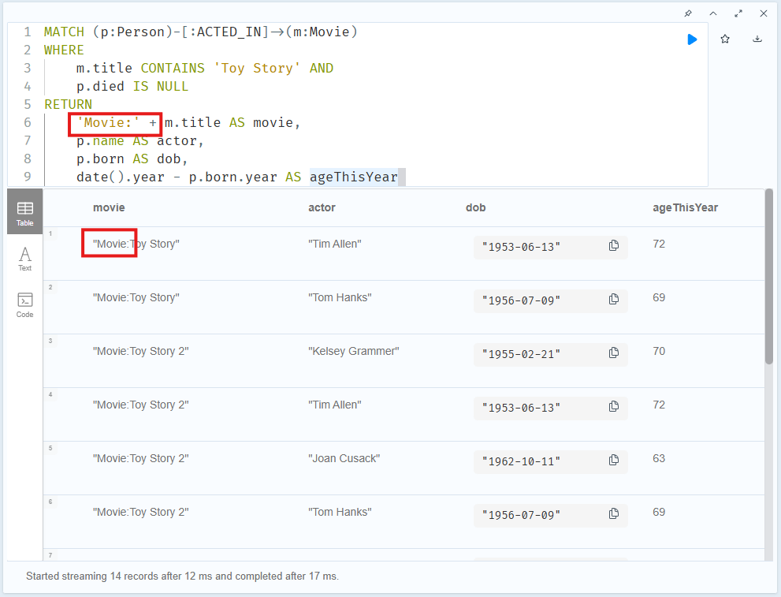
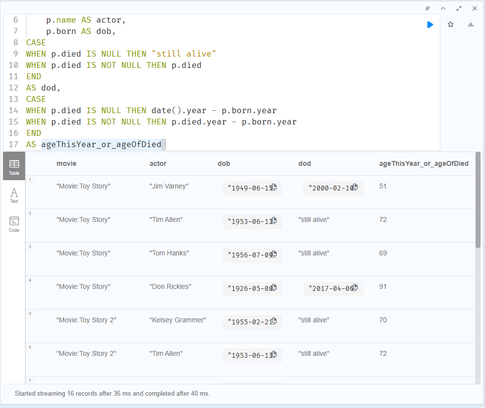
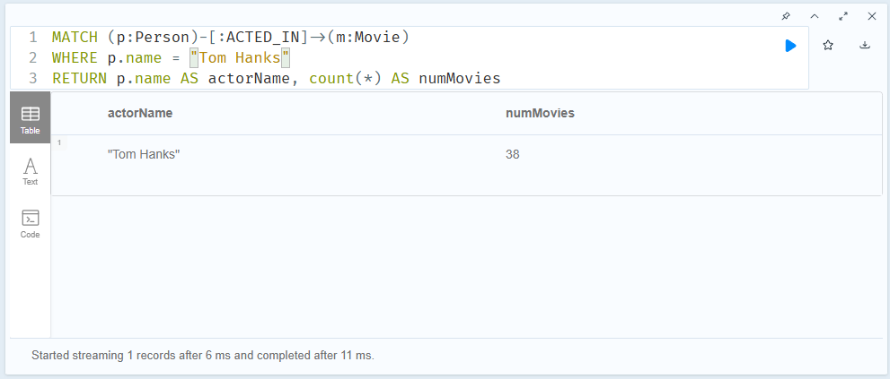
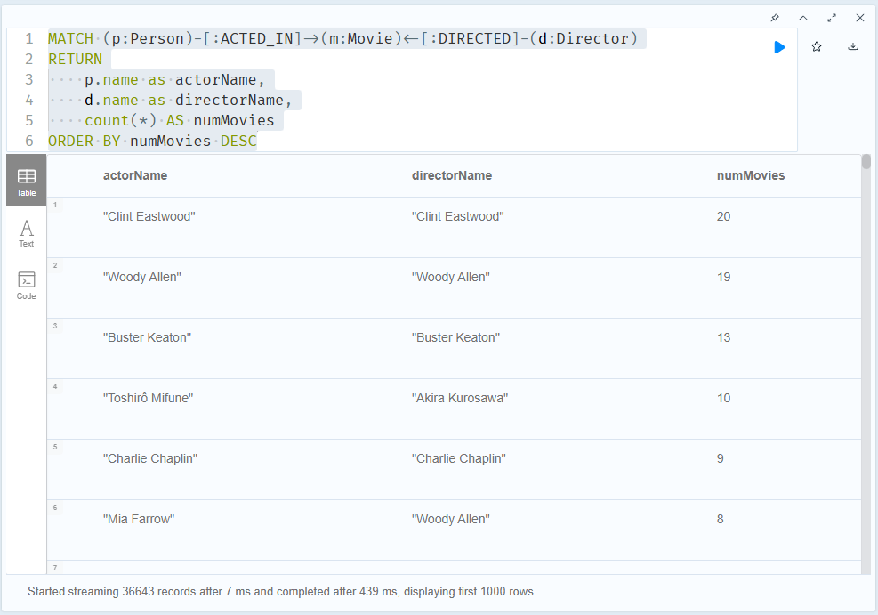

# Neo4j - Intermediate Cypher Queries

Updated at: 2025-11-22

- [Neo4j - Intermediate Cypher Queries](#neo4j---intermediate-cypher-queries)
  - [1. Filtering Queries](#1-filtering-queries)
  - [2. Controlling Results Returned](#2-controlling-results-returned)
    - [2.1 Ordering Returned Results](#21-ordering-returned-results)
    - [2.2 Ordering Results](#22-ordering-results)
    - [2.3 Viewing the Ordered Results](#23-viewing-the-ordered-results)
    - [2.4 Ordering Multiple Values](#24-ordering-multiple-values)
    - [2.5 Limiting or Counting Results Returned](#25-limiting-or-counting-results-returned)
    - [2.6 Limiting Results](#26-limiting-results)
    - [2.7 Eliminating Duplicates](#27-eliminating-duplicates)
    - [2.8 Map Projections to Return Data](#28-map-projections-to-return-data)
    - [2.9 Change Resutls Returned](#29-change-resutls-returned)
    - [2.10 Conditionally Returning Data](#210-conditionally-returning-data)
  - [3. Workign with Cypher](#3-workign-with-cypher)
    - [3.1 Aggregating Data](#31-aggregating-data)
    - [3.2 Counting Results](#32-counting-results)
    - [3.3 Creating Lists](#33-creating-lists)
    - [3.4 How Many Actors?](#34-how-many-actors)
    - [3.5 Working with Dates and Times](#35-working-with-dates-and-times)
    - [3.6 Duration](#36-duration)
    - [3.7 Duration in Minutes](#37-duration-in-minutes)
  - [4. Graph Traversal](#4-graph-traversal)
  - [5. Pipelining Queries](#5-pipelining-queries)
  - [6. Reducing Memory](#6-reducing-memory)
  - [7. Using Parameters](#7-using-parameters)

## 1. Filtering Queries

## 2. Controlling Results Returned

### 2.1 Ordering Returned Results

### 2.2 Ordering Results

### 2.3 Viewing the Ordered Results

### 2.4 Ordering Multiple Values

```SQL
MATCH (p:Person)-[:ACTED_IN]->(m:Movie)
WHERE m.imdbRating IS NOT NULL AND p.born IS NOT NULL
RETURN p.name, p.born, m.title, m.imdbRating
ORDER BY m.imdbRating DESC, p.born DESC
LIMIT 30
```

Answer: Scott Grimes

### 2.5 Limiting or Counting Results Returned

What movies have reviews:

```SQL
MATCH ()-[:RATED]->(m:Movie)
RETURN DISTINCT m.title
```

### 2.6 Limiting Results

```SQL
MATCH (m:Movie)
WHERE m.imdbRating IS NOT NULL
RETURN m.title, m.imdbRating
ORDER BY m.imdbRating LIMIT 1
```

Question: the lowest m.imdbRating = 1.6, while there're two movies - "Ring of Terror" and "Hip Hop Witch, Da" - in this rating, `LIMIT 1` missed the 2nd movie!

### 2.7 Eliminating Duplicates

Without `DISTINCT`: there're 183 rows

```SQL
MATCH (p:Person)-[:ACTED_IN | DIRECTED]->(m)
WHERE m.title = 'Toy Story'
MATCH (p)-[:ACTED_IN]->()<-[:ACTED_IN]-(p2:Person)
RETURN p.name, p2.name
```

With `DISCTING`: there're 166 rows

```SQL
MATCH (p:Person)-[:ACTED_IN | DIRECTED]->(m)
WHERE m.title = 'Toy Story'
MATCH (p)-[:ACTED_IN]->()<-[:ACTED_IN]-(p2:Person)
RETURN DISTINCT p.name, p2.name
```

### 2.8 Map Projections to Return Data

```SQL
MATCH (p:Person)
WHERE p.name CONTAINS "Thomas"
RETURN p AS person
ORDER BY p.name ASC
```


It returns `identity`, `labels`, `properties`, `elementsId` in every row, not returning `type`!

Return the title and release date as Movie objects for all Woody Allen movies:

```SQL
MATCH (d:Director)-[:DIRECTED]->(m:Movie)
WHERE d.name = 'Woody Allen'
RETURN m {.title, .released} AS Movie
ORDER BY m.released
```

### 2.9 Change Resutls Returned

```SQL
MATCH (p:Person)-[:ACTED_IN]->(m:Movie)
WHERE
    m.title CONTAINS 'Toy Story' AND
    p.died IS NULL
RETURN
    m.title AS movie,
    p.name AS actor,
    p.born AS dob,
    date().year - p.born.year AS ageThisYear
```



```SQL
MATCH (p:Person)-[:ACTED_IN]->(m:Movie)
WHERE
    m.title CONTAINS 'Toy Story' AND
    p.died IS NULL
RETURN
    'Movie:' + m.title AS movie,
    p.name AS actor,
    p.born AS dob,
    date().year - p.born.year AS ageThisYear
```



Conditional data return using `CASE`:

```SQL
MATCH (p:Person)-[:ACTED_IN]->(m:Movie)
WHERE
    m.title CONTAINS 'Toy Story'
RETURN
    'Movie:' + m.title AS movie,
    p.name AS actor,
    p.born AS dob,
CASE
WHEN p.died IS NULL THEN "still alive"
WHEN p.died IS NOT NULL THEN p.died
END
AS dod,
CASE
WHEN p.died IS NULL THEN date().year - p.born.year
WHEN p.died IS NOT NULL THEN p.died.year - p.born.year
END
AS ageThisYear_or_ageOfDied
```



Question

```SQL
MATCH (m:Movie)<-[:ACTED_IN]-(p:Person)
WHERE m.title CONTAINS 'Toy Story'
RETURN m.title AS movie,
p.name AS actor,
p.born AS dob,
CASE WHEN p.died IS NULL THEN date().year - p.born.year WHEN p.died IS NOT NULL THEN "Died" END
AS ageThisYear
```

My query:

```SQL
MATCH (p:Person)-[:ACTED_IN]->(m:Movie)
WHERE m.title CONTAINS 'Toy Story'
RETURN DISTINCT
    p.name AS actor,
CASE
    WHEN p.died IS NULL THEN date().year - p.born.year
    WHEN p.died IS NOT NULL THEN "Actor had died"
END
AS age
```

### 2.10 Conditionally Returning Data

```SQL
MATCH (p:Person)-[:ACTED_IN]->(m:Movie)
WHERE p.name = "Charlie Chaplin"
RETURN m.title AS movie,
CASE
WHEN m.runtime < 120 THEN "Short"
ELSE "Long"
END
AS runtime
ORDER BY runtime
```

## 3. Workign with Cypher 

### 3.1 Aggregating Data

Using `count()` to aggregate data:

```SQL
MATCH (p:Person)-[:ACTED_IN]->(m:Movie)
WHERE p.name = "Tom Hanks"
RETURN p.name AS actorName, count(*) AS numMovies
```



```SQL
MATCH (p:Person)-[:ACTED_IN]->(m:Movie)<-[:DIRECTED]-(d:Director)
RETURN
    p.name as actorName,
    d.name as directorName,
    count(*) AS numMovies
ORDER BY numMovies DESC
```



Eager Aggregation: When you aggreate in a Cypher statement, the query must process all patterns in the `MATCH` clause to complete the aggregation to return results.

Here is a comparison of the `COUNT()` clause in **SQL** vs **Cypher**:

| Feature | SQL | Cypher |
| --- | --- | --- |
| Primary Purpose | Counts rows or non-NULL values in a column | Counts nodes, relationships, rows, or expressions. |
| Basic Syntax | `COUNT(*)` - counts all rows<br>`COUNT(expression)` - counts non-NULL values | `COUNT(*)` - counts all rows (including those with nulls)<br>`COUNT(expression)` - counts non-null values of the expression (e.g. `COUNT(n)`) |
| Counting all returned rows | `SELECT COUNT(*) FROM table` | `RETURN COUNT(*)` (inside `WITH` or `RETURN` after aggregation; counts all matching rows from `MATCH`) |
| Counting distinct values | `COUNT(DISTINCT column)` | `COUNT(DISTINCT expression)` - works the same way |
| Aggregation requirement | **Must** be used with `GROUP BY` when mixed with non-aggregated columns | When you use `COUNT()` together with non-aggregated columns, must use `WITH` or `RETURN` with grouping keys |

Sample: chaining with `WITH` for filtering aggregates (SQL `HAVING` equivalent):

```cypher
MATCH (c:City)<-[:LIVES_IN]-(p:Persion)
WITH c, COUNT(*) AS cnt
WHERE cnt > 100000
RETURN c.name, cnt
```

### 3.2 Counting Results

### 3.3 Creating Lists

### 3.4 How Many Actors?

### 3.5 Working with Dates and Times

### 3.6 Duration

### 3.7 Duration in Minutes

## 4. Graph Traversal

## 5. Pipelining Queries

## 6. Reducing Memory

## 7. Using Parameters
