# Neo4j - Intermediate Cypher Queries

Updated at: 2025-11-23

- [Neo4j - Intermediate Cypher Queries](#neo4j---intermediate-cypher-queries)
  - [1. Filtering Queries](#1-filtering-queries)
  - [2. Controlling Results Returned](#2-controlling-results-returned)
    - [2.1 Ordering Returned Results](#21-ordering-returned-results)
    - [2.2 Ordering Results](#22-ordering-results)
    - [2.3 Viewing the Ordered Results](#23-viewing-the-ordered-results)
    - [2.4 Ordering Multiple Values](#24-ordering-multiple-values)
    - [2.5 Limiting or Counting Results Returned](#25-limiting-or-counting-results-returned)
    - [2.6 Limiting Results](#26-limiting-results)
    - [2.7 Eliminating Duplicates](#27-eliminating-duplicates)
    - [2.8 Map Projections to Return Data](#28-map-projections-to-return-data)
    - [2.9 Change Resutls Returned](#29-change-resutls-returned)
    - [2.10 Conditionally Returning Data](#210-conditionally-returning-data)
  - [3. Workign with Cypher](#3-workign-with-cypher)
    - [3.1 Aggregating Data](#31-aggregating-data)
      - [3.1.1 COUNT](#311-count)
      - [3.1.2 COLLECT() to create a list](#312-collect-to-create-a-list)
    - [3.2 Counting Results](#32-counting-results)
    - [3.3 Creating Lists](#33-creating-lists)
    - [3.4 How Many Actors?](#34-how-many-actors)
    - [3.5 Working with Dates and Times](#35-working-with-dates-and-times)
    - [3.6 Duration](#36-duration)
    - [3.7 Duration in Minutes](#37-duration-in-minutes)
  - [4. Graph Traversal](#4-graph-traversal)
    - [4.1 Graph Traversal](#41-graph-traversal)
    - [4.2 Traversing the Graph](#42-traversing-the-graph)
    - [4.3 Relationships Traversed](#43-relationships-traversed)
    - [4.4 Varying Length Traversal](#44-varying-length-traversal)
      - [4.4.1 Shortest path](#441-shortest-path)
      - [4.4.2 Varying length traversal](#442-varying-length-traversal)
    - [4.5 Actors 2 Hops Away](#45-actors-2-hops-away)
    - [4.6 Actors 4 Hops Away](#46-actors-4-hops-away)
    - [4.7 Actors Up to 4 Hops Away](#47-actors-up-to-4-hops-away)
  - [5. Pipelining Queries](#5-pipelining-queries)
    - [5.1 Scoping Variables](#51-scoping-variables)
    - [5.2 Tom Hanks Movies](#52-tom-hanks-movies)
    - [5.3 Highest Revenue Movies](#53-highest-revenue-movies)
    - [5.4 Top Movies](#54-top-movies)
    - [5.5 Adding Genres](#55-adding-genres)
    - [5.6 Pipelining Queries](#56-pipelining-queries)
      - [5.6.1 Using `WITH` for aggregation](#561-using-with-for-aggregation)
      - [5.6.2 Using `WITH` for collecting](#562-using-with-for-collecting)
      - [5.6.3 Using `LIMIT` early](#563-using-limit-early)
      - [5.6.4 Use `DISTINCT` when necessary](#564-use-distinct-when-necessary)
    - [5.7 Highest Rated Tom Hanks Movie](#57-highest-rated-tom-hanks-movie)
    - [5.8 Highest Average Rating](#58-highest-average-rating)
    - [5.9 Unwinding Lists](#59-unwinding-lists)
    - [5.10 UK Movies](#510-uk-movies)
    - [5.11 Swizerland Movies](#511-swizerland-movies)
  - [6. Reducing Memory](#6-reducing-memory)
    - [6.1 Subqueries](#61-subqueries)
      - [6.1.1 Performing subqueires with `CALL`](#611-performing-subqueires-with-call)
      - [6.1.2 Passing variables into a subquery](#612-passing-variables-into-a-subquery)
      - [6.1.3 Combining query results with `UNION`](#613-combining-query-results-with-union)
      - [6.1.4 Using `UNION` with subqueries](#614-using-union-with-subqueries)
    - [6.2 Using](#62-using)
    - [6.3 Combining Results](#63-combining-results)
  - [7. Using Parameters](#7-using-parameters)
    - [7.1 Parameters in Cypher](#71-parameters-in-cypher)
      - [7.1.1 Using Cypher parameters](#711-using-cypher-parameters)
      - [7.1.2 Setting a parameter](#712-setting-a-parameter)
      - [7.1.3 Setting Integers](#713-setting-integers)
      - [7.1.4 Setting multiple parameters](#714-setting-multiple-parameters)
      - [7.1.5 Using multiple parameters](#715-using-multiple-parameters)
      - [7.1.6 Viewing parameters](#716-viewing-parameters)
      - [7.1.7 Removing parameters](#717-removing-parameters)
    - [7.2 Setting Parameters](#72-setting-parameters)
    - [7.3 Using Parameters](#73-using-parameters)
    - [7.4 Application Examples Using Parameters](#74-application-examples-using-parameters)

## 1. Filtering Queries

## 2. Controlling Results Returned

### 2.1 Ordering Returned Results

### 2.2 Ordering Results

### 2.3 Viewing the Ordered Results

### 2.4 Ordering Multiple Values

```cypher
MATCH (p:Person)-[:ACTED_IN]->(m:Movie)
WHERE m.imdbRating IS NOT NULL AND p.born IS NOT NULL
RETURN p.name, p.born, m.title, m.imdbRating
ORDER BY m.imdbRating DESC, p.born DESC
LIMIT 30
```

Answer: Scott Grimes

### 2.5 Limiting or Counting Results Returned

What movies have reviews:

```cypher
MATCH ()-[:RATED]->(m:Movie)
RETURN DISTINCT m.title
```

### 2.6 Limiting Results

```cypher
MATCH (m:Movie)
WHERE m.imdbRating IS NOT NULL
RETURN m.title, m.imdbRating
ORDER BY m.imdbRating LIMIT 1
```

Question: the lowest m.imdbRating = 1.6, while there're two movies - "Ring of Terror" and "Hip Hop Witch, Da" - in this rating, `LIMIT 1` missed the 2nd movie!

### 2.7 Eliminating Duplicates

Without `DISTINCT`: there're 183 rows

```cypher
MATCH (p:Person)-[:ACTED_IN | DIRECTED]->(m)
WHERE m.title = 'Toy Story'
MATCH (p)-[:ACTED_IN]->()<-[:ACTED_IN]-(p2:Person)
RETURN p.name, p2.name
```

With `DISCTING`: there're 166 rows

```cypher
MATCH (p:Person)-[:ACTED_IN | DIRECTED]->(m)
WHERE m.title = 'Toy Story'
MATCH (p)-[:ACTED_IN]->()<-[:ACTED_IN]-(p2:Person)
RETURN DISTINCT p.name, p2.name
```

### 2.8 Map Projections to Return Data

```cypher
MATCH (p:Person)
WHERE p.name CONTAINS "Thomas"
RETURN p AS person
ORDER BY p.name ASC
```


It returns `identity`, `labels`, `properties`, `elementsId` in every row, not returning `type`!

Return the title and release date as Movie objects for all Woody Allen movies:

```cypher
MATCH (d:Director)-[:DIRECTED]->(m:Movie)
WHERE d.name = 'Woody Allen'
RETURN m {.title, .released} AS Movie
ORDER BY m.released
```

### 2.9 Change Resutls Returned

```cypher
MATCH (p:Person)-[:ACTED_IN]->(m:Movie)
WHERE
    m.title CONTAINS 'Toy Story' AND
    p.died IS NULL
RETURN
    m.title AS movie,
    p.name AS actor,
    p.born AS dob,
    date().year - p.born.year AS ageThisYear
```


```cypher
MATCH (p:Person)-[:ACTED_IN]->(m:Movie)
WHERE
    m.title CONTAINS 'Toy Story' AND
    p.died IS NULL
RETURN
    'Movie:' + m.title AS movie,
    p.name AS actor,
    p.born AS dob,
    date().year - p.born.year AS ageThisYear
```


Conditional data return using `CASE`:

```cypher
MATCH (p:Person)-[:ACTED_IN]->(m:Movie)
WHERE
    m.title CONTAINS 'Toy Story'
RETURN
    'Movie:' + m.title AS movie,
    p.name AS actor,
    p.born AS dob,
CASE
WHEN p.died IS NULL THEN "still alive"
WHEN p.died IS NOT NULL THEN p.died
END
AS dod,
CASE
WHEN p.died IS NULL THEN date().year - p.born.year
WHEN p.died IS NOT NULL THEN p.died.year - p.born.year
END
AS ageThisYear_or_ageOfDied
```


Question

```cypher
MATCH (m:Movie)<-[:ACTED_IN]-(p:Person)
WHERE m.title CONTAINS 'Toy Story'
RETURN m.title AS movie,
p.name AS actor,
p.born AS dob,
CASE WHEN p.died IS NULL THEN date().year - p.born.year WHEN p.died IS NOT NULL THEN "Died" END
AS ageThisYear
```

My query:

```cypher
MATCH (p:Person)-[:ACTED_IN]->(m:Movie)
WHERE m.title CONTAINS 'Toy Story'
RETURN DISTINCT
    p.name AS actor,
CASE
    WHEN p.died IS NULL THEN date().year - p.born.year
    WHEN p.died IS NOT NULL THEN "Actor had died"
END
AS age
```

### 2.10 Conditionally Returning Data

```cypher
MATCH (p:Person)-[:ACTED_IN]->(m:Movie)
WHERE p.name = "Charlie Chaplin"
RETURN m.title AS movie,
CASE
WHEN m.runtime < 120 THEN "Short"
ELSE "Long"
END
AS runtime
ORDER BY runtime
```

## 3. Workign with Cypher 

### 3.1 Aggregating Data

#### 3.1.1 COUNT

Using `count()` to aggregate data:

```cypher
MATCH (p:Person)-[:ACTED_IN]->(m:Movie)
WHERE p.name = "Tom Hanks"
RETURN p.name AS actorName, count(*) AS numMovies
```


```cypher
MATCH (p:Person)-[:ACTED_IN]->(m:Movie)<-[:DIRECTED]-(d:Director)
RETURN
    p.name as actorName,
    d.name as directorName,
    count(*) AS numMovies
ORDER BY numMovies DESC
```


Eager Aggregation: When you aggreate in a Cypher statement, the query must process all patterns in the `MATCH` clause to complete the aggregation to return results.

Here is a comparison of the `COUNT()` clause in **SQL** vs **Cypher**:

| Feature | SQL | Cypher |
| --- | --- | --- |
| Primary Purpose | Counts rows or non-NULL values in a column | Counts nodes, relationships, rows, or expressions. |
| Basic Syntax | `COUNT(*)` - counts all rows<br>`COUNT(expression)` - counts non-NULL values | `COUNT(*)` - counts all rows (including those with nulls)<br>`COUNT(expression)` - counts non-null values of the expression (e.g. `COUNT(n)`) |
| Counting all returned rows | `SELECT COUNT(*) FROM table` | `RETURN COUNT(*)` (inside `WITH` or `RETURN` after aggregation; counts all matching rows from `MATCH`) |
| Counting distinct values | `COUNT(DISTINCT column)` | `COUNT(DISTINCT expression)` - works the same way |
| Aggregation requirement | **Must** be used with `GROUP BY` when mixed with non-aggregated columns | When you use `COUNT()` together with non-aggregated columns, must use `WITH` or `RETURN` with grouping keys |

Sample: chaining with `WITH` for filtering aggregates (SQL `HAVING` equivalent):

```cypher
MATCH (c:City)<-[:LIVES_IN]-(p:Persion)
WITH c, COUNT(*) AS cnt
WHERE cnt > 100000
RETURN c.name, cnt
```

#### 3.1.2 COLLECT() to create a list

```cypher
MATCH (p:Person)-[:ACTED_IN]->(m:Movie)
RETURN
    p.name,
    count(*) AS total,
    collect(m.title) AS movies
ORDER BY total DESC
LIMIT 5
```


Reference: [Aggregating Functions in Neo4j Cypher](https://neo4j.com/docs/cypher-manual/current/functions/aggregating/?_gl=1*1u6pg51*_gcl_au*MTM2MDA4NTA5MC4xNzYzODExOTk1*_ga*MTk3MzcxMjU0Ni4xNzYzODExOTk1*_ga_DL38Q8KGQC*czE3NjM4NjgyMjQkbzMkZzEkdDE3NjM4NjgyMjkkajU1JGwwJGgw*_ga_DZP8Z65KK4*czE3NjM4NjgyMjQkbzMkZzEkdDE3NjM4NjgyMjkkajU1JGwwJGgw)

| `COUNT()` | `SIZE()` |
| --- | --- |
| Count the number of rows, or alternatively, return the size of the collected results. | Returns the number of elements in a list. |

Compare `Size()` and `Count`:
- `size(movies)` return the number of elements in a list of Movie nodes
- `size(collect(moview))` is not same as above, since movies is already a list so do not need to create another list
- `count()` used to count the number of rows or variables returned, not used to return the number of elements in a list

```cypher
MATCH (actor:Person)-[:ACTED_IN]->(m:Movie)<-[:DIRECTED]-(director:Person)
RETURN actor.name, director.name,
size(collect(m)) AS collaborations,
collect(m.title) AS movies
```


Besides the performance, `size(collect(m)) AS numMovies` is same results as `count(m) AS numMovies`.

Question: return the list of names of actors in the movie Toy Story as a single row.

```cypher
MATCH (p:Person)-[:ACTED_IN]->(m:Movie {title: 'Toy Story'})
RETURN collect(p.name) AS Actors
```

### 3.2 Counting Results

Question: find hte highest number of movies directed by a single director

```cypher
MATCH (d:Director)-[:DIRECTED]->(m:Movie)
RETURN
    d.name AS director,
    count(m) AS numMovies,
    collect(m.title) AS Movies
ORDER BY numMovies DESC
```


### 3.3 Creating Lists

Question: return a list actors who have appeared in movies with the smae title

```cypher
MATCH (a:Actor)-[:ACTED_IN]->(m:Movie)
RETURN
    m.title AS movie,
    size(collect(a.name)) AS numActors,
    collect(a.name) AS actors
ORDER BY size(actors) DESC
```


### 3.4 How Many Actors?

Question: return the number of actors in movies with the same title

The question in 3.3 already have the needed column, answer is "Hamlet".

### 3.5 Working with Dates and Times

Cypher has 3 basic formats for storing date and time data:

```cypher
RETURN date(), datetime(), time()
```

Other reference: [Temporal Functions section of the Neo4j Cypher Manual](https://neo4j.com/docs/cypher-manual/current/functions/temporal/?_gl=1*1s8a3jd*_gcl_au*MTM2MDA4NTA5MC4xNzYzODExOTk1*_ga*MTk3MzcxMjU0Ni4xNzYzODExOTk1*_ga_DL38Q8KGQC*czE3NjM4NzYzOTgkbzQkZzEkdDE3NjM4NzgzNzMkajU3JGwwJGgw*_ga_DZP8Z65KK4*czE3NjM4NzYzOTgkbzQkZzEkdDE3NjM4NzgzNzMkajU3JGwwJGgw)

Question: how long did Charlie Chaplin live?

```cypher
MATCH (p:Person {name: 'Charlie Chaplin'})
RETURN duration.between(p.born, p.died).years
```

### 3.6 Duration

Question: calculate the number of days between the `date1` and `date2` properties of the `Test` node:

```cypher
MATCH (x:Test {id: 1})
RETURN duration.inDays(x.date1,x.date2).days
```

Answer is 165 days.

### 3.7 Duration in Minutes

Question: calculate the number of minutes between the `datetime1` and `datetime2`properties of the `Test` node

```cypher
MATCH (x:Test {id: 1})
RETURN duration.between(x.datetime1,x.datetime2).Minutes
```

Answer is 400

## 4. Graph Traversal

### 4.1 Graph Traversal

Question: the best performed query to return a list of names of reviewers who rated the movie.

```cypher
MATCH (movie:Movie)<-[:RATED]-(reviewer)
WHERE movie.title = 'Toy Story'
RETURN reviewer.name
```

Explanation: it uses a label for the anchor node, Movie and specifies the relationship type. You need not specify a label for non-anchor nodes in the pattern. Specifying the relationship type in a pattern will always yield better performance.

### 4.2 Traversing the Graph

Question: Co-actors of Robert Blake

```cypher
MATCH (p:Person {name: 'Robert Blake'})-[:ACTED_IN]->(m:Movie),
 (coActors:Person)-[:ACTED_IN]->(m)
RETURN m.title, collect(coActors.name)
```

Through PROFILE, there're 16 relationship expanded to find coActors


### 4.3 Relationships Traversed

Question: find actors in movies that Robert Black acted in

```cypher
MATCH (p:Person {name: 'Robert Blake'})-[:ACTED_IN]->(m:Movie)
MATCH (allActors:Person)-[:ACTED_IN]->(m)
RETURN m.title, collect(allActors.name)
```

Answer: 20 relationships are traversed to return the result.

### 4.4 Varying Length Traversal

#### 4.4.1 Shortest path

```cypher
MATCH p = shortestPath((p1:Person)-[*]-(p2:Person))
WHERE p1.name = "Eminem" ANd p2.name = "Charlton Heston"
RETURN p
```


Limit the relaitonship to `:ACTED_IN`:

```cypher
MATCH p = shortestPath((p1:Person)-[:ACTED_IN*]-(p2:Person))
WHERE p1.name = "Eminem" ANd p2.name = "Charlton Heston"
RETURN p
```


Using `allShortestPaths` instead:

```cypher
MATCH p = allShortestPaths((p1:Person)-[:ACTED_IN*]-(p2:Person))
WHERE p1.name = "Eminem" ANd p2.name = "Charlton Heston"
RETURN p
```


#### 4.4.2 Varying length traversal

### 4.5 Actors 2 Hops Away

Question: return the names of actors taht are 2 hops away from Robert Blake using hte ACTED_IN relationship

```cypher
MATCH (p:Person)-[:ACTED_IN*2]-(others:Person)
WHERE p.name = "Robert Blake"
RETURN count(others)
```

Answer is 12

### 4.6 Actors 4 Hops Away

Question: return the unique names of actors that are 4 hops aways from Robert Blake using hte ACTED_IN relationship

```SQL
MATCH (p:Person {name: "Robert Blake"})-[:ACTED_IN*4]-(others:Person)
RETURN COUNT(DISTINCT others.name)
```

Answer is 253

### 4.7 Actors Up to 4 Hops Away

Question: return the unique names of actors that are up to 4 hops away from Robert Blake using the ACTED_IN relationship.

```cypher
MATCH (p:Person {name: "Robert Blake"})-[:ACTED_IN*1..4]-(others:Person)
RETURN COUNT(DISTINCT others.name)
```

## 5. Pipelining Queries

In this module, you will learn how to use the Cypher `WITH` clause to set values and control query processing.

- Initialize data for a `MATCH` clause.
- Define and name a subset of data for a query.
- Limit data that is processed.
- Pass data from one part of a query to the next part of the query (pipelining).
- Unwind a temporary list for processing in a later part of a query.

### 5.1 Scoping Variables

Method 1:

```cypher
WITH  'toy story' AS mt, 'Tom Hanks' AS actorName
MATCH (p:Person)-[:ACTED_IN]->(m:Movie)
WHERE p.name = actorName
AND toLower(m.title) CONTAINS mt
RETURN m.title AS movies
```

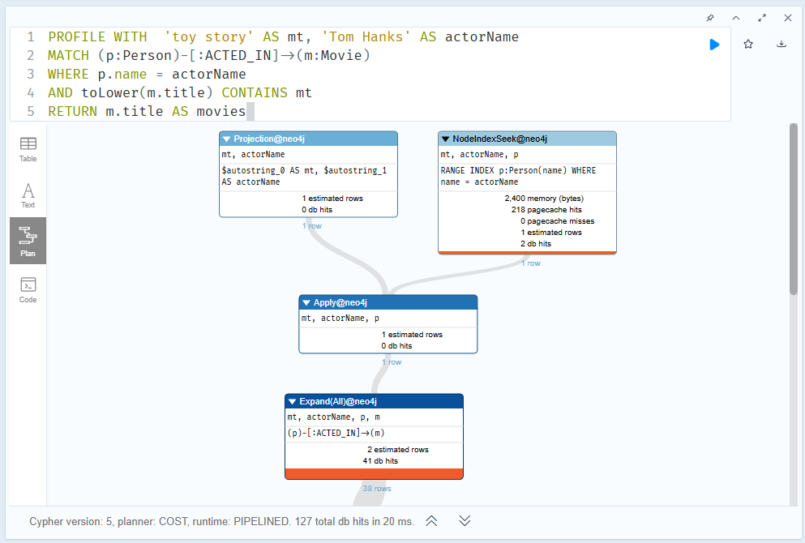

Method 2:

```cypher
WITH  'toy story' AS mt, 'Tom Hanks' AS actorName
MATCH (p:Person)-[:ACTED_IN]->(m:Movie)
WITH m, toLower(m.title) AS movieTitle
WHERE p.name = actorName
AND movieTitle CONTAINS mt
RETURN m.title AS movies, movieTitle
```

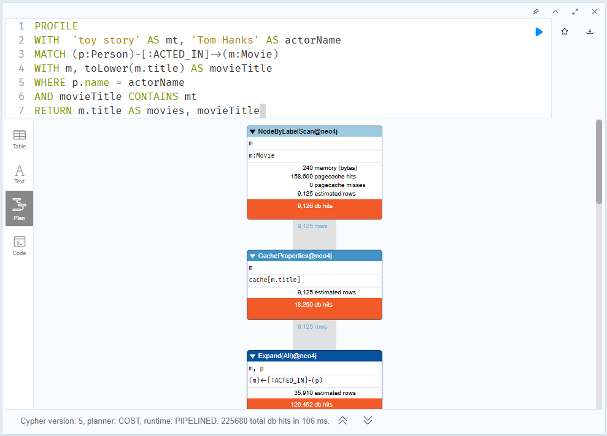

Question: return the name of the actor (Clint Eastwood) and all the movies that he acted in that contain the string 'high'.

```cypher
WITH "Clint Eastwood" AS a, 'high' AS t
MATCH (p:Person)-[:ACTED_IN]->(m:Movie)
WITH p, m, toLower(m.title) AS movieTitle
WHERE p.name = a AND movieTitle CONTAINS t
RETURN p.name AS actor, m.title AS movie
```

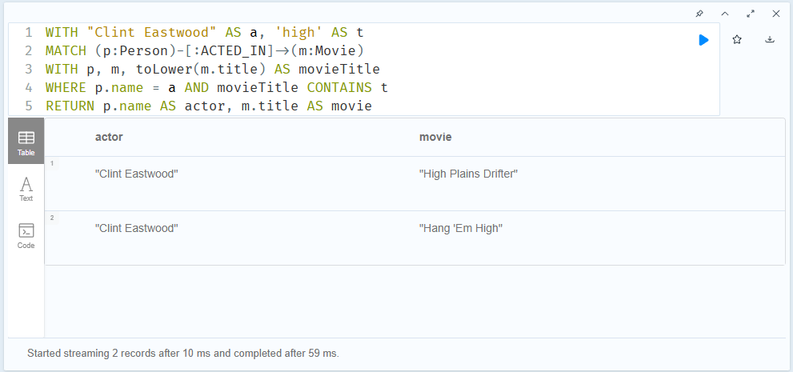

### 5.2 Tom Hanks Movies

Question: use a `WITH` clause to create a variable for the actor's name

```cypher
WITH 'Tom Hanks' AS actorName
MATCH (p:Person)-[:ACTED_IN]->(m:Movie)
WHERE p.name = actorName
RETURN m.title AS title
```

Answer is 38 movies titles.

### 5.3 Highest Revenue Movies

Question: update `WITH` clause to scope

```cypher
WITH 'Tom Hanks' AS theActor
MATCH (p:Person)-[:ACTED_IN]->(m:Movie)
WHERE p.name = theActor
AND m.revenue IS NOT NULL
WITH theActor, m  ORDER BY m.revenue DESC LIMIT 1
RETURN theActor, m.title AS title, m.revenue AS revenue
```

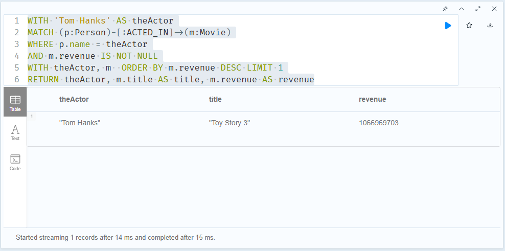

### 5.4 Top Movies

Question: use `WITH` to return a map projection of the top 10 movies by IMDBrating

```cypher
MATCH (n:Movie)
WHERE n.imdbRating IS NOT NULL
WITH n {
  .title,
  .imdbRating,
  .plot,
  .released,
  .countries
}
ORDER BY n.imdbRating DESC
LIMIT 10
RETURN collect(n)
```

### 5.5 Adding Genres

```cypher
MATCH (n:Movie)
WHERE n.imdbRating IS NOT NULL
WITH n {
  .title,
  .imdbRating,
  actors: [ (n)<-[:ACTED_IN]-(p) | p { .imdbId, .name } ],
  genres: [ (n)-[:IN_GENRE]->(g) | g {.name} ]
}
ORDER BY n.imdbRating DESC
LIMIT 10
RETURN collect(n)
```

### 5.6 Pipelining Queries

#### 5.6.1 Using `WITH` for aggregation

```cypher
MATCH (:Movie {title:'Toy Story'})-[:IN_GENRE]->(g:Genre)<-[:IN_GENRE]-(m)
WHERE m.imdbRating IS NOT NULL
WITH g.name AS genre, count(m) AS moviesInCommon, sum(m.imdbRating) AS total
RETURN genre, moviesInCommon, total/moviesInCommon AS score
ORDER BY score DESC
```

```cypher
MATCH (u:User {name: "Misty Williams"})-[r:RATED]->(:Movie)
WITH u, avg(r.rating) AS average
MATCH (u)-[r:RATED]->(m:Movie)
WHERE r.rating < average
RETURN average, m.title AS movie, r.rating as rating
ORDER BY rating DESC
```

#### 5.6.2 Using `WITH` for collecting

```cypher
MATCH (m:Movie)--(a:Actor)
WHERE m.title CONTAINS 'New York'
WITH m, collect(a.name) AS actors, count(*) AS numActors
RETURN m.title AS movieTitle, actors
ORDER BY numActors DESC
```


```cypher
MATCH (m:Movie)<-[:ACTED_IN]-(a:Actor)
WHERE m.title CONTAINS 'New York'
WITH m, collect (a.name) AS actors,
count(*) AS numActors
ORDER BY numActors DESC
RETURN collect(m { .title, actors, numActors }) AS movies
```

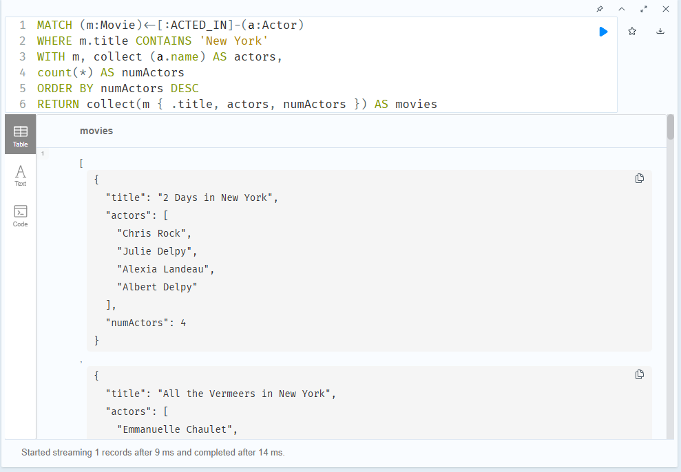

#### 5.6.3 Using `LIMIT` early

A **best practice** is to execute queries that minimze the number of rows processed in the query, one way to do that is to limit early in the query.

#### 5.6.4 Use `DISTINCT` when necessary

### 5.7 Highest Rated Tom Hanks Movie

Question: determine the highest average rating for a Tom Hanks movie

```cypher
MATCH (p:Person)-[:ACTED_IN]->(m:Movie)<-[r:RATED]-(:User)
WHERE p.name = "Tom Hanks"
WITH m, avg(r.rating) AS avgRating
WHERE avgRating > 4
RETURN m.title AS Movie, avgRating AS `AverageRating`
ORDER BY avgRating DESC
```

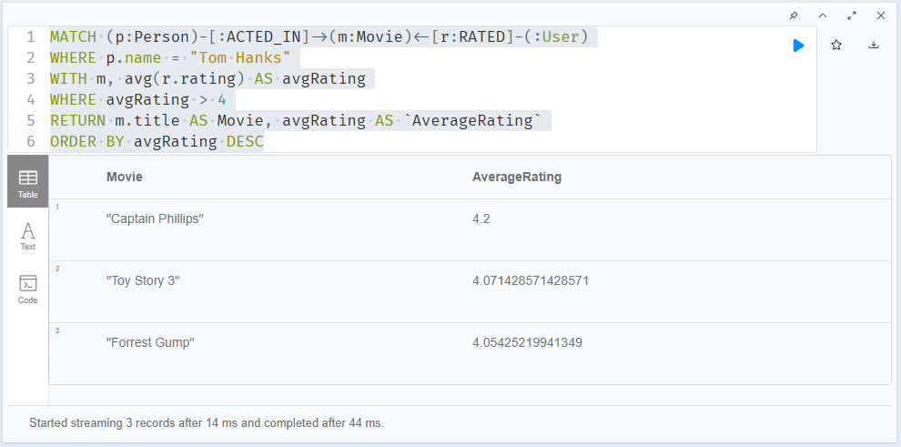

### 5.8 Highest Average Rating

Question: what is the highest average rating for a moview acted in by Tom Hanks?

Answer is 4.2

### 5.9 Unwinding Lists

`UNWIND` returns a row for each element of a list.

```cypher
MATCH (m:Movie)-[:ACTED_IN]-(a:Actor)
WHERE a.name = 'Tom Hanks'
UNWIND m.languages AS lang
RETURN m.title AS movie, m.languages AS languages, lang AS language
```

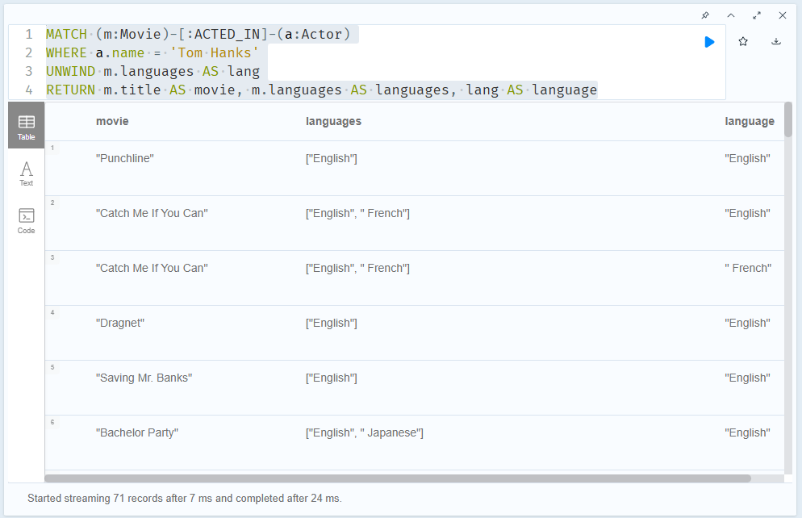

### 5.10 UK Movies

Question: use `UNWIND` to find the number of movies in each country

```cypher
MATCH (m:Movie)
UNWIND m.countries AS coun
WITH m, trim(coun) AS country
WITH country, collect(m.title) AS movies
RETURN country, size(movies)
```

Answer is 1386 Movies in UK country

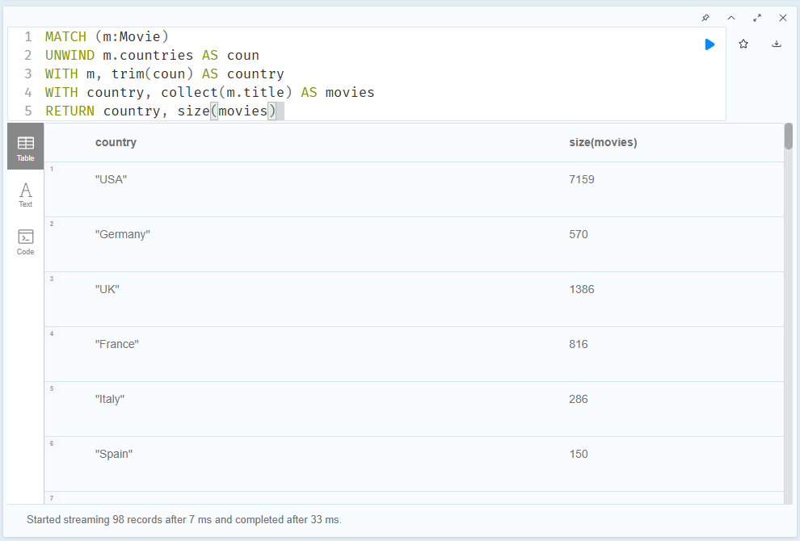

### 5.11 Swizerland Movies

Question: Add a `WHERE` clause to filter the movies produced in Switzerland

```cypher
MATCH (m:Movie)
UNWIND m.countries AS coun
WITH m, trim(coun) AS country
WITH country, collect(m.title) AS movies
WHERE country = "Switzerland"
RETURN country, size(movies)
```

Answer is 50 movies produced in Switzerland.

## 6. Reducing Memory

Limiting Results and Filtering your queries are the easiest ways to reduce memory requirements.
- Using `CALL` to perform a subquery
- Using `UNION` to combine the results of multiple queries

### 6.1 Subqueries

A subquery is a set of Cypher statements that execute within their own scope.

A subquery is typically called from an outer enclosing query.

Using a subquery, you can limit the number of rows that need to be processed.

Some important things about a subquery:
- A subquery returns values referred to by the variables in the `RETURN` clause
- A subquery cannot return variables with the same name used in the enclosing query
- You must explicitly pass in variables from the enclosing query to a subquery

#### 6.1.1 Performing subqueires with `CALL`

```cypher
CALL {
    MATCH (m:Movie {year: 2000})
    RETURN m
    ORDER BY m.imdbRating DESC
    LIMIT 10
}
MATCH (:User)-[r:RATED]->(m)
RETURN m.title, round(avg(r.rating),2)
```

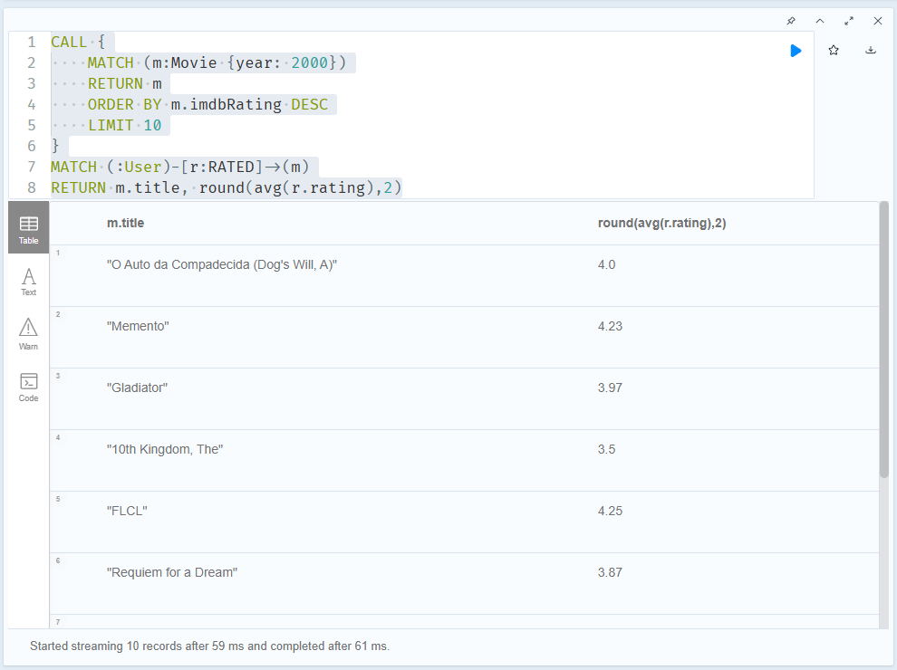

The subquery is demarcated by the `{...}` pair.

#### 6.1.2 Passing variables into a subquery

```cypher
MATCH (m:Movie)
CALL {
    WITH m
    MATCH (m)<-[r:RATED]-(u:User)
    WHERE r.rating = 5
    RETURN count(u) AS numReviews
}
RETURN m.title, numReviews
ORDER BY numReviews DESC
```

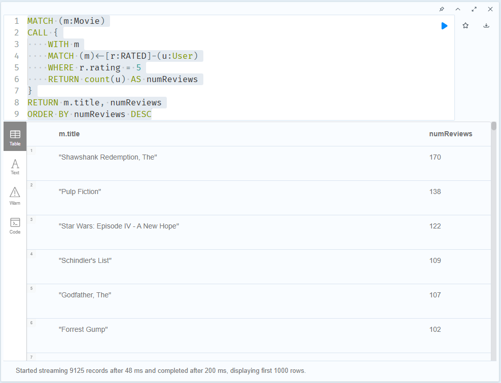

#### 6.1.3 Combining query results with `UNION`

#### 6.1.4 Using `UNION` with subqueries

### 6.2 Using 

Question: find the number of movies in each genre that have a `imdbRating` greater than 9

```cypher
MATCH (g:Genre)
CALL { 
    WITH g
    MATCH (g)<-[:IN_GENRE]-(m) WHERE m.imdbRating > 9
    RETURN count(m) AS numMovies
}
RETURN g.name AS Genre, numMovies 
ORDER BY numMovies DESC
```

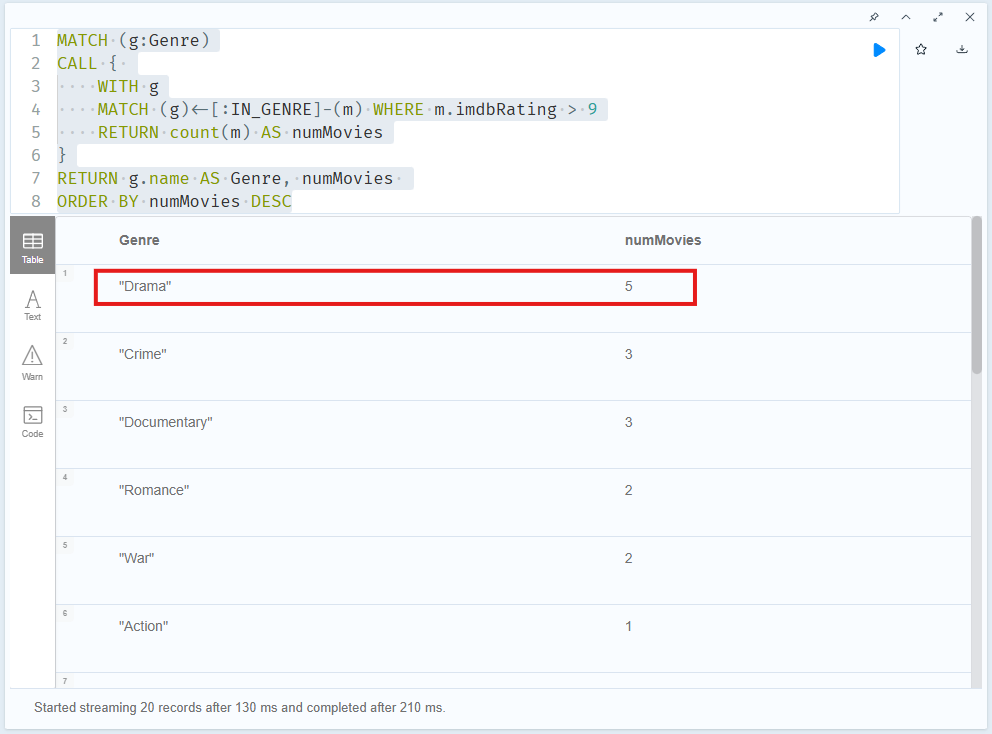

### 6.3 Combining Results

```cypher
MATCH (m:Movie)<-[:ACTED_IN]-(p:Person)
WHERE m.year = 2015
RETURN 
    "Actor" AS type,
    p.name AS name,
    collect(m.title) AS movies
UNION ALL
MATCH (m:Movie)<-[:DIRECTED]-(p:Person)
WHERE m.year = 2015
RETURN 
    "Actor" AS type,
    p.name AS name,
    collect(m.title) AS movies
```

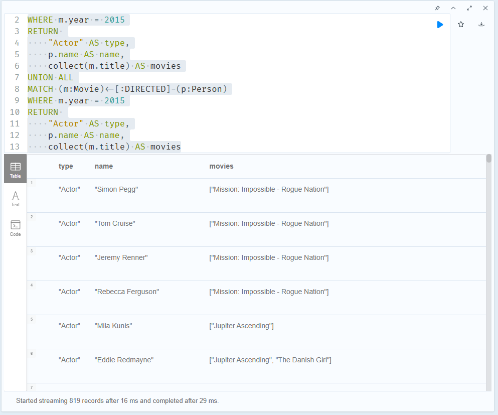

## 7. Using Parameters

### 7.1 Parameters in Cypher

A best practice is to parameterize values in your Cypher statements.

#### 7.1.1 Using Cypher parameters

```cypher
MATCH (p:Person)-[:ACTED_IN]->(m:Movie)
WHERE p.name = $actorName
RETURN m.released AS releaseDate,
m.title AS title
ORDER BY m.released DESC
```

#### 7.1.2 Setting a parameter

```cypher
:param actorName: 'Tom Hanks'
```

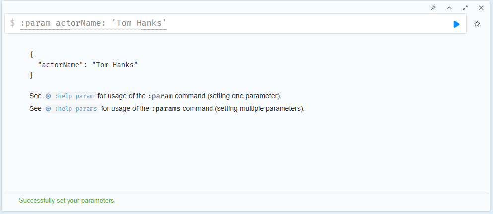

Now, execute statements in 7.1.1, with following result:

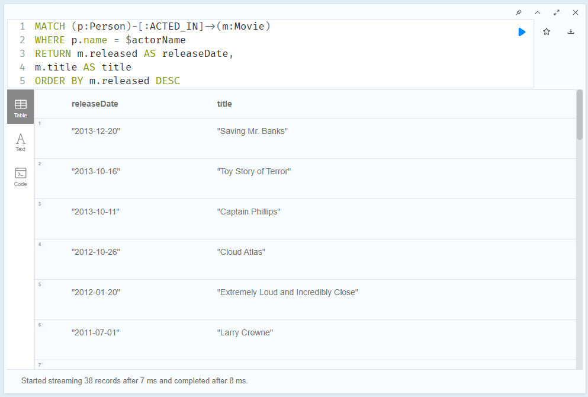

#### 7.1.3 Setting Integers

Due to a discrepancy between integers in JavaScript and the Neo4j type system, any integers are converted to floating point values when the parameter is set. This is designed to avoid any data loss on large numbers.

```cypher
:param number: 10
```

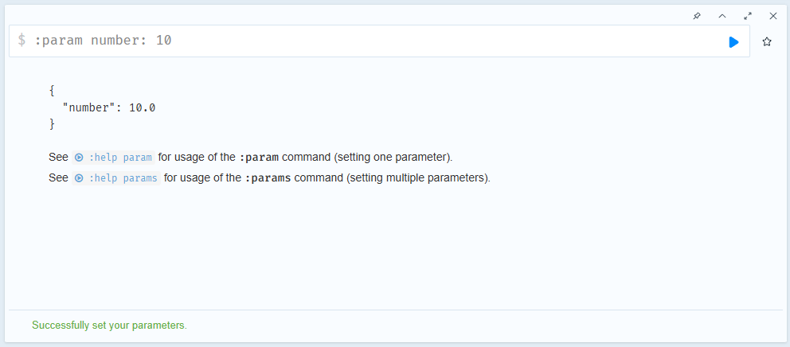

Instead, to force the number to be an integer, you can use the `⇒` operator.

```cypher
:param number=> 10
```

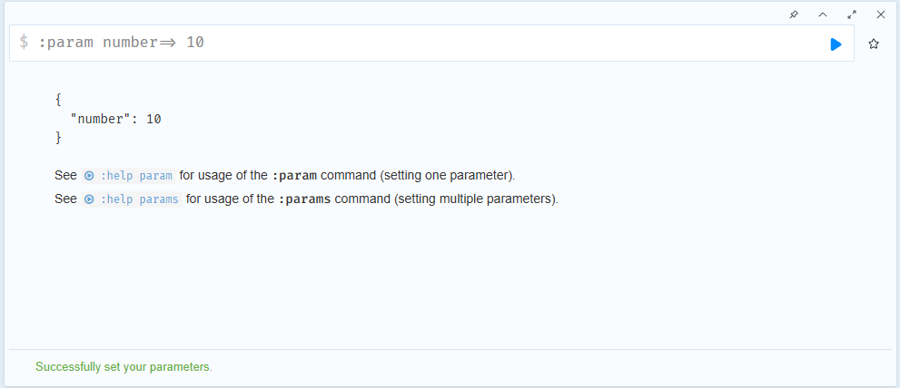

#### 7.1.4 Setting multiple parameters

You can also use the JSON-style syntax to set all of the parameters in your Neo4j Browser session.

The values you can specify in this object are numbers, strings, and booleans.

```cypher
:params {actorName: 'Tom Cruise', movieName: 'Top Gun'}
```

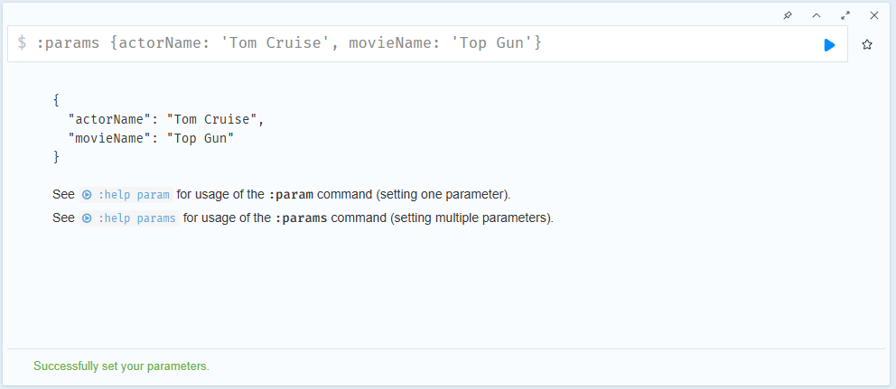

#### 7.1.5 Using multiple parameters

#### 7.1.6 Viewing parameters

```cypher
:params
```

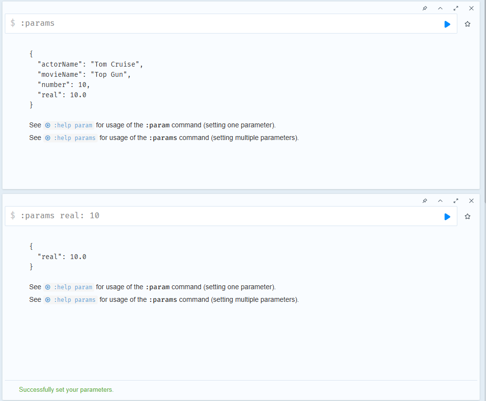

#### 7.1.7 Removing parameters

```python
:params {}
```

### 7.2 Setting Parameters

### 7.3 Using Parameters

### 7.4 Application Examples Using Parameters
