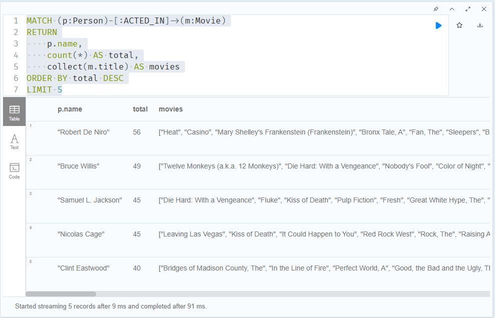
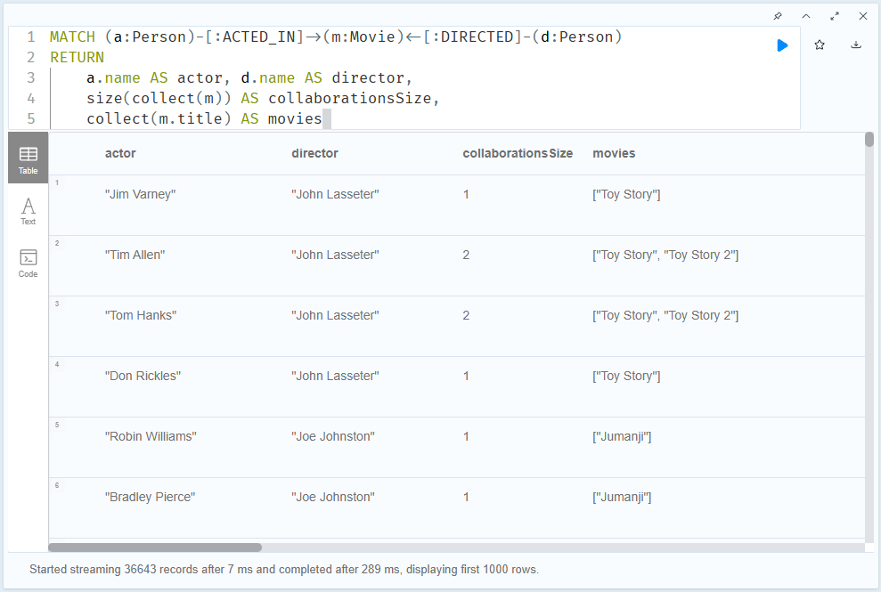
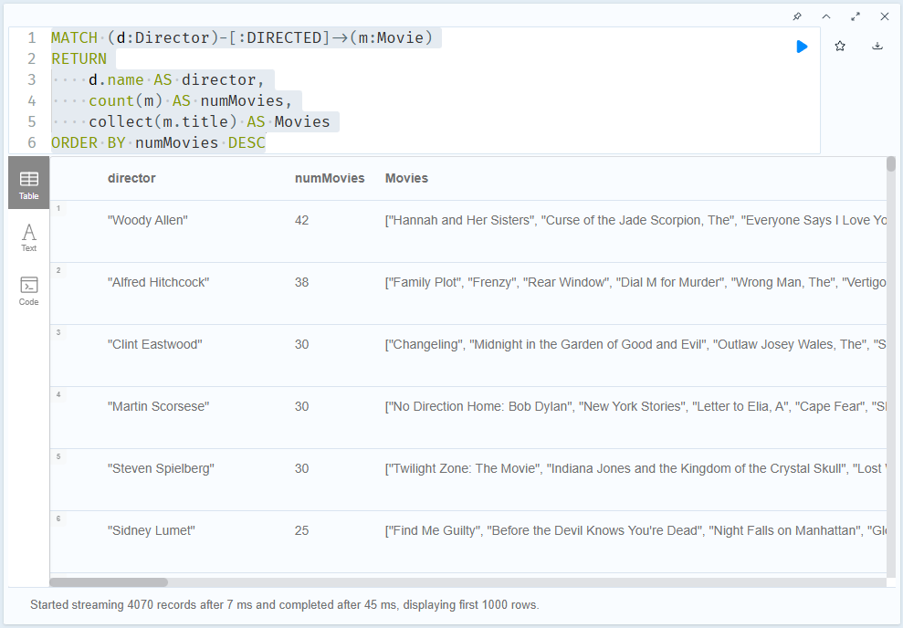
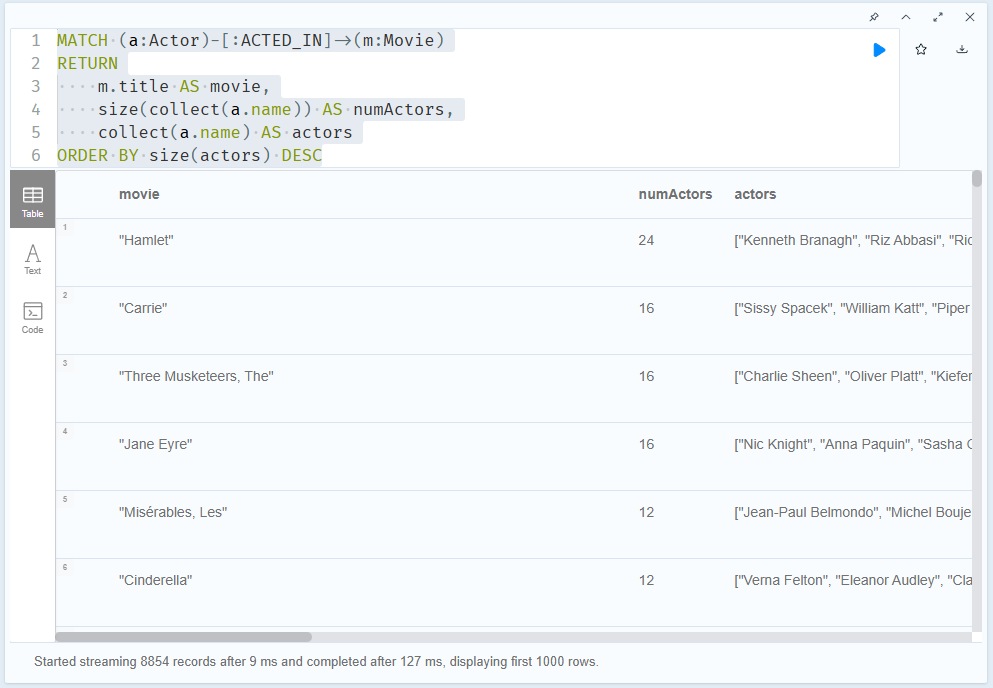
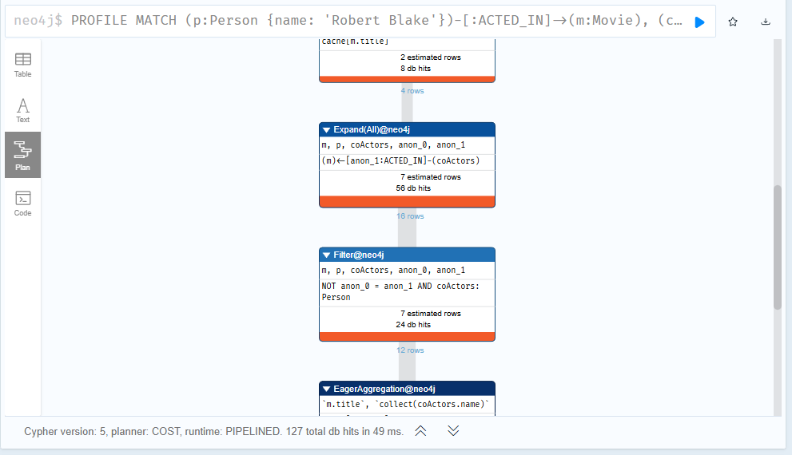
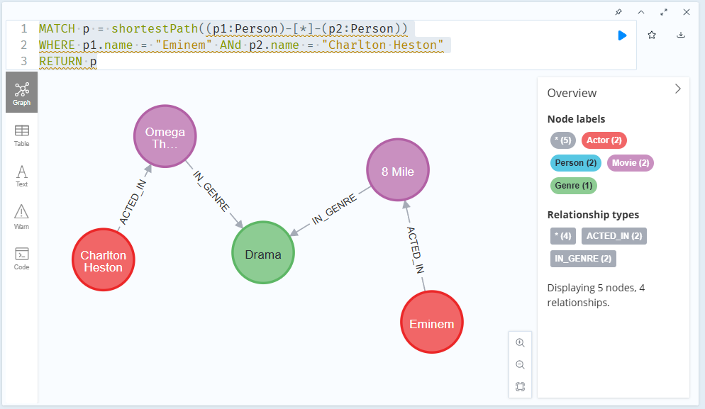
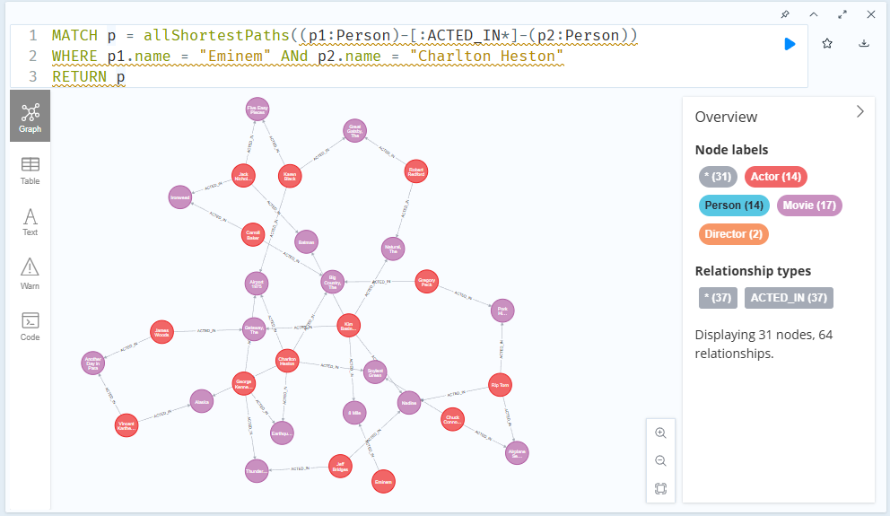

# Neo4j - Intermediate Cypher Queries

Updated at: 2025-11-22

- [Neo4j - Intermediate Cypher Queries](#neo4j---intermediate-cypher-queries)
  - [1. Filtering Queries](#1-filtering-queries)
  - [2. Controlling Results Returned](#2-controlling-results-returned)
    - [2.1 Ordering Returned Results](#21-ordering-returned-results)
    - [2.2 Ordering Results](#22-ordering-results)
    - [2.3 Viewing the Ordered Results](#23-viewing-the-ordered-results)
    - [2.4 Ordering Multiple Values](#24-ordering-multiple-values)
    - [2.5 Limiting or Counting Results Returned](#25-limiting-or-counting-results-returned)
    - [2.6 Limiting Results](#26-limiting-results)
    - [2.7 Eliminating Duplicates](#27-eliminating-duplicates)
    - [2.8 Map Projections to Return Data](#28-map-projections-to-return-data)
    - [2.9 Change Resutls Returned](#29-change-resutls-returned)
    - [2.10 Conditionally Returning Data](#210-conditionally-returning-data)
  - [3. Workign with Cypher](#3-workign-with-cypher)
    - [3.1 Aggregating Data](#31-aggregating-data)
      - [3.1.1 COUNT](#311-count)
      - [3.1.2 COLLECT() to create a list](#312-collect-to-create-a-list)
    - [3.2 Counting Results](#32-counting-results)
    - [3.3 Creating Lists](#33-creating-lists)
    - [3.4 How Many Actors?](#34-how-many-actors)
    - [3.5 Working with Dates and Times](#35-working-with-dates-and-times)
    - [3.6 Duration](#36-duration)
    - [3.7 Duration in Minutes](#37-duration-in-minutes)
  - [4. Graph Traversal](#4-graph-traversal)
    - [4.1 Graph Traversal](#41-graph-traversal)
    - [4.2 Traversing the Graph](#42-traversing-the-graph)
    - [4.3 Relationships Traversed](#43-relationships-traversed)
    - [4.4 Varying Length Traversal](#44-varying-length-traversal)
      - [4.4.1 Shortest path](#441-shortest-path)
      - [4.4.2 Varying length traversal](#442-varying-length-traversal)
    - [4.5 Actors 2 Hops Away](#45-actors-2-hops-away)
    - [4.6 Actors 4 Hops Away](#46-actors-4-hops-away)
    - [4.7 Actors Up to 4 Hops Away](#47-actors-up-to-4-hops-away)
  - [5. Pipelining Queries](#5-pipelining-queries)
  - [6. Reducing Memory](#6-reducing-memory)
  - [7. Using Parameters](#7-using-parameters)

## 1. Filtering Queries

## 2. Controlling Results Returned

### 2.1 Ordering Returned Results

### 2.2 Ordering Results

### 2.3 Viewing the Ordered Results

### 2.4 Ordering Multiple Values

```cypher
MATCH (p:Person)-[:ACTED_IN]->(m:Movie)
WHERE m.imdbRating IS NOT NULL AND p.born IS NOT NULL
RETURN p.name, p.born, m.title, m.imdbRating
ORDER BY m.imdbRating DESC, p.born DESC
LIMIT 30
```

Answer: Scott Grimes

### 2.5 Limiting or Counting Results Returned

What movies have reviews:

```cypher
MATCH ()-[:RATED]->(m:Movie)
RETURN DISTINCT m.title
```

### 2.6 Limiting Results

```cypher
MATCH (m:Movie)
WHERE m.imdbRating IS NOT NULL
RETURN m.title, m.imdbRating
ORDER BY m.imdbRating LIMIT 1
```

Question: the lowest m.imdbRating = 1.6, while there're two movies - "Ring of Terror" and "Hip Hop Witch, Da" - in this rating, `LIMIT 1` missed the 2nd movie!

### 2.7 Eliminating Duplicates

Without `DISTINCT`: there're 183 rows

```cypher
MATCH (p:Person)-[:ACTED_IN | DIRECTED]->(m)
WHERE m.title = 'Toy Story'
MATCH (p)-[:ACTED_IN]->()<-[:ACTED_IN]-(p2:Person)
RETURN p.name, p2.name
```

With `DISCTING`: there're 166 rows

```cypher
MATCH (p:Person)-[:ACTED_IN | DIRECTED]->(m)
WHERE m.title = 'Toy Story'
MATCH (p)-[:ACTED_IN]->()<-[:ACTED_IN]-(p2:Person)
RETURN DISTINCT p.name, p2.name
```

### 2.8 Map Projections to Return Data

```cypher
MATCH (p:Person)
WHERE p.name CONTAINS "Thomas"
RETURN p AS person
ORDER BY p.name ASC
```


It returns `identity`, `labels`, `properties`, `elementsId` in every row, not returning `type`!

Return the title and release date as Movie objects for all Woody Allen movies:

```cypher
MATCH (d:Director)-[:DIRECTED]->(m:Movie)
WHERE d.name = 'Woody Allen'
RETURN m {.title, .released} AS Movie
ORDER BY m.released
```

### 2.9 Change Resutls Returned

```cypher
MATCH (p:Person)-[:ACTED_IN]->(m:Movie)
WHERE
    m.title CONTAINS 'Toy Story' AND
    p.died IS NULL
RETURN
    m.title AS movie,
    p.name AS actor,
    p.born AS dob,
    date().year - p.born.year AS ageThisYear
```


```cypher
MATCH (p:Person)-[:ACTED_IN]->(m:Movie)
WHERE
    m.title CONTAINS 'Toy Story' AND
    p.died IS NULL
RETURN
    'Movie:' + m.title AS movie,
    p.name AS actor,
    p.born AS dob,
    date().year - p.born.year AS ageThisYear
```


Conditional data return using `CASE`:

```cypher
MATCH (p:Person)-[:ACTED_IN]->(m:Movie)
WHERE
    m.title CONTAINS 'Toy Story'
RETURN
    'Movie:' + m.title AS movie,
    p.name AS actor,
    p.born AS dob,
CASE
WHEN p.died IS NULL THEN "still alive"
WHEN p.died IS NOT NULL THEN p.died
END
AS dod,
CASE
WHEN p.died IS NULL THEN date().year - p.born.year
WHEN p.died IS NOT NULL THEN p.died.year - p.born.year
END
AS ageThisYear_or_ageOfDied
```


Question

```cypher
MATCH (m:Movie)<-[:ACTED_IN]-(p:Person)
WHERE m.title CONTAINS 'Toy Story'
RETURN m.title AS movie,
p.name AS actor,
p.born AS dob,
CASE WHEN p.died IS NULL THEN date().year - p.born.year WHEN p.died IS NOT NULL THEN "Died" END
AS ageThisYear
```

My query:

```cypher
MATCH (p:Person)-[:ACTED_IN]->(m:Movie)
WHERE m.title CONTAINS 'Toy Story'
RETURN DISTINCT
    p.name AS actor,
CASE
    WHEN p.died IS NULL THEN date().year - p.born.year
    WHEN p.died IS NOT NULL THEN "Actor had died"
END
AS age
```

### 2.10 Conditionally Returning Data

```cypher
MATCH (p:Person)-[:ACTED_IN]->(m:Movie)
WHERE p.name = "Charlie Chaplin"
RETURN m.title AS movie,
CASE
WHEN m.runtime < 120 THEN "Short"
ELSE "Long"
END
AS runtime
ORDER BY runtime
```

## 3. Workign with Cypher 

### 3.1 Aggregating Data

#### 3.1.1 COUNT

Using `count()` to aggregate data:

```cypher
MATCH (p:Person)-[:ACTED_IN]->(m:Movie)
WHERE p.name = "Tom Hanks"
RETURN p.name AS actorName, count(*) AS numMovies
```


```cypher
MATCH (p:Person)-[:ACTED_IN]->(m:Movie)<-[:DIRECTED]-(d:Director)
RETURN
    p.name as actorName,
    d.name as directorName,
    count(*) AS numMovies
ORDER BY numMovies DESC
```


Eager Aggregation: When you aggreate in a Cypher statement, the query must process all patterns in the `MATCH` clause to complete the aggregation to return results.

Here is a comparison of the `COUNT()` clause in **SQL** vs **Cypher**:

| Feature | SQL | Cypher |
| --- | --- | --- |
| Primary Purpose | Counts rows or non-NULL values in a column | Counts nodes, relationships, rows, or expressions. |
| Basic Syntax | `COUNT(*)` - counts all rows<br>`COUNT(expression)` - counts non-NULL values | `COUNT(*)` - counts all rows (including those with nulls)<br>`COUNT(expression)` - counts non-null values of the expression (e.g. `COUNT(n)`) |
| Counting all returned rows | `SELECT COUNT(*) FROM table` | `RETURN COUNT(*)` (inside `WITH` or `RETURN` after aggregation; counts all matching rows from `MATCH`) |
| Counting distinct values | `COUNT(DISTINCT column)` | `COUNT(DISTINCT expression)` - works the same way |
| Aggregation requirement | **Must** be used with `GROUP BY` when mixed with non-aggregated columns | When you use `COUNT()` together with non-aggregated columns, must use `WITH` or `RETURN` with grouping keys |

Sample: chaining with `WITH` for filtering aggregates (SQL `HAVING` equivalent):

```cypher
MATCH (c:City)<-[:LIVES_IN]-(p:Persion)
WITH c, COUNT(*) AS cnt
WHERE cnt > 100000
RETURN c.name, cnt
```

#### 3.1.2 COLLECT() to create a list

```cypher
MATCH (p:Person)-[:ACTED_IN]->(m:Movie)
RETURN
    p.name,
    count(*) AS total,
    collect(m.title) AS movies
ORDER BY total DESC
LIMIT 5
```



Reference: [Aggregating Functions in Neo4j Cypher](https://neo4j.com/docs/cypher-manual/current/functions/aggregating/?_gl=1*1u6pg51*_gcl_au*MTM2MDA4NTA5MC4xNzYzODExOTk1*_ga*MTk3MzcxMjU0Ni4xNzYzODExOTk1*_ga_DL38Q8KGQC*czE3NjM4NjgyMjQkbzMkZzEkdDE3NjM4NjgyMjkkajU1JGwwJGgw*_ga_DZP8Z65KK4*czE3NjM4NjgyMjQkbzMkZzEkdDE3NjM4NjgyMjkkajU1JGwwJGgw)

| `COUNT()` | `SIZE()` |
| --- | --- |
| Count the number of rows, or alternatively, return the size of the collected results. | Returns the number of elements in a list. |

Compare `Size()` and `Count`:
- `size(movies)` return the number of elements in a list of Movie nodes
- `size(collect(moview))` is not same as above, since movies is already a list so do not need to create another list
- `count()` used to count the number of rows or variables returned, not used to return the number of elements in a list

```cypher
MATCH (actor:Person)-[:ACTED_IN]->(m:Movie)<-[:DIRECTED]-(director:Person)
RETURN actor.name, director.name,
size(collect(m)) AS collaborations,
collect(m.title) AS movies
```



Besides the performance, `size(collect(m)) AS numMovies` is same results as `count(m) AS numMovies`.

Question: return the list of names of actors in the movie Toy Story as a single row.

```cypher
MATCH (p:Person)-[:ACTED_IN]->(m:Movie {title: 'Toy Story'})
RETURN collect(p.name) AS Actors
```

### 3.2 Counting Results

Question: find hte highest number of movies directed by a single director

```cypher
MATCH (d:Director)-[:DIRECTED]->(m:Movie)
RETURN
    d.name AS director,
    count(m) AS numMovies,
    collect(m.title) AS Movies
ORDER BY numMovies DESC
```



### 3.3 Creating Lists

Question: return a list actors who have appeared in movies with the smae title

```cypher
MATCH (a:Actor)-[:ACTED_IN]->(m:Movie)
RETURN
    m.title AS movie,
    size(collect(a.name)) AS numActors,
    collect(a.name) AS actors
ORDER BY size(actors) DESC
```



### 3.4 How Many Actors?

Question: return the number of actors in movies with the same title

The question in 3.3 already have the needed column, answer is "Hamlet".

### 3.5 Working with Dates and Times

Cypher has 3 basic formats for storing date and time data:

```cypher
RETURN date(), datetime(), time()
```

Other reference: [Temporal Functions section of the Neo4j Cypher Manual](https://neo4j.com/docs/cypher-manual/current/functions/temporal/?_gl=1*1s8a3jd*_gcl_au*MTM2MDA4NTA5MC4xNzYzODExOTk1*_ga*MTk3MzcxMjU0Ni4xNzYzODExOTk1*_ga_DL38Q8KGQC*czE3NjM4NzYzOTgkbzQkZzEkdDE3NjM4NzgzNzMkajU3JGwwJGgw*_ga_DZP8Z65KK4*czE3NjM4NzYzOTgkbzQkZzEkdDE3NjM4NzgzNzMkajU3JGwwJGgw)

Question: how long did Charlie Chaplin live?

```cypher
MATCH (p:Person {name: 'Charlie Chaplin'})
RETURN duration.between(p.born, p.died).years
```

### 3.6 Duration

Question: calculate the number of days between the `date1` and `date2` properties of the `Test` node:

```cypher
MATCH (x:Test {id: 1})
RETURN duration.inDays(x.date1,x.date2).days
```

Answer is 165 days.

### 3.7 Duration in Minutes

Question: calculate the number of minutes between the `datetime1` and `datetime2`properties of the `Test` node

```cypher
MATCH (x:Test {id: 1})
RETURN duration.between(x.datetime1,x.datetime2).Minutes
```

Answer is 400

## 4. Graph Traversal

### 4.1 Graph Traversal

Question: the best performed query to return a list of names of reviewers who rated the movie.

```cypher
MATCH (movie:Movie)<-[:RATED]-(reviewer)
WHERE movie.title = 'Toy Story'
RETURN reviewer.name
```

Explanation: it uses a label for the anchor node, Movie and specifies the relationship type. You need not specify a label for non-anchor nodes in the pattern. Specifying the relationship type in a pattern will always yield better performance.

### 4.2 Traversing the Graph

Question: Co-actors of Robert Blake

```cypher
MATCH (p:Person {name: 'Robert Blake'})-[:ACTED_IN]->(m:Movie),
 (coActors:Person)-[:ACTED_IN]->(m)
RETURN m.title, collect(coActors.name)
```

Through PROFILE, there're 16 relationship expanded to find coActors



### 4.3 Relationships Traversed

Question: find actors in movies that Robert Black acted in

```cypher
MATCH (p:Person {name: 'Robert Blake'})-[:ACTED_IN]->(m:Movie)
MATCH (allActors:Person)-[:ACTED_IN]->(m)
RETURN m.title, collect(allActors.name)
```

Answer: 20 relationships are traversed to return the result.

### 4.4 Varying Length Traversal

#### 4.4.1 Shortest path

```cypher
MATCH p = shortestPath((p1:Person)-[*]-(p2:Person))
WHERE p1.name = "Eminem" ANd p2.name = "Charlton Heston"
RETURN p
```



Limit the relaitonship to `:ACTED_IN`:

```cypher
MATCH p = shortestPath((p1:Person)-[:ACTED_IN*]-(p2:Person))
WHERE p1.name = "Eminem" ANd p2.name = "Charlton Heston"
RETURN p
```


Using `allShortestPaths` instead:

```cypher
MATCH p = allShortestPaths((p1:Person)-[:ACTED_IN*]-(p2:Person))
WHERE p1.name = "Eminem" ANd p2.name = "Charlton Heston"
RETURN p
```



#### 4.4.2 Varying length traversal

### 4.5 Actors 2 Hops Away

Question: return the names of actors taht are 2 hops away from Robert Blake using hte ACTED_IN relationship

```cypher
MATCH (p:Person)-[:ACTED_IN*2]-(others:Person)
WHERE p.name = "Robert Blake"
RETURN count(others)
```

Answer is 12

### 4.6 Actors 4 Hops Away

Question: return the unique names of actors that are 4 hops aways from Robert Blake using hte ACTED_IN relationship

```SQL
MATCH (p:Person {name: "Robert Blake"})-[:ACTED_IN*4]-(others:Person)
RETURN COUNT(DISTINCT others.name)
```

Answer is 253

### 4.7 Actors Up to 4 Hops Away

Question: return the unique names of actors that are up to 4 hops away from Robert Blake using the ACTED_IN relationship.

```cypher
MATCH (p:Person {name: "Robert Blake"})-[:ACTED_IN*1..4]-(others:Person)
RETURN COUNT(DISTINCT others.name)
```

## 5. Pipelining Queries

## 6. Reducing Memory

## 7. Using Parameters
