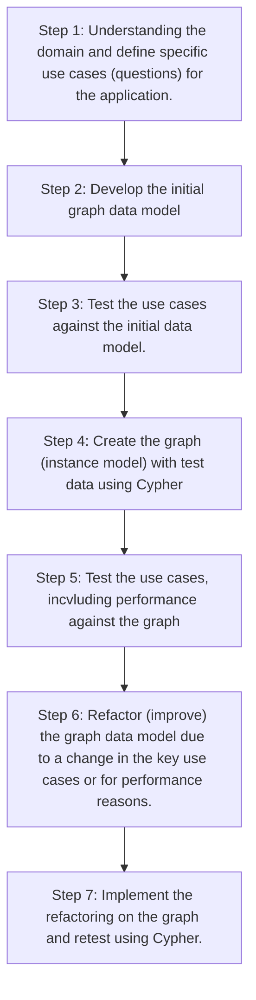

# Graph Data Modeling Fundamentals

- [Graph Data Modeling Fundamentals](#graph-data-modeling-fundamentals)
  - [01 Getting Started](#01-getting-started)
    - [Why Model?](#why-model)
  - [02 Modeling Nodes](#02-modeling-nodes)
  - [03 Modeling Relationships](#03-modeling-relationships)
  - [04 Testing the Model](#04-testing-the-model)
  - [05 Refactoring the Graph](#05-refactoring-the-graph)
  - [06 Eliminating Duplicate Data](#06-eliminating-duplicate-data)
  - [07 Using Specific Relationships](#07-using-specific-relationships)
  - [08 Adding Intermediate Nodes](#08-adding-intermediate-nodes)
  - [09 Course Summary](#09-course-summary)

## 01 Getting Started

### Why Model?

Componentes of a Neo4j Graph: Nodes, Labels, Relationships, Properties

## 02 Modeling Nodes

## 03 Modeling Relationships

## 04 Testing the Model

## 05 Refactoring the Graph

## 06 Eliminating Duplicate Data

## 07 Using Specific Relationships

## 08 Adding Intermediate Nodes

## 09 Course Summary

---

Updated at: 2025-10-31