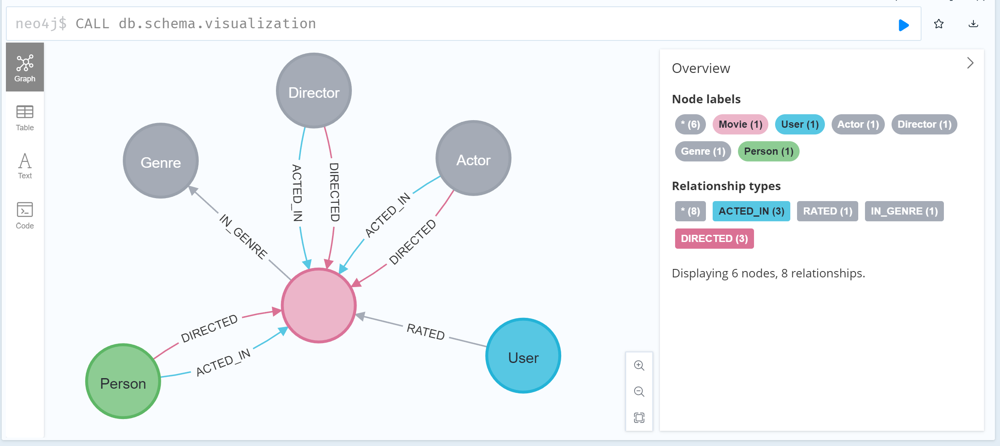
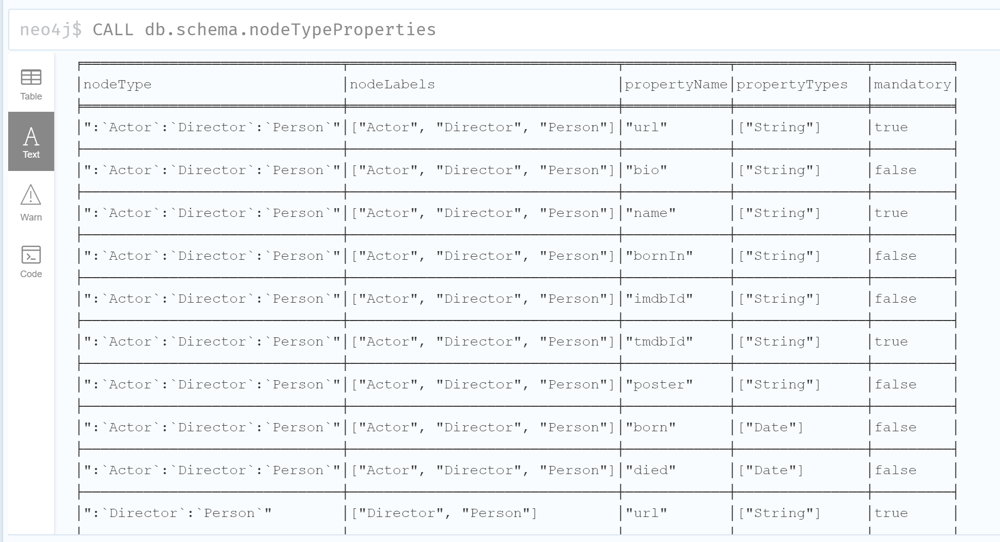

# Graph Data Modeling Fundamentals

- [Graph Data Modeling Fundamentals](#graph-data-modeling-fundamentals)
  - [01 Getting Started](#01-getting-started)
    - [Why Model?](#why-model)
    - [The Domain](#the-domain)
    - [Types of Models](#types-of-models)
    - [Style Guidelines for Modeling](#style-guidelines-for-modeling)
  - [02 Modeling Nodes](#02-modeling-nodes)
    - [Defining Nodes](#defining-nodes)
    - [Creating Nodes](#creating-nodes)
    - [Identifying a New Label](#identifying-a-new-label)
    - [Creating More Nodes](#creating-more-nodes)
  - [03 Modeling Relationships](#03-modeling-relationships)
    - [Defining Relationships](#defining-relationships)
  - [04 Testing the Model](#04-testing-the-model)
  - [05 Refactoring the Graph](#05-refactoring-the-graph)
  - [06 Eliminating Duplicate Data](#06-eliminating-duplicate-data)
  - [07 Using Specific Relationships](#07-using-specific-relationships)
  - [08 Adding Intermediate Nodes](#08-adding-intermediate-nodes)
  - [09 Course Summary](#09-course-summary)

## 01 Getting Started

### Why Model?

Componentes of a Neo4j Graph: Nodes, Labels, Relationships, Properties


Graph Data Modeling is an iterative process:
- your initial graph data model is a starting point, but as you learn more about the use cases or if the use cases change, the initial graph data model will need to change.
- in addition, you may find that especially when the graph scales, you will need to modify the graph (`refactor`) to achieve the best performance for your key use cases.

### The Domain

Before you begin the data modeling process, you must:
- Identify the stakeholders and developers of the application.
- With the stakeholders and developers:
  - Describe the application in detail
  - Identify the users of the application (people, systems)
  - Agree upon the use cases for the application
  - Rank the importance of the use cases

What makes the domain interesting are the connections or relationships between nodes in a graph.

Most use cases for an application can be enumerated by a comprehensive list of questions. The use cases help to define how the application will behave at runtime.

### Types of Models

When performing the graph data modeling process for an application, you need two types of models at least:
- Data Model: describes the labels, relationships, and properties for the graph, it does not have specific data that will be created in the graph.

- Instance Model: to test the model against the use cases, you need to have a set of sample data that you can use to see if the use cases can be answered with the model.


Use below Cypher command in Neo4j to check the Data Model:

```SQL
CALL db.schema.visualization
```

For Movie graph (v5.26), below is the schema (data model):



### Style Guidelines for Modeling

In Neo4j, `labels`, `relationship types`, and `property keys` are case-sensitive, unlike Cypher `keywords` which are case-insensitive.

A Neo4j best practice is to use the following when you name the elements of the graph:
- A `label` is a single identifier that begins with a capital letter and can be CamelCase
  - Examples: Person, Company, GitHubRepo
- A `relationship type` is a single identifier that is in all capital letters with the underscore character
  - Examples: FOLLOWS, MARRIED_TO, ACTORED_IN
- A `property key` for a node or a relationship is a single identifier that begins with a lower-case letter and can be camelCase
  - Examples: deptId, firstName

CamelCase: https://en.wikipedia.org/wiki/Camel_case

camelCase: https://en.wikipedia.org/wiki/Camel_case

## 02 Modeling Nodes

`Nodes` are the fundamental building blocks that represent the entities in your domain.

### Defining Nodes

Entities are the dominant nouns in your application use cases, they will be the labeled nodes in the graph data model.

Label names are using CamelCase format.

Node can have properties, whcih are used to:
- uniquely identify a nodd
- answer specific details of the use cases for the applications
- return data

As example in Movie graph, the properties are used to:
- Anchor (where to begin the query):
  - `MATCH (p:Person {name: 'Tom Hanks'})-[:ACTED_IN]-(m:Movie) RETURN m`
- Traverse the graph (navigation):
  - `MATCH (p:Person)-[:ACTED_IN]-(m:Movie {title: 'Apollo 13'})-[:RATED]-(u:User) RETURN p, u`
- Return data from the query:
  - `MATCH (p:Person {name: 'Tom Hanks'})-[:ACTED_IN]-(m:Movie) RETURN m.title, m.released`

You can use below Cypher to retrieve list of node properties:

```SQL
CALL db.schema.nodeTypeProperties
```



### Creating Nodes

### Identifying a New Label

### Creating More Nodes

Note on the case sentitivity: the property names and values are case-sensitive!

## 03 Modeling Relationships

Relationships are what connect nodes and give the graph a power, allowing you to traverse and query connected data efficiently.

### Defining Relationships

Connections are the **verbs** in use cases.

At a glance, cconnections are strightforward things, but their micro- and macro-design are arguably the most critical factors in graph performance.

According to naming relationships, we use the Neo4j best practice of all capital letters/underscore characters.

When you create a relationship in Neo4j, a direction must either be specified explicitly or inferred by the left-to-right direction in the pattern specified. While, at the runtime, during a query, direction is typically not required.

A relationship is typically between 2 different nodes, but it can also be to the same node.

## 04 Testing the Model

## 05 Refactoring the Graph

## 06 Eliminating Duplicate Data

## 07 Using Specific Relationships

## 08 Adding Intermediate Nodes

## 09 Course Summary

---

Updated at: 2025-10-31