# Graph Data Modeling Fundamentals

- [Graph Data Modeling Fundamentals](#graph-data-modeling-fundamentals)
  - [01 Getting Started](#01-getting-started)
    - [Why Model?](#why-model)
    - [The Domain](#the-domain)
    - [Types of Models](#types-of-models)
    - [Style Guidelines for Modeling](#style-guidelines-for-modeling)
    - [Practice](#practice)
  - [02 Modeling Nodes](#02-modeling-nodes)
    - [Defining Nodes](#defining-nodes)
    - [Creating Nodes](#creating-nodes)
    - [Identifying a New Label](#identifying-a-new-label)
    - [Creating More Nodes](#creating-more-nodes)
  - [03 Modeling Relationships](#03-modeling-relationships)
    - [Defining Relationships](#defining-relationships)
      - [Relationships in the Movie graph](#relationships-in-the-movie-graph)
      - [Properties for Relationships](#properties-for-relationships)
      - [Relationships Properties in the Movie Graph](#relationships-properties-in-the-movie-graph)
    - [Creating Initial Relationships](#creating-initial-relationships)
    - [Identifying a New Relationships](#identifying-a-new-relationships)
    - [Creating More Relationships](#creating-more-relationships)
  - [04 Testing the Model](#04-testing-the-model)
    - [Testing during Data Modeling](#testing-during-data-modeling)
    - [Testing with Instance Model](#testing-with-instance-model)
  - [05 Refactoring the Graph](#05-refactoring-the-graph)
    - [Refactoring 重构](#refactoring-重构)
    - [Labels in the Graph](#labels-in-the-graph)
    - [Adding the Actor Label](#adding-the-actor-label)
    - [Retesting after Refactoring](#retesting-after-refactoring)
    - [Retesting with Actor Label](#retesting-with-actor-label)
    - [Adding the Director Label](#adding-the-director-label)
    - [Avoid These Labels](#avoid-these-labels)
  - [06 Eliminating Duplicate Data](#06-eliminating-duplicate-data)
    - [Duplicate Data](#duplicate-data)
    - [Adding Language Data](#adding-language-data)
    - [Refactoring Duplicate Data](#refactoring-duplicate-data)
    - [Adding Language Nodes](#adding-language-nodes)
    - [Adding Genre Nodes](#adding-genre-nodes)
    - [Eliminating Complex Data in Nodes](#eliminating-complex-data-in-nodes)
  - [07 Using Specific Relationships](#07-using-specific-relationships)
    - [Relationships in the Graph](#relationships-in-the-graph)
    - [Specializing `ACTED_IN` and `DIRECTED` Relationships](#specializing-acted_in-and-directed-relationships)
      - [Use case #12: What `movies` did an `actor act` in for a particular `year`?](#use-case-12-what-movies-did-an-actor-act-in-for-a-particular-year)
      - [Use case #13: What `actors` or `directors` `worked in` a particular `year`?](#use-case-13-what-actors-or-directors-worked-in-a-particular-year)
    - [Specializing `RATED` Relationships (Use case #9)](#specializing-rated-relationships-use-case-9)
    - [Data Model (Visualized) So Far](#data-model-visualized-so-far)
  - [08 Adding Intermediate Nodes](#08-adding-intermediate-nodes)
    - [Intermediat Nodes](#intermediat-nodes)
      - [Example of Adding intermediate node for handling hyperedges](#example-of-adding-intermediate-node-for-handling-hyperedges)
      - [Example of Adding intermediate nodes for sharing data](#example-of-adding-intermediate-nodes-for-sharing-data)
    - [Adding a Role Node](#adding-a-role-node)
  - [09 Course Summary](#09-course-summary)
  - [Demo Course](#demo-course)

## 01 Getting Started

### Why Model?

Componentes of a Neo4j Graph: Nodes, Labels, Relationships, Properties

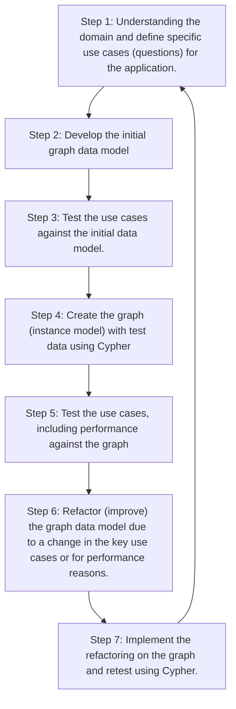

Graph Data Modeling is an iterative process:
- your initial graph data model is a starting point, but as you learn more about the use cases or if the use cases change, the initial graph data model will need to change.
- in addition, you may find that especially when the graph scales, you will need to modify the graph (`refactor`) to achieve the best performance for your key use cases.

### The Domain

Before you begin the data modeling process, you must:
- Identify the stakeholders and developers of the application.
- With the stakeholders and developers:
  - Describe the application in detail
  - Identify the users of the application (people, systems)
  - Agree upon the use cases for the application
  - Rank the importance of the use cases

What makes the domain interesting are the connections or relationships between nodes in a graph.

Most use cases for an application can be enumerated by a comprehensive list of questions. The use cases help to define how the application will behave at runtime.

### Types of Models

When performing the graph data modeling process for an application, you need two types of models at least:
- Data Model: describes the labels, relationships, and properties for the graph, it does not have specific data that will be created in the graph.


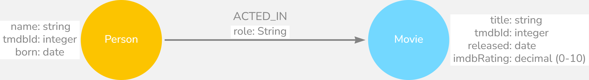

- Instance Model: to test the model against the use cases, you need to have a set of sample data that you can use to see if the use cases can be answered with the model.


Use below Cypher command in Neo4j to check the Data Model:

```SQL
CALL db.schema.visualization
```

For Movie graph (v5.26), below is the schema (data model):


### Style Guidelines for Modeling

In Neo4j, `labels`, `relationship types`, and `property keys` are case-sensitive, unlike Cypher `keywords` which are case-insensitive.

A Neo4j best practice is to use the following when you name the elements of the graph:
- A `label` is a single identifier that begins with a capital letter and can be CamelCase
  - Examples: Person, Company, GitHubRepo
- A `relationship type` is a single identifier that is in all capital letters with the underscore character
  - Examples: FOLLOWS, MARRIED_TO, ACTORED_IN
- A `property key` for a node or a relationship is a single identifier that begins with a lower-case letter and can be camelCase
  - Examples: deptId, firstName

CamelCase: https://en.wikipedia.org/wiki/Camel_case

camelCase: https://en.wikipedia.org/wiki/Camel_case

### Practice

Creating Sample Nodes:

```SQL
MERGE (p1:Person {name:'Tom Hanks', tmdbId: 31, born: "1956-07-09"});
MERGE (p2:Person {name:'Meg Ryan', tmdbId: 5344, born: "1961-11-19"});
MERGE (p3:Person {name:'Danny De Vito', tmdbId: 518, born: "1944-11-17"});
MERGE (p4:Person {name:'Jack Nicholson', tmdbId: 514, born: "1937-04-22"});
MERGE (m1:Movie {title:"Apollo 13", tmdbId: 568, released:"1995-06-30", imdbRating:7.6});
MERGE (m2:Movie {title:"Sleepless in Seattle", tmdbId: 858, released:"1993-06-25", imdbRating:6.8});
MERGE (m3:Movie {title:"Hoffa", tmdbId: 10410, released:"1992-12-25", imdbRating:6.6});
```

Create Relationships:

```SQL
MATCH (p1:Person {name: 'Tom Hanks'}), (m1:Movie {title: "Apollo 13"}), (m2:Movie {title:"Sleepless in Seattle"})
MERGE (m2)<-[r2:ACTED_IN {role:'Sam Baldwin'}]-(p1)-[r1:ACTED_IN {role:'Jim Lovell'}]->(m1)
RETURN m1,m2,p1,r1,r2
```

```SQL
MATCH (p2:Person {name:"Meg Ryan"}),(p3:Person {name:"Danny De Vito"}), (p4:Person {name:"Jack Nicholson"}), (m2:Movie {title:"Sleepless in Seattle"}), (m3:Movie {title:"Hoffa"})
MERGE (p2)-[r3:ACTED_IN {role:'Annie Reed'}]->(m2)
MERGE (p3)-[r4:ACTED_IN {role:'Bobby Ciaro'}]->(m3)<-[r5:ACTED_IN {role:'Jimmy Hoffa'}]-(p4)
RETURN p2, p3, p4, m2, m3, r3, r4, r5
```

Combined as --

```SQL
MATCH (p1:Person {name: 'Tom Hanks'}), (p2:Person {name:"Meg Ryan"}),(p3:Person {name:"Danny De Vito"}), (p4:Person {name:"Jack Nicholson"}), (m1:Movie {title: "Apollo 13"}), (m2:Movie {title:"Sleepless in Seattle"}), (m3:Movie {title:"Hoffa"})
MERGE (m2)<-[r2:ACTED_IN {role:'Sam Baldwin'}]-(p1)-[r1:ACTED_IN {role:'Jim Lovell'}]->(m1)
MERGE (p2)-[r3:ACTED_IN {role:'Annie Reed'}]->(m2)
MERGE (p3)-[r4:ACTED_IN {role:'Bobby Ciaro'}]->(m3)<-[r5:ACTED_IN {role:'Jimmy Hoffa'}]-(p4)
RETURN p1, p2, p3, p4, m1, m2, m3, r1, r2, r3, r4, r5
```

## 02 Modeling Nodes

`Nodes` are the fundamental building blocks that represent the entities in your domain.

### Defining Nodes

Entities are the dominant nouns in your application use cases, they will be the labeled nodes in the graph data model.

Label names are using CamelCase format.

Node can have properties, whcih are used to:
- uniquely identify a nodd
- answer specific details of the use cases for the applications
- return data

As example in Movie graph, the properties are used to:
- Anchor (where to begin the query):
  - `MATCH (p:Person {name: 'Tom Hanks'})-[:ACTED_IN]-(m:Movie) RETURN m`
- Traverse the graph (navigation):
  - `MATCH (p:Person)-[:ACTED_IN]-(m:Movie {title: 'Apollo 13'})-[:RATED]-(u:User) RETURN p, u`
- Return data from the query:
  - `MATCH (p:Person {name: 'Tom Hanks'})-[:ACTED_IN]-(m:Movie) RETURN m.title, m.released`

```SQL
MATCH (p:Person)-[:ACTED_IN]-(m:Movie)
WHERE p.name = 'Tom Hanks'
RETURN p.name AS Actor, m.title AS `Movie Title`, m.released AS `Released Date`
```

You can use below Cypher to retrieve list of node properties:

```SQL
CALL db.schema.nodeTypeProperties
```


### Creating Nodes

Creating first `Person` node:

```SQL
MERGE (:Person {name:'Tom Hanks', tmdbId:31, born:'1956-07-09'})
```

Create 3 more `Person` nodes:

```SQL
MERGE (:Person {name:'Mge Ryan', tmdbId:5344, born:'1961-11-19'})
MERGE (:Person {name:'Danny DeVito', tmdbId:518, born:'1944-11-17'})
MERGE (:Person {name:'Jack Nicholson', tmdbId:514, born:'1937-04-22'})
```

Create 3 `Movie` nodes:

```SQL
MERGE (:Person {name:'Mge Ryan', tmdbId:5344, born:'1961-11-19'})
MERGE (:Person {name:'Danny DeVito', tmdbId:518, born:'1944-11-17'})
MERGE (:Person {name:'Jack Nicholson', tmdbId:514, born:'1937-04-22'})
```

### Identifying a New Label

### Creating More Nodes

Note on the case sentitivity: the property names and values are case-sensitive!

Method 1 - Creating Label in Single Line

```SQL
MERGE (s:User {userId: 534, name: "Sandy Jones"})
```

Method 2 - Creating Label in Multiple Line, with `SET`

```SQL
MERGE (u:User {userId: 105})
SET u.name = "Clinton Spencer"
```

The data model after Chapter 1 so far is as below:

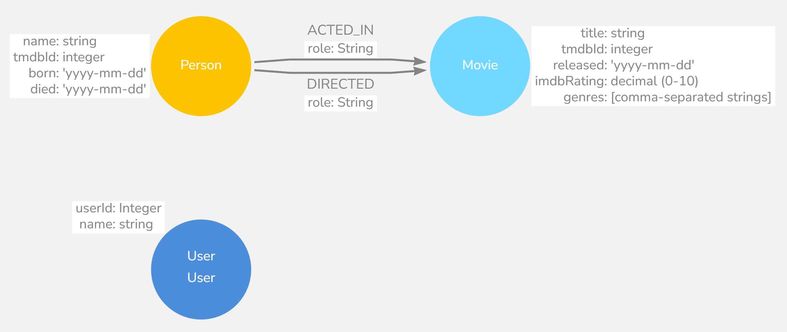

## 03 Modeling Relationships

Relationships are what connect nodes and give the graph a power, allowing you to traverse and query connected data efficiently.

### Defining Relationships

Connections are the **verbs** in use cases.

At a glance, cconnections are strightforward things, but their micro- and macro-design are arguably the most critical factors in graph performance.

According to naming relationships, we use the Neo4j best practice of all capital letters/underscore characters.

When you create a relationship in Neo4j, a direction must either be specified explicitly or inferred by the left-to-right direction in the pattern specified. While, at the runtime, during a query, direction is typically not required.

A relationship is typically between 2 different nodes, but it can also be to the same node.

Properties for a relationship are used to enrich how two nodes are related. When you define a property for a relationship, it is because your use cases ask a specific question about how two nodes are related, not just that they are related.

#### Relationships in the Movie graph

Data Model:


Instance Model:


#### Properties for Relationships


#### Relationships Properties in the Movie Graph

Data Model:


Instance Model:


### Creating Initial Relationships

```SQL
MATCH (apollo:Movie {title: 'Apollo 13'})
MATCH (sleep:Movie {title: 'Sleepless in Seattle'})
MATCH (hoffa:Movie {title: "Hoffa"})

MATCH (tom:Person {name: "Tom Hanks"})
MATCH (meg:Person {name: "Meg Ryan"})
MATCH (danny:Person {name: 'Danny DeVito'})
MATCH (jack:Person {name: 'Jack Nicholson'})

MERGE (tom)-[a1:ACTED_IN {role: 'Jim Lovell'}]->(apollo)
MERGE (tom)-[a2:ACTED_IN {role: 'Sam Baldwin'}]->(sleep)
MERGE (meg)-[a3:ACTED_IN {role: 'Annie Reed'}]->(sleep)
MERGE (danny)-[a4:ACTED_IN {role: 'Bobby Ciaro'}]->(hoffa)
MERGE (jack)-[a5:ACTED_IN {role: 'Jimmy Hoffa'}]->(hoffa)

MERGE (danny)-[d:DIRECTED]->(hoffa)

RETURN apollo, sleep, hoffa, tom, meg, danny, jack, a1, a2, a3, a4, a5, d
```

Result:

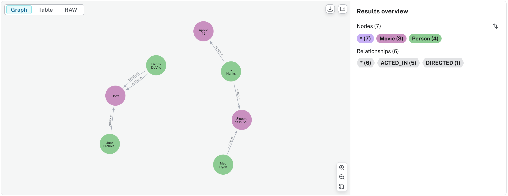

### Identifying a New Relationships

### Creating More Relationships

```SQL
MATCH (apollo:Movie {title: 'Apollo 13'})
MATCH (sleep:Movie {title: 'Sleepless in Seattle'})
MATCH (hoffa:Movie {title: "Hoffa"})

MATCH (sandy:User {name: 'Sandy Jones'})
MATCH (clinton:User {name: 'Clinton Spencer'})

MERGE (sandy)-[r1:RATED {rating: 5}]->(apollo)
MERGE (sandy)-[r2:RATED {rating: 4}]->(sleep)
MERGE (clinton)-[r3:RATED {rating: 3}]->(apollo)
MERGE (clinton)-[r4:RATED {rating: 3}]->(sleep)
MERGE (clinton)-[r5:RATED {rating: 3}]->(hoffa)

RETURN apollo, sleep, hoffa, sandy, clinton, r1, r2, r3, r4, r5
```

Result:

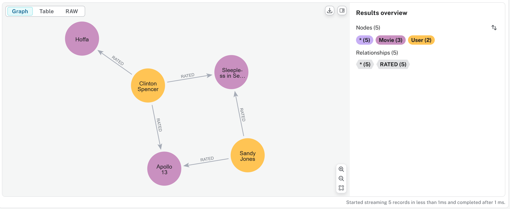

After this chapter, using `MATCH (n)-[r]-(m) RETURN n, r, m` to display full graph - nodes and relationships - so far:

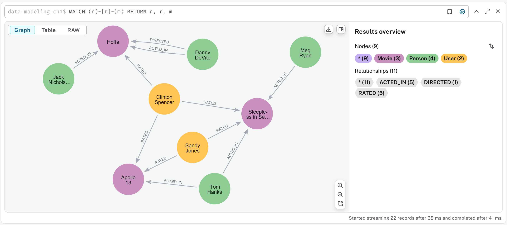

## 04 Testing the Model

Testing is a critical step to ensure that your model supports all the required queries and use cases efficiently before moving to production.

### Testing during Data Modeling

arrow.app: https://arrows.app/ is the tool that you can design the data model.

To ensure the graph can satisfy every use case, you must test the use cases against the graph.

### Testing with Instance Model

Use case #1: What `person` `acted in` a `movie`?

```SQL
MATCH (p:Person)-[a:ACTED_IN]->(m:Movie)
WHERE m.title CONTAINS "Seattle"
RETURN p.name AS Actor, m.title
```

Use case #2: What `person` `directed` a `movie`?

```SQL
MATCH (p:Person)-[d:DIRECTED]->(m:Movie)
WHERE m.title CONTAINS "Hoffa"
RETURN p.name AS Director, m.title AS Movie
```

Use case #3: What `movies` did a `person` `act in`?

```SQL
MATCH (p:Person)-[a:ACTED_IN]->(m:Movie)
WHERE p.name = "Tom Hanks"
RETURN p.name AS Actor, m.title AS Movie
```

Use case #4: How many `users` `rated` a `movie`?

```SQL
MATCH (u:User)-[r:RATED]->(m:Movie {title: "Apollo 13"})
RETURN COUNT(DISTINCT u)
// RETURN u.name, r.rating
```

Use case #5: Who was the youngest `person` to `act in` a `movie`?

```SQL
MATCH (p:Person)-[:ACTED_IN]->(m:Movie)
WHERE m.title = "Hoffa"
RETURN p.name, p.born ORDER BY p.born DESC LIMIT 1
```

Use case #6: What `role` did a `person` `play in` a `movie`?

```SQL
MATCH (p:Person)-[a:ACTED_IN]->(m:Movie)
WHERE m.title = "Sleepless in Seattle" AND p.name = "Meg Ryan"
RETURN p.name, a.role AS Role
```

Use case #7: What is the highest `rated` `movie` in a particular `year` according to imDB?

```SQL
MATCH (u:User)-[r:RATED]->(m:Movie)
WHERE m.released STARTS WITH "1995"
RETURN m.title, r.rating AS Rating ORDER BY r.rating DESC
```

```SQL
MERGE (casino:Movie {title: 'Casino', tmdbId: 524, released: '1995-11-22', imdbRating: 8.2, genres: ['Drama','Crime']})
MERGE (martin:Person {name: 'Martin Scorsese', tmdbId: 1032})
MERGE (martin)-[:DIRECTED]->(casino)
```

```SQL
MATCH (m:Movie)
WHERE m.released STARTS WITH '1995'
RETURN  m.title as Movie, m.imdbRating as Rating ORDER BY m.imdbRating DESC LIMIT 1
```

Use case #8: What `drama` `movies` did an `actor` `act in?

```SQL
MATCH (p:Person)-[:ACTED_IN]->(m:Movie)
WHERE p.name = "Tom Hanks" AND "Drama" IN m.genres
RETURN m.title
```

Use case #9: What `users` gave a `movie` a `rating` of 5?

```SQL
MATCH (u:User)-[r:RATED]->(m:Movie)
WHERE r.rating = 5 AND m.title = "Apollo 13"
RETURN u.name, m.title
```

## 05 Refactoring the Graph

Refactoring is an essential skill as your understanding of the domain evolves and new requirements emerge.

### Refactoring 重构

Refactoring is the process of changing the data model and the graph.

There are 3 reasons why you would refactor:
1. The graph as modeled does not answer all of the use cases.
2. A new use case has come up that you must account for in your data model.
3. The Cypher for the use cases does not perform optimally, especially when the graph scales.

Steps for refactoring are as below:

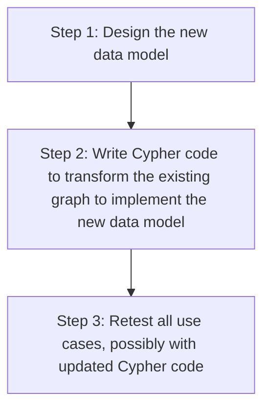

### Labels in the Graph

Labels at Runtime: node labels serve as an anchor point for a query, by specifying a label, we are specifying a subset of one or more nodes with which to start a query. Using a label helps to reduce the amount of data that is retrieved.

DO NOT overuse labels, a best practice is to limit the number of labels for a node to 4.

You can use `PROFILE` keyword to see the performance for a question, like below example:

```SQL
PROFILE MATCH (p:Person)-[:ACTED_IN]-()
WHERE p.born < "1950"
RETURN p.name
```

Refactor the graph to add `Actor` to `Person` nodes:

```SQL
MATCH (p:Person)
WHERE exists ((p)-[:ACTED_IN]-())
SET p.Actor
```

### Adding the Actor Label

```SQL
MATCH (p:Person)
WHERE exists ((p)-[:ACTED_IN]-())
SET p:Actor
```

### Retesting after Refactoring

After refactoring, you should revisit all queries for your use cases.

### Retesting with Actor Label

### Adding the Director Label

```SQL
MATCH (p:Person) 
WHERE exists ((p)-[:DIRECTED]->()) 
SET p:Director
```

### Avoid These Labels

"**Semantically Orthogonal**" is a fancy term that means that labels should have nothing to do with one another.

You should be careful not to use the same type of label in different contexts. e.g. using the region for all types of nodes is not useful for most queries.

You also want to avoid labeling your nodes to represent hierarchies.

## 06 Eliminating Duplicate Data

By converting repeated property values into dedicated nodes, you can improve query performance, reduce storage overhead, and make your model more maintainable.

### Duplicate Data

You should take care to avoid duplicating data in your graph.

### Adding Language Data

```SQL
MATCH (apollo:Movie {title: 'Apollo 13'})
MATCH (sleep:Movie {title: 'Sleepless in Seattle'})
MATCH (hoffa:Movie {title: 'Hoffa'})
MATCH (casino:Movie {title: 'Casino'})
SET apollo.language = ['English']
SET sleep.language = ['English']
SET hoffa.language = ['English', 'Italian', 'Latin']
SET casino.language = ['English']
RETURN apollo, sleep, hoffa, casino
```

To validate Use case #11: What movies are available in a particular language?

```SQL
MATCH (m:Movie)
WHERE 'Italian' IN m.language
RETURN m.title
```

### Refactoring Duplicate Data

Below steps refactoring properties as nodes:
1. Take the property value for each `Movie` node and create a `Language` node
2. Create the `IN_LANGUAGE` relationship between that `Movie` node and the `Language` node
3. Remove the languages property from the `Movie` node

### Adding Language Nodes

```SQL
MATCH (m:Movie)
UNWIND m.languages AS language

MERGE (l:Language {name:language})
MERGE (m)-[:IN_LANGUAGE]->(l)
SET m.languages = null
```

The Cypher `UNWIND` clause separates each element fo the `languages` property list into a separate row value that is processed later in the query.

### Adding Genre Nodes

```language=cypher
MATCH (m:Movie)
UNWIND m.genres as genre
MERGE (g:Genre {name:genre})
MERGE (m)-[:IN_GENRE]->(g)
SET m.genres = null
```

### Eliminating Complex Data in Nodes

If there is a high amount of duplicate data in the nodes or if key questions of your use cases would perform better if all nodes need not be retrieved to get at the complex data, then you might consider refactoring the graph.

Creating new `ProductionCompany` nodes:

```SQL
MATCH (m:Movie {title: 'Hoffa'})
MERGE (pc:ProductionCompany {address1: '10351 Santa Monica Blvd', city: 'Los Angeles', state: 'CA', postalCode: 90049, country: 'US', name: 'Jersey Films'})
MERGE (pc)-[p:PRODUCED]->(m)
RETURN m, p, pc
```

```SQL
MATCH (m:Movie {title: 'Apollo 13'})
MERGE (pc:ProductionCompany {address1: '150 S El Camino Drive', city: 'Beverly Hills', state: 'CA', postalCode: 90212, country: 'US', name: 'Imagine Entertainment'})
MERGE (pc)-[p:PRODUCED]->(m)
RETURN m, p, pc
```

Refactoring to eleminate complex data structure:

```SQL
MATCH (pc:ProductionCompany)
MERGE (a:Address {address1:pc.address1, city:pc.city, postalCode:pc.postalCode})
MERGE (s:State {name:pc.state})
MERGE (c:Country {name:pc.country})
MERGE (pc)-[r1:LOCATED_AT]->(a)
MERGE (a)-[r2:IN_STATE]->(s)
MERGE (s)-[r3:IN_COUNTRY]->(c)
RETURN pc, a, s, c, r1, r2, r3
```

Clean up properties in old `ProductionCompany` nodes:

```SQL
MATCH (pc:ProductionCompany)
SET pc.address1 = null, pc.city = null, pc.state = null, pc.postalCode = null, pc.country = null
RETURN pc
```

## 07 Using Specific Relationships

### Relationships in the Graph

Neo4j - as a native graph database - is implemented to traverse relationships quickly. In some cases, ikt is more performant to query the graph based upon relationship types, rather than properties in the nodes.

Relationships are fast to traverse and they do not take up a lot of space in the graph.

The `apoc.merge.relationship` procedure allows to **dynamically** create relationships in the graph.

### Specializing `ACTED_IN` and `DIRECTED` Relationships

#### Use case #12: What `movies` did an `actor act` in for a particular `year`?

| Query before Specializing Relatiohship | Performance from PROFILE |
| --- | --- |
| MATCH (p:Actor)-[:ACTED_IN]-(m:Movie)<br>WHERE p.name = 'Tom Hanks' AND m.released STARTS WITH '1995'<br>RETURN m.title AS Movie |  |

```SQL
MATCH (n:Actor)-[:ACTED_IN]->(m:Movie)
CALL apoc.merge.relationship(
  n,
  'ACTED_IN_' + left(m.released,4),
  {},
  {},
  m ,
  {}
) YIELD rel
RETURN count(*) AS `Number of relationships merged`;
```

| Query after Specializing Relatiohship | Performance from PROFILE |
| --- | --- |
| MATCH (p:Person)-[:ACTED_IN_1995]->(m:Movie)<br>WHERE p.name = 'Tom Hanks'<br>RETURN m.title AS Movie | 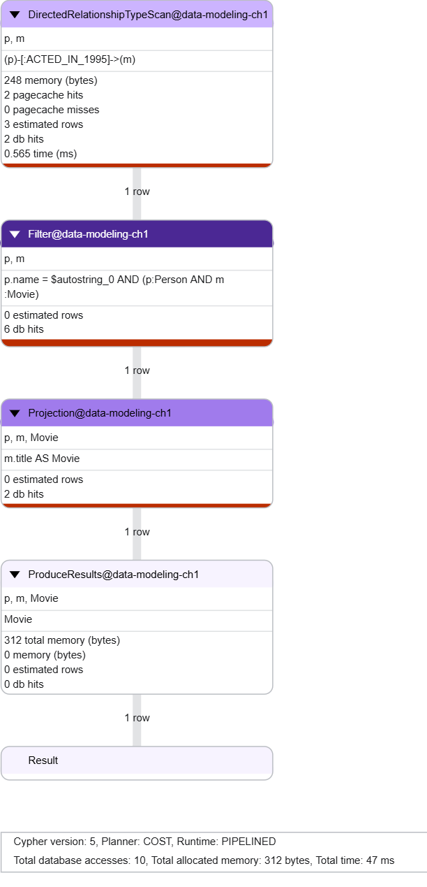 |

#### Use case #13: What `actors` or `directors` `worked in` a particular `year`?

| Query before Specializing Relatiohship | Performance from PROFILE |
| --- | --- |
| MATCH (p:Person)--(m:Movie)<br>WHERE m.released STARTS WITH '1995'<br>RETURN DISTINCT p.name as `Actor or Director` | 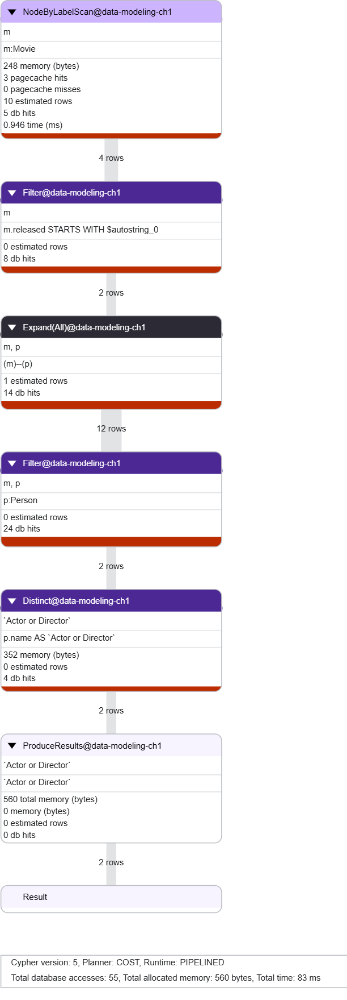 |

```SQL
MATCH (n:Actor)-[:DIRECTED]->(m:Movie)
CALL apoc.merge.relationship(
  n,
  'DIRECTED_' + left(m.released,4),
  {},
  {},
  m ,
  {}
) YIELD rel
RETURN count(*) AS `Number of relationships merged`;
```

| Query after Specializing Relatiohship | Performance from PROFILE |
| --- | --- |
| MATCH (p:Person)-[:ACTED_IN_1995\|:DIRECTED_1995]->()<br>RETURN p.name AS `Actor or Director` | 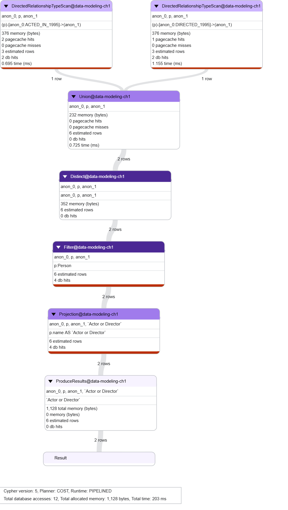 |

### Specializing `RATED` Relationships (Use case #9)

| Query before Specializing Relatiohship | Performance from PROFILE |
| --- | --- |
| MATCH (u:User)-[r:RATED]->(m:Movie)<br>WHERE m.title = 'Apollo 13' AND r.rating = 5<br>RETURN u.name AS Reviewer, m.title | 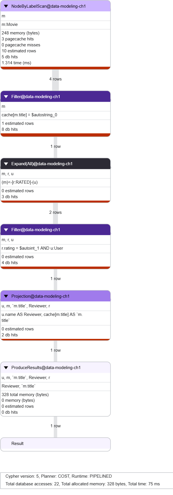 |

Refactor into below specialized `RATED` relationship:

```SQL
MATCH (u:User)-[:RATED]->(m:Movie)
CALL apoc.merge.relationship(
  u,
  'RATED_' + r.rating,
  {},
  {},
  m,
  {}
) YIELD rel
RETURN COUNT(*) AS `Number of relationships added`;
```

| Query after Specializing Relatiohship | Performance from PROFILE |
| --- | --- |
| MATCH (u:User)-[r:RATED_5]->(m:Movie)<br>WHERE m.title = 'Apollo 13'<br>RETURN u.name AS Reviewer, m.title | 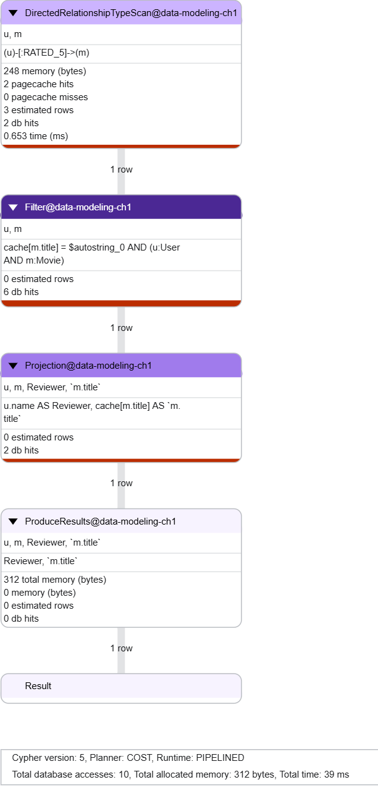 |

### Data Model (Visualized) So Far

After above refactoring on specialing relationships, here is the latest schema:

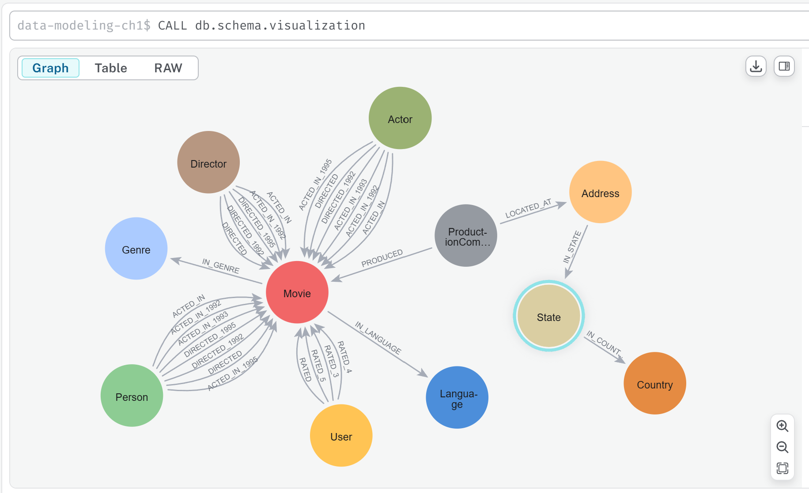

## 08 Adding Intermediate Nodes

Intermediate nodes allow you to add context and additional information to relationships, making your model more expressive and powerful.

### Intermediat Nodes

#### Example of Adding intermediate node for handling hyperedges

Example Instance Model:


Query for creating this example:

```SQL
MERGE (p:Person {name: 'Mary Smith', dob: '1990-11-19'})
MERGE (c:Company {name: 'Graph Inc.', city:'Malmo', country:'Sweden'})
MERGE (p)-[w:WORKS_AT {dates:['2018-07-18 - 2019-10-15', '2019-10-16 - present'], roles: ['Software Engineer', 'Senior Software Engineer']}]->(c)
RETURN p, w, c
```

Adding intermediate nodes:

```SQL
MATCH (p:Person {name: 'Mary Smith'})-[w:WORKS_AT]->(c:Company {name: 'Graph Inc.'})
MERGE (e1:Employment {from:left(w.dates[0],10), to:right(w.dates[0],10)})
MERGE (e2:Employment {from:left(w.dates[1],10), to:right(w.dates[1],10)})
MERGE (s1:Role {name:w.roles[0]})
MERGE (s2:Role {name:w.roles[1]})
MERGE (p)-[w1:WORKED]->(e1)
MERGE (p)-[w2:WORKED]->(e2)
MERGE (e1)-[r1:IN_ROLE]->(s1)
MERGE (e1)-[r2:AT_COMPANY]->(c)
MERGE (e2)-[r3:IN_ROLE]->(s2)
MERGE (e2)-[r4:AT_COMPANY]->(c)
RETURN p, e1, e2, s1, s2, c, w1, w2, r1, r2, r3, r4
```


#### Example of Adding intermediate nodes for sharing data

The graph before we factor it:


Query to create the instance model:

```SQL
MATCH (u1:User {name:'Mary Smith'})
SET u1.email = 'mary.smith@gmail.com'
MERGE (u2:User {name:'Lucy Smith', email:'lucy.smith@gmail.com'})
MERGE (u3:User {name:'David Smith', email:'david.smith@gmail.com'})
MERGE (u4:User {name:'John Smith', email:'John.smith@gmail.com'})
MERGE (u1)-[e1:EMAILED {message:'xxxxx'}]->(u2)
MERGE (u1)-[e2:CCD {message:'xxxxx'}]->(u3)
MERGE (u1)-[e3:CCD {message:'xxxxx'}]->(u4)
RETURN u1, u2, u3, u4, e1, e2, e3
```

Refactor to create intermediate nodes - `Email`:


```SQL
MATCH (u1:User {name:'Mary Smith'})
SET u1.email = 'mary.smith@gmail.com'
MERGE (u2:User {name:'Lucy Smith', email:'lucy.smith@gmail.com'})
MERGE (u3:User {name:'David Smith', email:'david.smith@gmail.com'})
MERGE (u4:User {name:'John Smith', email:'John.smith@gmail.com'})
MERGE (u1)-[e1:EMAILED {message:'xxxxx'}]->(u2)
MERGE (u1)-[e2:CCD {message:'xxxxx'}]->(u3)
MERGE (u1)-[e3:CCD {message:'xxxxx'}]->(u4)
RETURN u1, u2, u3, u4, e1, e2, **e3**
```

Schema so far:

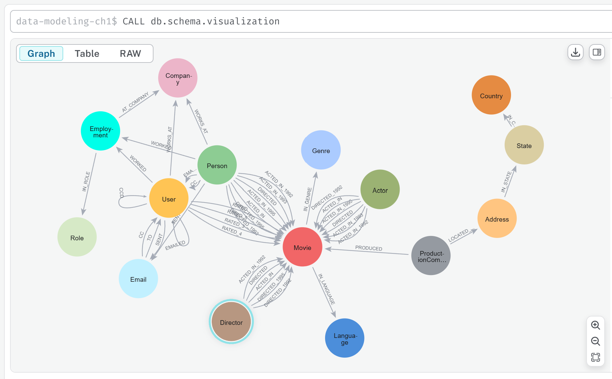

### Adding a Role Node

```SQL
MATCH (a:Actor)-[r:ACTED_IN]->(m:Movie)
MERGE (x:Role {name:r.role})
MERGE (a)-[r1:PLAYED]->(x)
MERGE (x)-[r2:IN_MOVIE]->(m)
RETURN a, r, m, x, r1, r2
```

Add `INTERACTED_WITH` relationship:

```SQL
MERGE (r1:Role)-[i1:IN_MOVIE]->(m:Movie)<-[i2:IN_MOVIE]-(r2:Role)
MERGE (r1)-[w:INTERACTED_WITH]->(r2)
RETURN r1, i1, m, i2, r2, w
```

Schema after chapter 8:

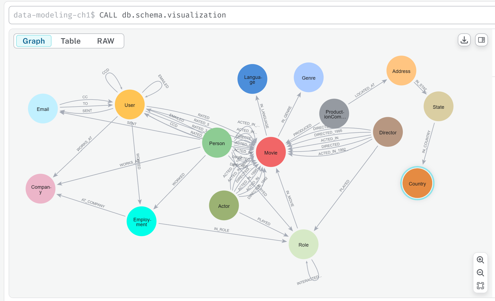

## 09 Course Summary

Complete DB Dump is here: [data-modeling-2025-11-09T02-43-32.dump](../db_dump/data-modeling-2025-11-09T02-43-32.dump), enjoy!

---

## Demo Course

This is the 3rd packaged courses that you may find in Udemy now, after `Neo4j Fundamentals` and `Cypher Fundamentals`, use below link to enroll the course and start learning now:

English Language Version:

- [1. Neo4j Fundamentals - Demo and Hands On Practice](https://www.udemy.com/course/graph-database-neo4j-fundamentals/?referralCode=A1B6F8575B9981D1F770)
- [2. Cypher Fundamentals - Demo and Hands On Practice](https://www.udemy.com/course/graph-database-2-neo4j-cypher-fundamentals-learn-by-hand/?referralCode=C9E7F41F45B9E097078D)
- [3. Graph Data Modeling Fundamentals (this one) - Demo and Hands On Practice](https://www.udemy.com/course/graph-database-3-neo4j-graph-data-modeling-fundamentals/?referralCode=E1A967D24DC1380C0750)

Chinese Language Version:

- [1. 图形数据库 1 - Neo4j基础入门 - 实操与练习](https://www.udemy.com/course/neo4j-fundamental-chn/?referralCode=741F6AF4EADD83261F20)

Welcome to help promoting then! Looking forward to hear your comments and questions.

---

Updated at: 2025-11-08