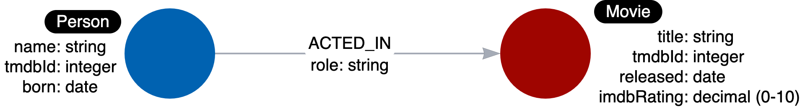

# Graph Data Modeling Fundamentals

- [Graph Data Modeling Fundamentals](#graph-data-modeling-fundamentals)
  - [01 Getting Started](#01-getting-started)
    - [Why Model?](#why-model)
    - [The Domain](#the-domain)
    - [Types of Models](#types-of-models)
    - [Style Guidelines for Modeling](#style-guidelines-for-modeling)
  - [02 Modeling Nodes](#02-modeling-nodes)
    - [Defining Nodes](#defining-nodes)
    - [Creating Nodes](#creating-nodes)
    - [Identifying a New Label](#identifying-a-new-label)
    - [Creating More Nodes](#creating-more-nodes)
  - [03 Modeling Relationships](#03-modeling-relationships)
    - [Defining Relationships](#defining-relationships)
    - [Creating Initial Relationships](#creating-initial-relationships)
    - [Identifying a New Relationships](#identifying-a-new-relationships)
    - [Creating More Relationships](#creating-more-relationships)
  - [04 Testing the Model](#04-testing-the-model)
    - [Testing during Data Modeling](#testing-during-data-modeling)
    - [Testing with Instance Model](#testing-with-instance-model)
  - [05 Refactoring the Graph](#05-refactoring-the-graph)
    - [Refactoring 重构](#refactoring-重构)
    - [Labels in the Graph](#labels-in-the-graph)
    - [Adding the Actor Label](#adding-the-actor-label)
    - [Retesting after Refactoring](#retesting-after-refactoring)
    - [Retesting with Actor Label](#retesting-with-actor-label)
    - [Adding the Director Label](#adding-the-director-label)
    - [Avoid These Labels](#avoid-these-labels)
  - [06 Eliminating Duplicate Data](#06-eliminating-duplicate-data)
    - [Duplicate Data](#duplicate-data)
    - [Adding Language Data](#adding-language-data)
    - [Refactoring Duplicate Data](#refactoring-duplicate-data)
    - [Adding Language Nodes](#adding-language-nodes)
    - [Adding Genre Nodes](#adding-genre-nodes)
    - [Eliminating Complex Data in Nodes](#eliminating-complex-data-in-nodes)
  - [07 Using Specific Relationships](#07-using-specific-relationships)
    - [Relationships in the Graph](#relationships-in-the-graph)
    - [Specializing `ACTED_IN` and `DIRECTED` Relationships](#specializing-acted_in-and-directed-relationships)
    - [Specializing `RATED` Relationships](#specializing-rated-relationships)
  - [08 Adding Intermediate Nodes](#08-adding-intermediate-nodes)
    - [Intermediat Nodes](#intermediat-nodes)
    - [Adding a Role Node](#adding-a-role-node)
  - [09 Course Summary](#09-course-summary)

## 01 Getting Started

### Why Model?

Componentes of a Neo4j Graph: Nodes, Labels, Relationships, Properties


Graph Data Modeling is an iterative process:
- your initial graph data model is a starting point, but as you learn more about the use cases or if the use cases change, the initial graph data model will need to change.
- in addition, you may find that especially when the graph scales, you will need to modify the graph (`refactor`) to achieve the best performance for your key use cases.

### The Domain

Before you begin the data modeling process, you must:
- Identify the stakeholders and developers of the application.
- With the stakeholders and developers:
  - Describe the application in detail
  - Identify the users of the application (people, systems)
  - Agree upon the use cases for the application
  - Rank the importance of the use cases

What makes the domain interesting are the connections or relationships between nodes in a graph.

Most use cases for an application can be enumerated by a comprehensive list of questions. The use cases help to define how the application will behave at runtime.

### Types of Models

When performing the graph data modeling process for an application, you need two types of models at least:
- Data Model: describes the labels, relationships, and properties for the graph, it does not have specific data that will be created in the graph.

- Instance Model: to test the model against the use cases, you need to have a set of sample data that you can use to see if the use cases can be answered with the model.


Use below Cypher command in Neo4j to check the Data Model:

```SQL
CALL db.schema.visualization
```

For Movie graph (v5.26), below is the schema (data model):


### Style Guidelines for Modeling

In Neo4j, `labels`, `relationship types`, and `property keys` are case-sensitive, unlike Cypher `keywords` which are case-insensitive.

A Neo4j best practice is to use the following when you name the elements of the graph:
- A `label` is a single identifier that begins with a capital letter and can be CamelCase
  - Examples: Person, Company, GitHubRepo
- A `relationship type` is a single identifier that is in all capital letters with the underscore character
  - Examples: FOLLOWS, MARRIED_TO, ACTORED_IN
- A `property key` for a node or a relationship is a single identifier that begins with a lower-case letter and can be camelCase
  - Examples: deptId, firstName

CamelCase: https://en.wikipedia.org/wiki/Camel_case

camelCase: https://en.wikipedia.org/wiki/Camel_case

## 02 Modeling Nodes

`Nodes` are the fundamental building blocks that represent the entities in your domain.

### Defining Nodes

Entities are the dominant nouns in your application use cases, they will be the labeled nodes in the graph data model.

Label names are using CamelCase format.

Node can have properties, whcih are used to:
- uniquely identify a nodd
- answer specific details of the use cases for the applications
- return data

As example in Movie graph, the properties are used to:
- Anchor (where to begin the query):
  - `MATCH (p:Person {name: 'Tom Hanks'})-[:ACTED_IN]-(m:Movie) RETURN m`
- Traverse the graph (navigation):
  - `MATCH (p:Person)-[:ACTED_IN]-(m:Movie {title: 'Apollo 13'})-[:RATED]-(u:User) RETURN p, u`
- Return data from the query:
  - `MATCH (p:Person {name: 'Tom Hanks'})-[:ACTED_IN]-(m:Movie) RETURN m.title, m.released`

You can use below Cypher to retrieve list of node properties:

```SQL
CALL db.schema.nodeTypeProperties
```


### Creating Nodes

### Identifying a New Label

### Creating More Nodes

Note on the case sentitivity: the property names and values are case-sensitive!

## 03 Modeling Relationships

Relationships are what connect nodes and give the graph a power, allowing you to traverse and query connected data efficiently.

### Defining Relationships

Connections are the **verbs** in use cases.

At a glance, cconnections are strightforward things, but their micro- and macro-design are arguably the most critical factors in graph performance.

According to naming relationships, we use the Neo4j best practice of all capital letters/underscore characters.

When you create a relationship in Neo4j, a direction must either be specified explicitly or inferred by the left-to-right direction in the pattern specified. While, at the runtime, during a query, direction is typically not required.

A relationship is typically between 2 different nodes, but it can also be to the same node.

Properties for a relationship are used to enrich how two nodes are related. When you define a property for a relationship, it is because your use cases ask a specific question about how two nodes are related, not just that they are related.

### Creating Initial Relationships

### Identifying a New Relationships

### Creating More Relationships

## 04 Testing the Model

Testing is a critical step to ensure that your model supports all the required queries and use cases efficiently before moving to production.

### Testing during Data Modeling

arrow.app: https://arrows.app/ is the tool that you can design the data model.

To ensure the graph can satisfy every use case, you must test the use cases against the graph.

### Testing with Instance Model

## 05 Refactoring the Graph

Refactoring is an essential skill as your understanding of the domain evolves and new requirements emerge.

### Refactoring 重构

Refactoring is the process of changing the data model and the graph.

There are 3 reasons why you would refactor:
1. The graph as modeled does not answer all of the use cases.
2. A new use case has come up that you must account for in your data model.
3. The Cypher for the use cases does not perform optimally, especially when the graph scales.

Steps for refactoring are as below:


### Labels in the Graph

Labels at Runtime: node labels serve as an anchor point for a query, by specifying a label, we are specifying a subset of one or more nodes with which to start a query. Using a label helps to reduce the amount of data that is retrieved.

DO NOT overuse labels, a best practice is to limit the number of labels for a node to 4.

You can use `PROFILE` keyword to see the performance for a question, like below example:

```SQL
PROFILE MATCH (p:Person)-[:ACTED_IN]-()
WHERE p.born < "1950"
RETURN p.name
```

Refactor the graph to add `Actor` to `Person` nodes:

```SQL
MATCH (p:Person)
WHERE exists ((p)-[:ACTED_IN]-())
SET p.Actor
```

### Adding the Actor Label

### Retesting after Refactoring

After refactoring, you should revisit all queries for your use cases.

### Retesting with Actor Label

### Adding the Director Label

```SQL
MATCH (p:Person) 
WHERE exists ((p)-[:DIRECTED]->()) 
SET p:Director
```

### Avoid These Labels

"**Semantically Orthogonal**" is a fancy term that means that labels should have nothing to do with one another.

You should be careful not to use the same type of label in different contexts. e.g. using the region for all types of nodes is not useful for most queries.

You also want to avoid labeling your nodes to represent hierarchies.

## 06 Eliminating Duplicate Data

By converting repeated property values into dedicated nodes, you can improve query performance, reduce storage overhead, and make your model more maintainable.

### Duplicate Data

You should take care to avoid duplicating data in your graph.

### Adding Language Data

### Refactoring Duplicate Data

Below steps refactoring properties as nodes:
1. Take the property value for each `Movie` node and create a `Language` node
2. Create the `IN_LANGUAGE` relationship between that `Movie` node and the `Language` node
3. Remove the languages property from the `Movie` node

### Adding Language Nodes

```SQL
MATCH (m:Movie)
UNWIND m.languages AS language

MERGE (l:Language {name:language})
MERGE (m)-[:IN_LANGUAGE]->(l)
SET m.languages = null
```

The Cypher `UNWIND` clause separates each element fo the `languages` property list into a separate row value that is processed later in the query.

### Adding Genre Nodes

```language=cypher
MATCH (m:Movie)
UNWIND m.genres as genre
MERGE (g:Genre {name:genre})
MERGE (m)-[:IN_GENRE]->(g)
SET m.genres = null
```

### Eliminating Complex Data in Nodes

If there is a high amount of duplicate data in the nodes or if key questions of your use cases would perform better if all nodes need not be retrieved to get at the complex data, then you might consider refactoring the graph.

## 07 Using Specific Relationships

### Relationships in the Graph

Neo4j - as a native graph database - is implemented to traverse relationships quickly. In some cases, ikt is more performant to query the graph based upon relationship types, rather than properties in the nodes.

The `apoc.merge.relationship` procedure allows to **dynamically** create relationships in the graph.

### Specializing `ACTED_IN` and `DIRECTED` Relationships

```SQL
MATCH (n:Actor)-[:ACTED_IN]->(m:Movie)
CALL apoc.merge.relationship(
  n,
  'ACTED_IN_' + left(m.released,4),
  {},
  {},
  m ,
  {}
) YIELD rel
RETURN count(*) AS `Number of relationships merged`;
```

```SQL
MATCH (n:Actor)-[:DIRECTED]->(m:Movie)
CALL apoc.merge.relationship(
  n,
  'DIRECTED_' + left(m.released,4),
  {},
  {},
  m ,
  {}
) YIELD rel
RETURN count(*) AS `Number of relationships merged`;
```

### Specializing `RATED` Relationships

From this original query:

```SQL
MATCH (u:User)-[r:RATED]->(m:Movie)
WHERE m.title = 'Apollo 134' AND r.rating = 5
RETURN u.name as Reviewer
```

Refactor into below specialized `RATED` relationship:

```SQL
MATCH (u:User)-[:RATED]->(m:Movie)
CALL apoc.merge.relationship(
  u,
  'RATED_' + r.rating,
  {},
  {},
  m,
  {}
) YIELD rel
RETURN COUNT(*) AS `Number of relationships added`;
```

## 08 Adding Intermediate Nodes

Intermediate nodes allow you to add context and additional information to relationships, making your model more expressive and powerful.

### Intermediat Nodes

### Adding a Role Node

```SQL
MATCH (a:Actor)-[:ACTED_IN]->(m:Movie)
MERGE (x:)
``

## 09 Course Summary

---

Updated at: 2025-10-31