# Neo4j - Importing Data Fundamentals

- [Neo4j - Importing Data Fundamentals](#neo4j---importing-data-fundamentals)
  - [Contents](#contents)
  - [1. Importing Data into Neo4j](#1-importing-data-into-neo4j)
    - [1.1 Getting Started](#11-getting-started)
    - [1.2 How can I import data into Neo4j?](#12-how-can-i-import-data-into-neo4j)
    - [1.3 Tools](#13-tools)
  - [2. Neo4j Data Importer](#2-neo4j-data-importer)
    - [2.1 Data Importer](#21-data-importer)
    - [2.2 Properties and Types](#22-properties-and-types)
    - [2.3 Add Movie Nodes](#23-add-movie-nodes)
    - [2.4 Unique IDs and Constraints](#24-unique-ids-and-constraints)
    - [2.5 Creating Relationships](#25-creating-relationships)
    - [2.6 Add Directed Relationship](#26-add-directed-relationship)
    - [2.7 Add Users Ratings](#27-add-users-ratings)
    - [2.8 Data Importer Considerations](#28-data-importer-considerations)
  - [3. Source Data Considerations](#3-source-data-considerations)
    - [3.1 Understanding the Source Data](#31-understanding-the-source-data)
    - [3.2 Developing a Data Model](#32-developing-a-data-model)
    - [3.3 Import your CSV File](#33-import-your-csv-file)

## Contents

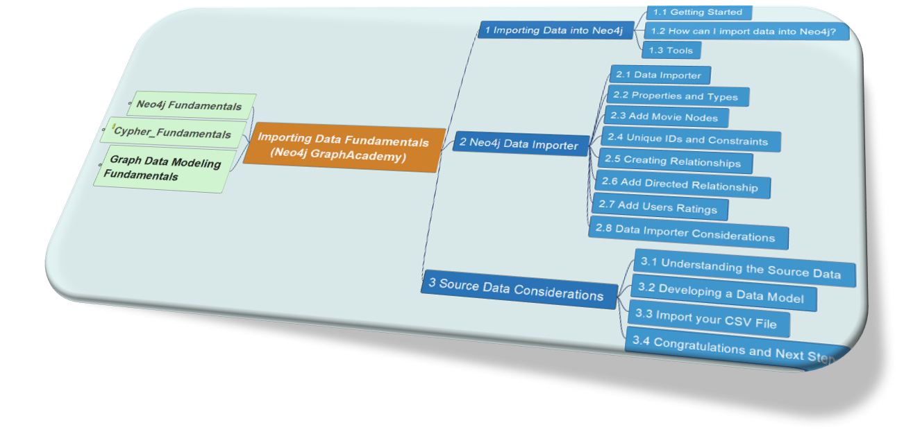

Learning objectives:

- Creating nodes, labels, relationships, and properties from data in **CSV** files.
- Setting **unique** IDs and **constraints**.
- Creating **indexes** to improve query performance.

## 1. Importing Data into Neo4j

### 1.1 Getting Started

Neo4j Data Importer: https://data-importer.neo4j.io/

Neo4j Sandbox: https://sandbox.neo4j.com/

### 1.2 How can I import data into Neo4j?

The source may expose data in different ways, for example:

- Relational Database Management Systems (RDBMS)
- Web APIs
- Public data directories
- BI tools
- Excel
- Flat files (CSV, JSON, XML)

The method by which you import data into Neo4j will depend on several factors, including:

- The source of the data
- The volume of data
- The frequency of the import
- The complexity of the data model
- The transformation required

The options available to you are numerous, and include:

- One-off batch import of all data
- One-off load with a regular update
- Continuous import of data
- Real-time application updates
- ETL (Extract, Transform, Load) pipelines

Potential options and tools for data importing:


### 1.3 Tools

| Tool | Illustration |
| --- | --- |
| Data Importer |  |
| Cypher and LOAD CSV | 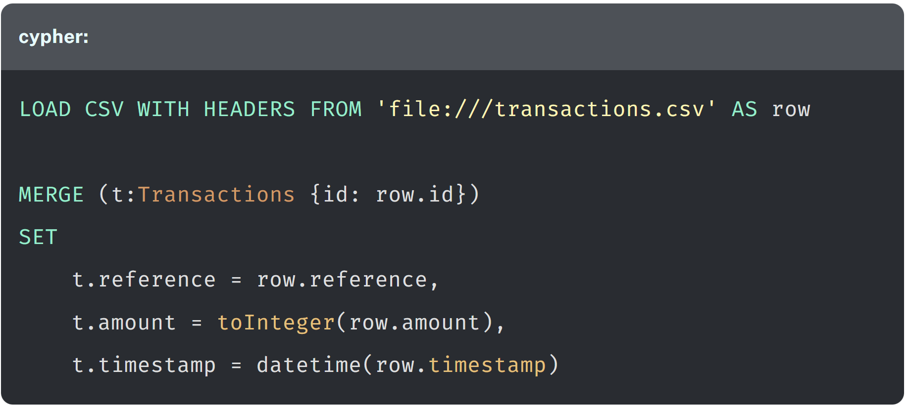 |
| neo4j-admin | 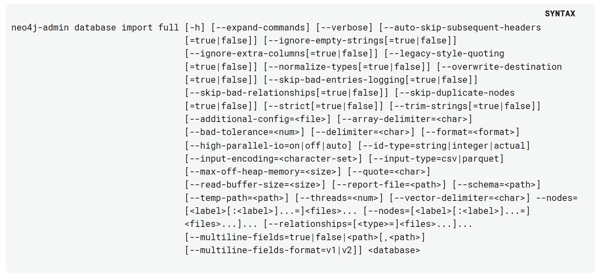
| ETL tools | [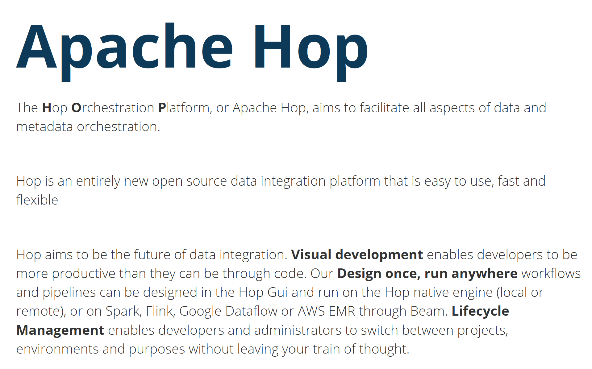](https://hop.apache.org/) |
| Custom Application | A custom application will allow you complete control over the import process and integration with other systems and data sources. |

## 2. Neo4j Data Importer

### 2.1 Data Importer

In order to create nodes using Data Importer, you must do:

- Upload a source file
- Create a node label
- Set a unique identifier for each node
- ... while, you don't have to update any perperty names.

```SQL
LOAD CSV WITH HEADERS FROM 'file:///D://GitHub//learn_graphdb//neo4j//import_data_fundamentals//docs//person-import//persons.csv' AS row
MERGE (p:Person {tmdbId: row.person_tmdbId})
SET
  p.bio = row.bio,
  p.born = row.born,
  p.bornIn = row.bornIn,
  p.died = row.died,
  p.imdbId = row.person_imdbId,
  p.name = row.name,
  p.poster = row.person_poster,
  p.url = row.person_url
```


### 2.2 Properties and Types

Data Importer allow you to select specific properties to import and assign custom names and data types.

Data Inporter supports following data types to be imported:

| Data Type | Description |
| --- | --- |
| `string` | Text data of variable length |
| `integer` | Whole numbers |
| `float` | Decimal numbers |
| `boolean` | True or False values |
| `datetime` | Data and time values |

You can import multiple properties of different types from the same column in the source file. For example, if your source data contained a field of `string` and `integer` values, you could import both as separate properties.

### 2.3 Add Movie Nodes

Here is the [movies.csv](docs/movies.csv)

```SQL
LOAD CSV WITH HEADERS FROM 'file:///D://GitHub//learn_graphdb//neo4j//import_data_fundamentals//docs//movies.csv' AS row
MERGE (m:Movie {movieId: row.movieId})
SET
  m.title = row.title,
  m.budget = row.budget,
  m.countries = row.countries,
  m.imdbId = row.movie_imdbId,
  m.rating = row.imdbRating,
  m.votes = row.imdbVotes,
  m.languages = row.languages,
  m.plot = row.plot,
  m.poster = row.movie_poster,
  m.released = row.released,
  m.revenue = row.revenue,
  m.runtime = row.runtime,
  m.tmdbId = row.movie_tmdbId,
  m.url = row.movie_url,
  m.year = row.year,
  m.genres = row.genres
```

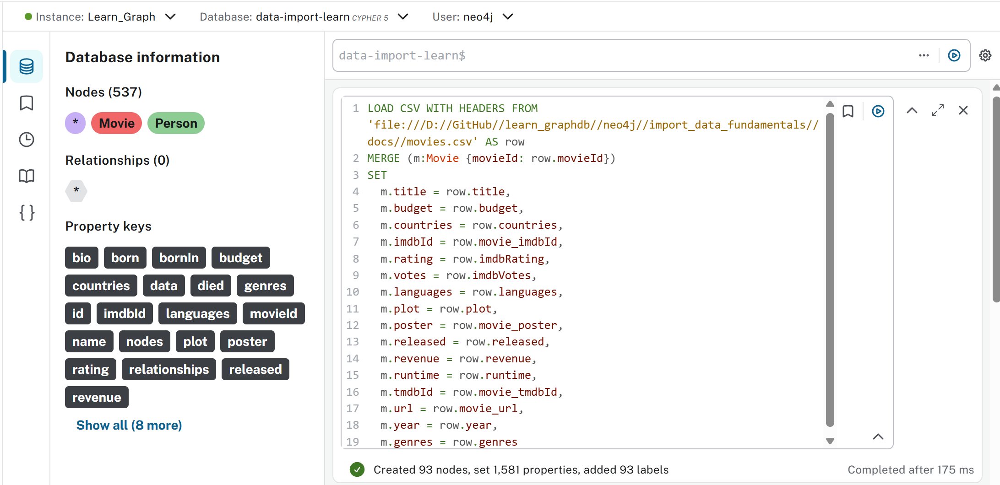

### 2.4 Unique IDs and Constraints

When you set a unique ID, Data Importer will automatically create a `constraint` and `index` for the property.

```
SHOW CONSTRAINT
SHOW INDEX
```

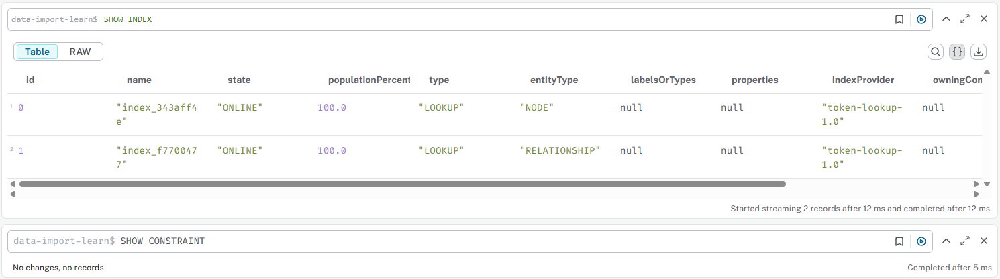

Create Constraint - `movie_imdbId`:

```SQL
CREATE CONSTRAINT movie_imdbId
FOR (m:Movie) REQUIRE (m.imdbId) IS NODE KEY
```

`SHOW CONSTRAINT` as below:


An index is created automatically for the unique ID property. For example, once you have above query to create a new constraint for unique `movie_imdbId`, a new index is created, see below through `SHOW INDEX`:

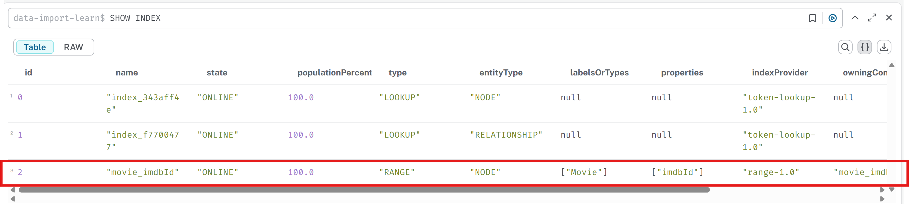

Manually add new index from below Cypher:

```SQL
CREATE RANGE INDEX title_index IF NOT EXISTS
FOR (m:Movie)
ON (m.title)
```

A new `title_index` is added for property `title` in `Movie`, as below through `SHOW INDEX`:

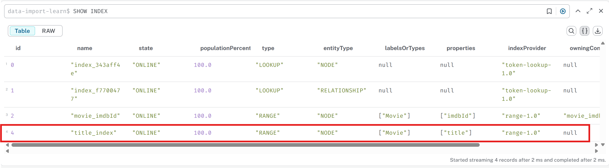

### 2.5 Creating Relationships

The process for creating relationships is similar to creating nodes:

1. Upload the data
2. Creat the relationship in the model
3. Map the fiels
4. Run the import

Create `ACTED_IN` relationship base on the file [acted_in.csv](docs/acted_in.csv) in Cypher:

```SQL
LOAD CSV WITH HEADERS FROM 'file:///D://GitHub//learn_graphdb//neo4j//import_data_fundamentals//docs//acted_in.csv' AS row
MATCH (p:Person),(m:Movie)
WHERE p.tmdbId = row.person_tmdbId AND m.movieId = row.movieId
MERGE (p)-[a:ACTED_IN]->(m)
SET a.role = row.role
RETURN p, a, m
```

Result is as below:

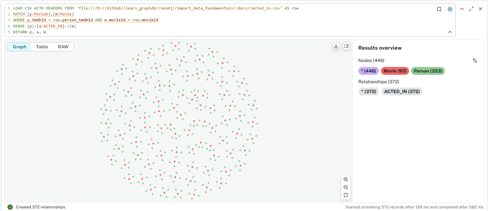

Check the relationship through one sample:

```SQL
MATCH (p:Person)-[r:ACTED_IN]->(m:Movie)
WHERE m.title = 'Toy Story'
RETURN p,r,m
```

You should see below four relationships from `Toy Story`:

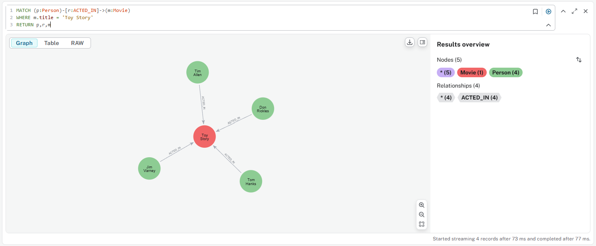

### 2.6 Add Directed Relationship

Create `DIRECTED` relationship base on the file [directed.csv](docs/directed.csv) in Cypher:

```SQL
LOAD CSV WITH HEADERS FROM 'file:///D://GitHub//learn_graphdb//neo4j//import_data_fundamentals//docs//directed.csv' AS row
MATCH (p:Person),(m:Movie)
WHERE p.tmdbId = row.person_tmdbId AND m.movieId = row.movieId
MERGE (p)-[d:DIRECTED]->(m)
RETURN p, d, m
```

Result is as below:

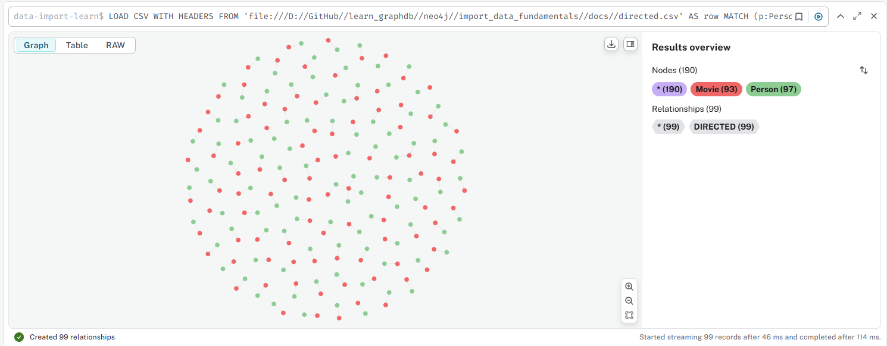

Check the relationship through one sample:

```SQL
MATCH (p:Person)-[d:DIRECTED]->(m:Movie)
RETURN p,d,m
LIMIT 25
```

You should see below relationships:

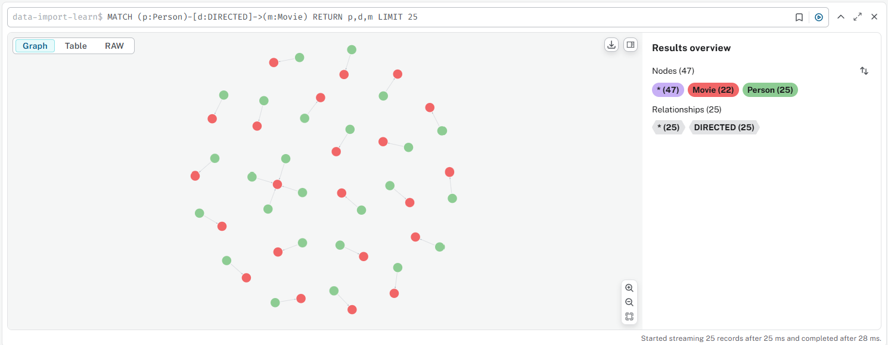

### 2.7 Add Users Ratings

Create `RATED` relationship base on the file [ratings.csv](docs/ratings.csv) in Cypher:

```SQL
LOAD CSV WITH HEADERS FROM 'file:///D://GitHub//learn_graphdb//neo4j//import_data_fundamentals//docs//ratings.csv' AS row
MATCH (m:Movie)
WHERE m.movieId = row.movieId
MERGE (u:User {userID: row.userId, name: row.name})
MERGE (u)-[r:RATED {rating: row.rating}]->(m)
SET r.timestamp = row.timestamp
RETURN u,r,m
```

Result is as below:

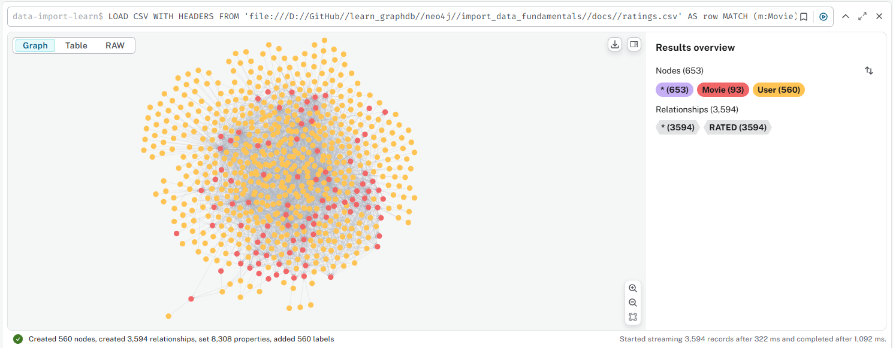

Check result from below query:

```SQL
MATCH (u:User)-[r:RATED]->(m:Movie)
RETURN u,r,m
LIMIT 25
```

You should see below relationships:

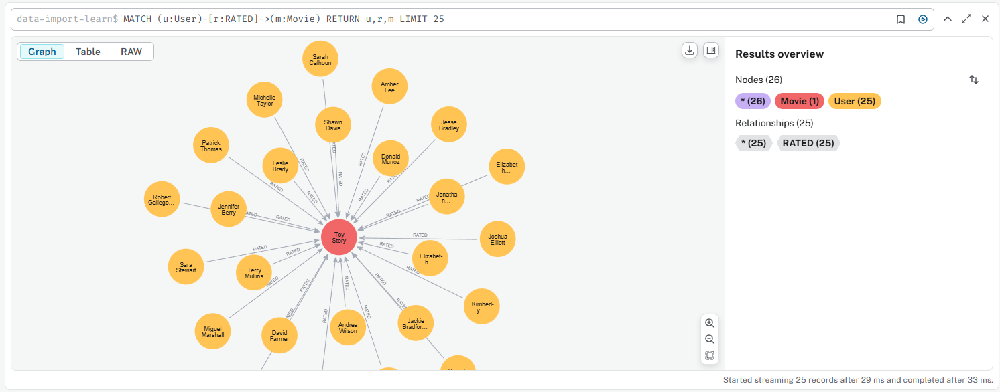

### 2.8 Data Importer Considerations

- Data Formats - you can only import data from a CSV / TSV files.
- Complex Schema Setup - there is no data manipulation or transformation functionality and some advanced schema options are not supported (e.g. multiple node labels, multiple constraints per node)
- Dependency on Clean Data - the data must be clean and well-structured.
- Automation - Data Importer is not suitable for automating data import tasks.
- Real-time integration - there is no real-time integration with external data sources.
- Data Volumes - Very large datasets may require a different approach.

Other resources:
- [Course: Importing CSV data inot Neo4j](https://graphacademy.neo4j.com/courses/importing-cypher/)
- [Info: Other ways of importing data into Neo4j](https://neo4j.com/docs/data-importer/current/import-others/)

## 3. Source Data Considerations

### 3.1 Understanding the Source Data

Before data importing, following factors should be understood first:
- Data format and structure
- Frequency of updates
- Data quality: Accuracy, Validity, Completeness, Reliability, Consistency
- Uniquely identifying data
- 
### 3.2 Developing a Data Model

Learn more Neo4j data type in [Neo4j Documentation](https://neo4j.com/docs/cypher-manual/current/values-and-types/)

### 3.3 Import your CSV File

Online "kaggle" datasets library: https://www.kaggle.com/datasets
