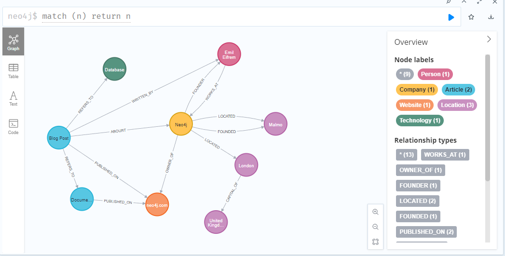

# Neo4j Fundamentals - 01 Graph Thinking

- [Neo4j Fundamentals - 01 Graph Thinking](#neo4j-fundamentals---01-graph-thinking)
  - [Nodes](#nodes)
    - [Create Nodes with Labels](#create-nodes-with-labels)
    - [Correct Property in a Node](#correct-property-in-a-node)
    - [Add additional labels to one node](#add-additional-labels-to-one-node)
  - [Relationships](#relationships)
    - [One-Way Relationships](#one-way-relationships)
    - [Two-Way Relationships](#two-way-relationships)
  - [Properties](#properties)
    - [Add Properties into Node](#add-properties-into-node)
    - [Add Properties into Relationship](#add-properties-into-relationship)
  - [Thinking in Graphse - Types of Databases](#thinking-in-graphse---types-of-databases)

## Nodes

### Create Nodes with Labels

```SQL
create (:Person {name:"Michael"});
merge (:Person {name:"Sarah"});
create (:Company {name:"Neo4j"});
create (:Location {name:"Sweden"})
```

### Correct Property in a Node

If you want to correct/change one label, e.g. you mistake type "Neorj" for Company label, use SET

```SQL
match (c:Company {name:"Neorj"})
set c.name = "Neo4j"
return c
```

### Add additional labels to one node

```SQL
MATCH (n {name:"Michael"})
SET n:Employee
RETURN n
```

## Relationships

### One-Way Relationships

Standard way to create one relationship a time:

```SQL
MATCH (p:Person {name:"Michael"})
MATCH (c:Company {name:"Neo4j"})
MATCH (l:Location {name:"Sweden"})
CREATE (p)-[:WORKS_AT]->(c)
CREATE (c)-[:FOUNDED_IN]->(l)
RETURN p,c,l
```

You may create two relationship in one single line if they have common node:

```SQL
MATCH (p:Person {name:"Michael"})
MATCH (c:Company {name:"Neo4j"})
MATCH (l:Location {name:"Sweden"})
CREATE (p)-[:WORKS_AT]->(c)-[:FOUNDED_IN]->(l)
RETURN p,c,l
```

### Two-Way Relationships

```SQL
MATCH (p1:Person {name:"Michael"}), (p2:Person {name:"Sarah"})
CREATE (p1)-[:LOVES]->(p2)-[:LOVES]->(p1)
RETURN p1,p2
```

```SQL
MATCH (p1:Person {name:"Michael"}), (p2:Person {name:"Sarah"})
CREATE (p1)-[:MARRIED_TO]->(p2)-[:MARRIED_TO]->(p1)
RETURN p1,p2
```

## Properties

### Add Properties into Node

For Node "Michael", write SET in multiple lines:

```SQL
MATCH (p:Person {name:"Michael"})
SET p.firstName = "Michael",
    p.lastName = "Faraday",
    p.born = "1971-09-22"
RETURN p
```

For Node "Sarah", write SET in one line:

```SQL
MATCH (p:Person {name:"Sarah"})
SET p.firstName = "Sarah", p.lastName = "Faraday", p.maidenName = "Barnard"
RETURN p
```

For Node "Neo4j":

```SQL
MATCH (c:Company {name:"Neo4j"})
SET c.website = "neo4j.com"
RETURN c
```

Similarly, for Node "Sweden":

```SQL
MATCH (l:Location {name:"Sweden"})
SET l.capital = "Stockholm", l.region = "Europe"
RETURN l
```

### Add Properties into Relationship

```SQL
MATCH (p:Person {name:"Michael"})-[w:WORKS_AT]-(c:Company {name:"Neo4j"})
SET w.position = "Engineer"
RETURN p, w, c
```

## Thinking in Graphse - Types of Databases

The full query to create the graph in the course:

```SQL
MERGE (a1:Article {name: "Blog Post"})-[:REFERS_TO]->(t:Technology {name: "Database"})
MERGE (a1)-[:WRITTEN_BY]->(p:Person {name: "Emil Eifrem"})
MERGE (a1)-[:ABOURT]->(c:Company {name: "Neo4j"})
MERGE (a1)-[:REFERS_TO]->(a2:Article {name: "Documentation"})
MERGE (a1)-[:PUBLISHED_ON]->(w:Website {name: "neo4j.com"})
MERGE (a2)-[:PUBLISHED_ON]->(w)
MERGE (c)-[:OWNER_OF]->(w)
MERGE (c)-[:FOUNDER]->(p)-[:WORKS_AT]->(c)
MERGE (c)-[:LOCATED]->(l1:Location {name: "London"})
MERGE (l1)-[:CAPITAL_OF]->(l2:Location {name: "United Kingdom"})
MERGE (c)-[:FOUNDED]->(l3:Location {name: "Malmo"})
MERGE (c)-[:LOCATED]->(l3)
```

Using `MATCH (n) RETURN n` to query as below:



How does the graph database (Neo4j) solve the `O(n)` problem as data grows compared to RDBMs？（Refer from [here](https://dba.stackexchange.com/questions/345622/how-does-the-graph-database-neo4j-solve-the-on-problem-as-data-grows-compa))

In traditional RDBMS, joining two or more tables, in the usual best case scenario of an Indexed Nested Loop Join (INLJ), the cost can be approximated to one or more O(log n) index lookups, plus the O(n) time needed to join all of the data records to the main table, e.g.: joining three tables with INLJ has a cost of O(log n * log n * n).

In contrast, joins is where Graph Database really shines. Because, native Graph Databases solve this problem using the concept of index-free adjacency, meaning that nodes directly store references (pointers) to related (neighboring) nodes. This means that queries traverse relationships directly, rather than relying on lookups. So, even for deep traversals and in presence of lookups, performance scales logarithmically instead of linearly, and is very hard to reach O(log n) time complexity.

---
Updated at: 2025-10-05