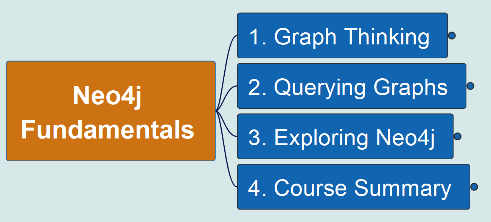

# Learning Neo4j Fundamentals

Based on Neo4j's online course [Neo4j Fundamentals](https://graphacademy.neo4j.com/courses/neo4j-fundamentals/), go through with live demo and show detail practical skills.

Following are the level 1 structure of the course:

The mindmap is created using Open Source tool called FreePlane.

You may find the markdown format export of full mindmap here: [Neo4j_Fundamentals.md](Neo4j_Fundamentals.md).

The most effective learning is act with your hands, so, do not just read and watch, prepare the tool and type all querying code together with me.

You may find that I'll also make mistakes, however, that's the GOLDEN chance to learn more!

This is the first of the series course for gaining the deeper level Neo4j Graph Database certification, enjoy your learning!

Here you may find the key information as well as Cypher queries per chapter:

- [1. Graph Thinking](./1_Graph_Thinking.md)
- [2. Querying Graphs](./2_Querying_Graphs.md)
- [3. Exploring Neo4j](./3_Exploring_Neo4j.md)

The demo videso are posted on following platform for your checking:

- [YouTube Channel - Yasen - Enterprise Architecture](https://www.youtube.com/playlist?list=PL6DEHvciXKeXjMDEhDVnZwljcpsoW2Yfp)
- Packaged videos are published in [here Udemy](https://www.udemy.com/course/graph-database-neo4j-fundamentals/?referralCode=A1B6F8575B9981D1F770)

---

Updated at: September 27th, 2025