# 第一章 图形化思考

- [第一章 图形化思考](#第一章-图形化思考)
  - [1.1 Neo4j是什么？](#11-neo4j是什么)
    - [1.1.1 节点 Nodes](#111-节点-nodes)
    - [1.1.2 标签 Labels](#112-标签-labels)
    - [1.1.3 关系 Relationships](#113-关系-relationships)
    - [1.1.4 属性 Properties](#114-属性-properties)
  - [1.2 用图形来思考](#12-用图形来思考)
  - [1.3 图形无处不在](#13-图形无处不在)

## 1.1 Neo4j是什么？

Neo4j是一种图像数据库，其在一个图形结构中存储数据，数据在存储的时候不是以表格或文档的方式，而是以节点(Nodes)和关系(Relationships)的方式。

在数据分析过程中，当数据之间的联结(关系)与数据本身同样重要时，图像数据库就会变得特别的有用。

在本体论中，我们用三段式来表示一个知识项：主语-谓语-宾语，映射到图像数据库里面，就是：源节点-关系->目的节点，在图像数据库中，每个这样的三段式描述都是有方向性的，如果要表示双向的关系，那就用两个方向相反的三段式来描述。

使用这样的图形结构来存储数据的Neo4j数据库也被成为“具有标签的属性图 (Labeled Property Graph)”。

在Neo4j中，数据使用下面的四种基本结构来进行组织：

- 节点 Nodes：图形中的基本元素
- 关系 Relationships：两个节点之间的联结
- 标签 Labels：节点的类别
- 属性 Properties：节点或者关系的属性

接下来，我们假定你已经先行完成了第三部分的下载和安装Neo4j部分，我们在讲解过程中将直接在一个Neo4j的本地数据库(Local DBMS)中进行实践与演示。

### 1.1.1 节点 Nodes

在图形中，节点用圆形来表示，其代表了数据模型中的对象或实体。

设想一个社交网络，其中的实体（如人，地点，公司等）就可以用节点来表示。

使用下面的Neo4j查询语言-Cypher-来创建三个节点：

```SQL
CREATE (:Person {name: "Michael"})
MERGE (:Company {name: "Neo4j"})
MERGE (:Location {name: "Sweden"})
```

Result as below after using `MATCH (n) RETURN n` for checking:

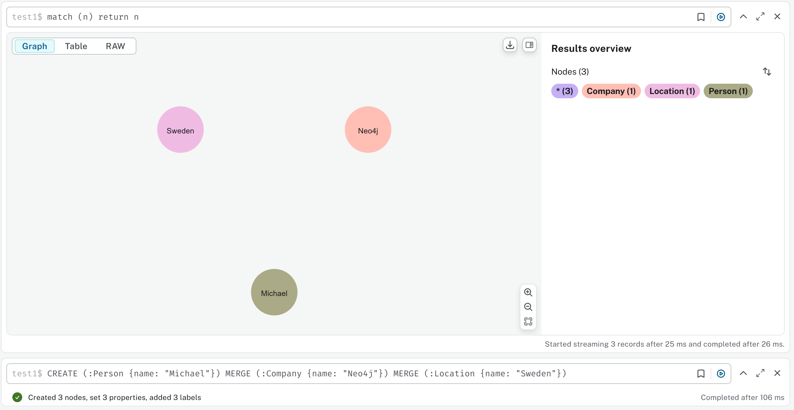

你可以把那句 `MATCH (n) RETURN n` 放到创建语句的最后，试试能否在创建之后直接显示结果。

现在我们再次运行一下上面的语句，加上查询：

```SQL
CREATE (:Person {name: "Michael"})
MERGE (:Company {name: "Neo4j"})
MERGE (:Location {name: "Sweden"})
MATCH (n) RETURN n
```

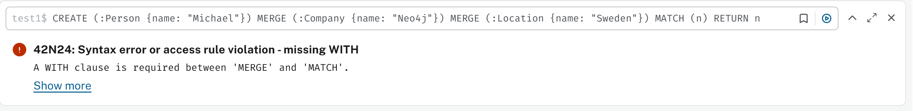

这个`WITH`的提示我们以后学习Cypher基础的时候可以讲到，目前我们还是分别进行，再次运行一下上面的创建语句

```SQL
CREATE (:Person {name: "Michael"})
MERGE (:Company {name: "Neo4j"})
MERGE (:Location {name: "Sweden"})
```

你会看到结果是又创建了一个名字为Michael的`Person`节点，而其他两个节点则没有重复创建：

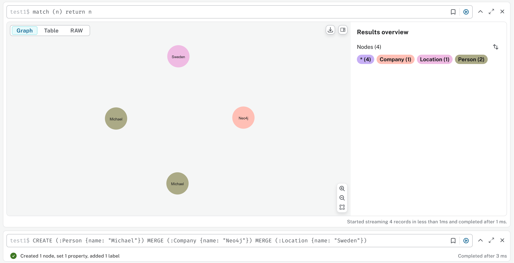

这是`CREATE`有别于`MERGE`的重要的地方，当Neo4j运行`CREATE`时，它不管数据库中已有的数据，直接按照语句的命令进行新的创建；`MERGE`则会进行数据库的对应模式的先行查询，发现已有同样模式的元素（节点或关系）则不再创建另外一个重复元素。从这个不同的特性上看，我们以后进行新元素的创建命令的时候，使用`MERGE`总是会比较“安全”，我们也会尽可能避免`CREATE`（除非你明确是进行数据库初始化的第一次创建，那这两个命令的效果是等同的）。

为了保持我们数据库的清洁，我们现在学习下面这个-比较危险的-命令来清除数据库的所有元素：

```SQL
MATCH (n) DETACH DELETE n
```

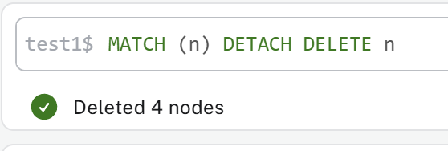

改造我们之前的创建命令，全部使用`MERGE`，如下运行：

```SQL
MERGE (:Person {name: "Michael"})
MERGE (:Company {name: "Neo4j"})
MERGE (:Location {name: "Sweden"})
```

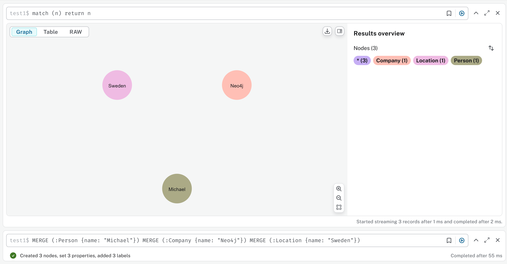

### 1.1.2 标签 Labels

节点通过使用不同的标签来分组或分类。标签描述了这些节点的类别，如 `Person` `Company` `Location`。

清除上面的数据，如下我们来创建中文的节点，如 `人` `公司` `地点`

```SQL
MERGE (:人 {名称: "张三"})
MERGE (:公司 {名称: "Neo4j"})
MERGE (:地点 {名称: "瑞典"})
```

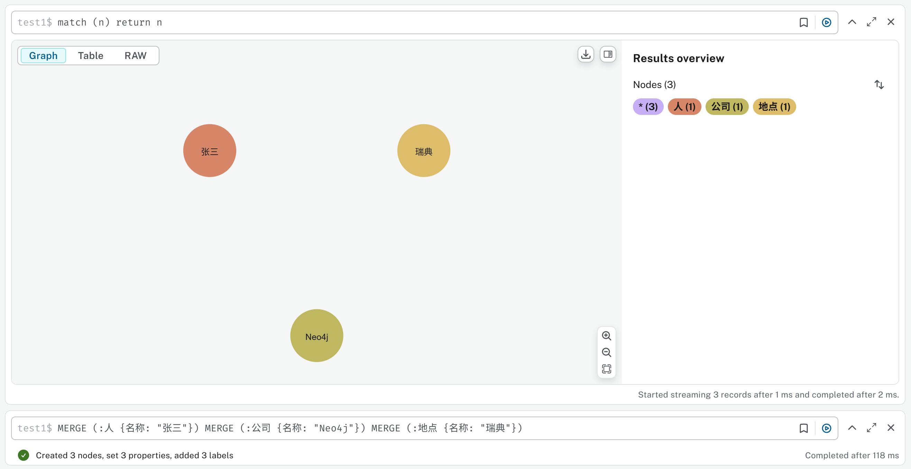

在这个课程中，我们试着全部用中文进行内容的演示。

再创建一个新的人物，使用`人`标签：

```SQL
MERGE (:人 {名称: "小红"})
```

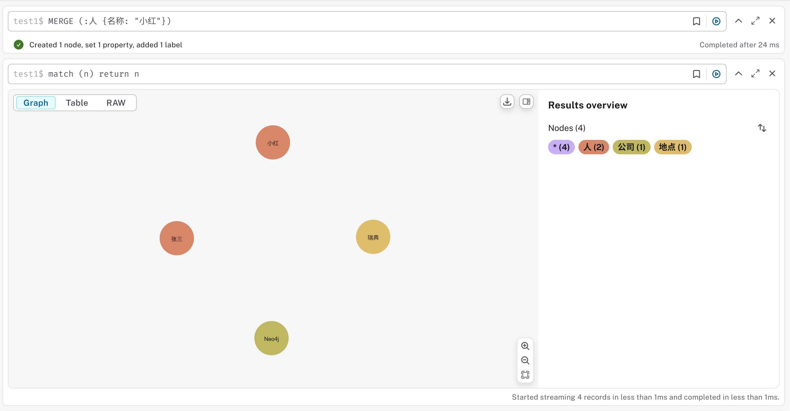

`小红`和`张三`都是类别为`人`的节点，他们具有同样的标签，在可视化展示中也用同样演示的圆形来形象的归组，使用标签可以帮助我们分辨不同类别的节点以及对图形进行过滤(Filter)。

节点（也包括后面讲到的关系）可以具有多个标签，比如下面`张三`还可能是`员工`类别（即标签），添加另外的标签，我们要用的模式匹配查询先定位到`张三`再使用`SET`命令来添加：

```SQL
MATCH (n {名称:"张三"})
SET n:员工
RETURN n
```

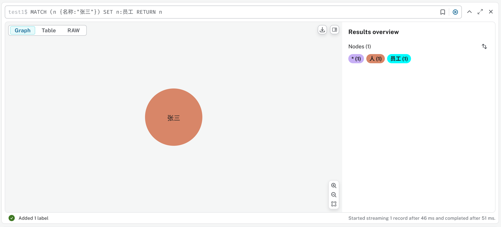

标签一般用名词来表示，请仔细选择标签的名称来避免歧义。

### 1.1.3 关系 Relationships

在一个图中，关系是用节点之间的连线来表示的。关系描述了图中节点是如何联结到其他节点的。

由于描述图形的三段式基本上是以英语口语的语序来设计的，比如中文中我们描述“张三在Neo4j公司工作”，中文中“张三”在前，“Neo4j公司”随后，而“工作”这个联结人物和公司的谓语（动词）-也就是关系-是放在最后的。而英语中的描述是 "Micheal works at Neo4j"，转成Cypher就是直接的原始位置“翻译”：(Michael)-[:WORKS_AT]->(Neo4j)，当然这是Cypher的简化，但是可以看出全部使用中文的话会让关系的命名显得不自然，所以我们还是使用英文进行演示。

创建下面两个关系：
- 张三在Neo4j公司**工作**（WORKS_AT）
- Neo4j公司**创建于**（FOUNDED_IN）瑞典

```SQL
MATCH (n:人 {名称: "张三"})
MATCH (c:公司 {名称: "Neo4j"})
MATCH (l:地点 {名称: "瑞典"})
MERGE (n)-[w:WORKS_AT]->(c)
MERGE (c)-[f:FOUNDED_IN]->(l)
RETURN n, c, l, w, f
```

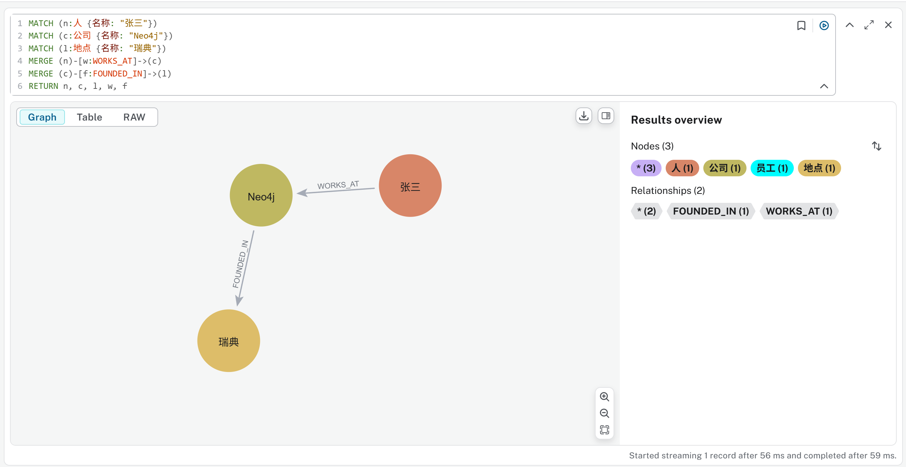

一般情况下，我们用英文的全大写来表示关系。

上面的两行关系创建语句中有共同的`(c)`，我们可以用下面的一行来简化，结果一样：

`MERGE (n)-[:WORKS_AT]->(c)-[:FOUNDED_IN]->(l)`

注意关系创建时的方向箭头，你如果改变方向也是允许的。

对于`张三`和`小红`，他们是恋爱关系，通常因为这种关系是相互的，所以我们用下面的语句创建双向关系：

```SQL
MATCH (n1:人 {名称: "张三"})
MATCH (n2:人 {名称: "小红"})
MERGE (n1)-[l1:LOVES]->(n2)
MERGE (n2)-[l2:LOVES]->(n1)
RETURN n1, n2, l1, l2
```

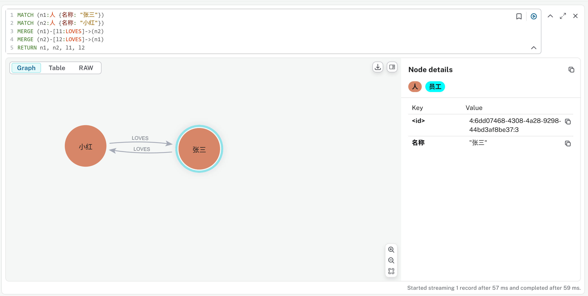

### 1.1.4 属性 Properties

属性用来在节点和关系中以键值对的方式存放数据。

为了关系和语句演示的方便，我们使用`MATCH (n) DETACH DELETE n`清除前面的内容，改为英文的元素信息。

下面的命令同时创建了节点，关系，标签和现在的属性：

```SQL
// Create Nodes
MERGE (p1:Person:Employee {name: "Michael"})
MERGE (p2:Person {name: "Sarah"})
MERGE (c:Company {name: "Neo4j"})
MERGE (l:Location {name: "Sweden"})
// Create Relationships
MERGE (p1)-[w:WORKS_AT]->(c)
MERGE (c)-[f:FOUNDED_IN]->(l)
MERGE (p1)-[m1:MARRIED_TO]->(p2)
MERGE (p2)-[m2:MARRIED_TO]->(p1)
// Create Properties
SET p1.firstName = "Michael",
    p1.lastName = "Faraday",
    p1.born = "1971-09-22",
    p2.firstName = "Sarah",
    p2.lastName = "Faraday",
    p2.maidenName = "Barnard",
    c.website = "https://www.neo4j.com",
    l.capital = "Stockholm",
    w.position = "Engineer" 
```

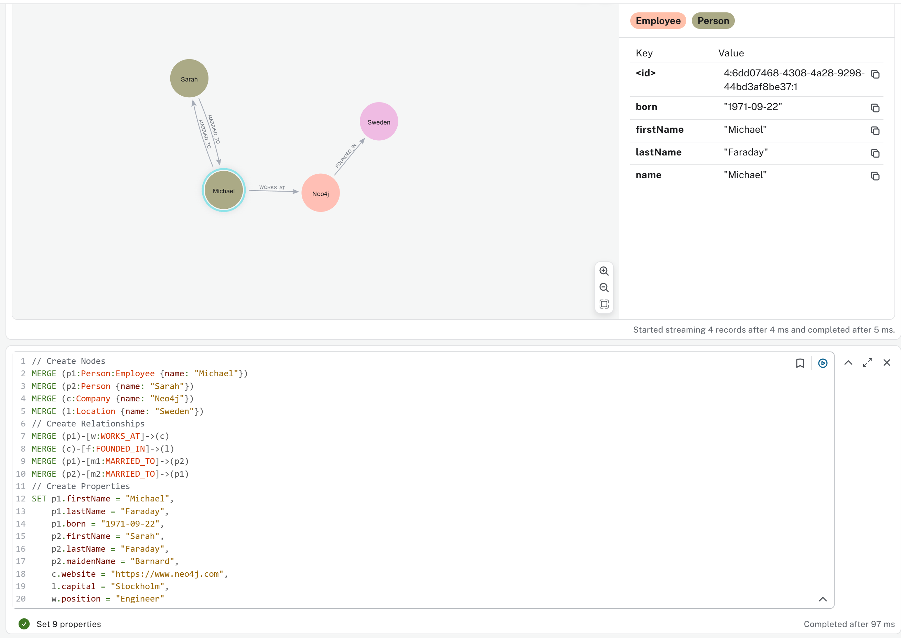

## 1.2 用图形来思考

## 1.3 图形无处不在