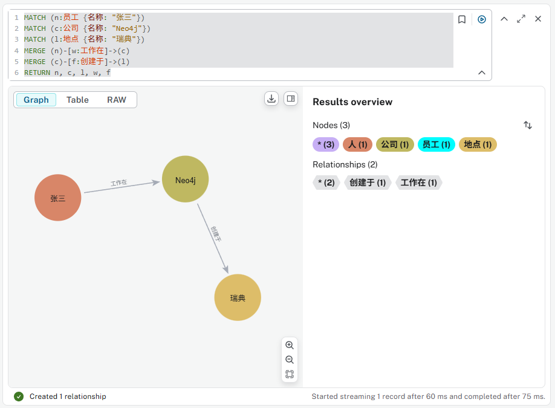
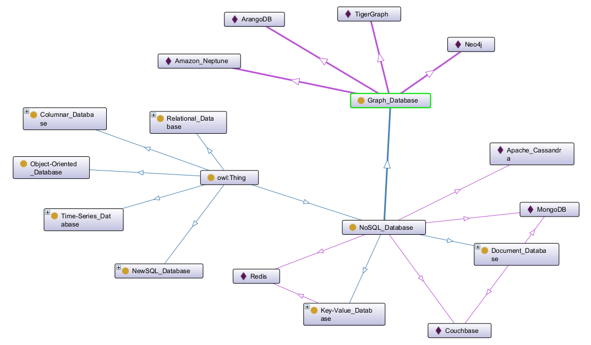
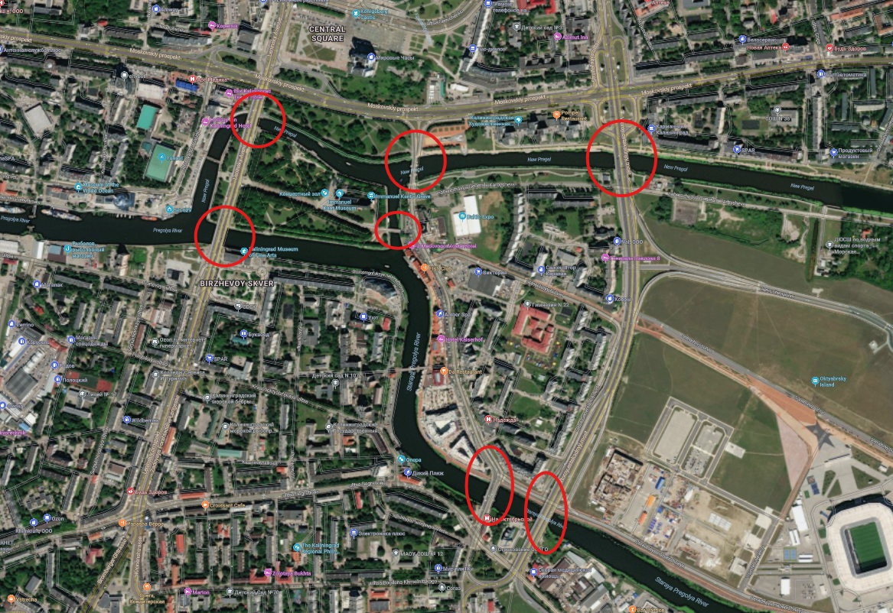

# 第一章 图形化思考

- [第一章 图形化思考](#第一章-图形化思考)
  - [1.1 Neo4j是什么？](#11-neo4j是什么)
    - [1.1.1 节点 Nodes](#111-节点-nodes)
    - [1.1.2 标签 Labels](#112-标签-labels)
    - [1.1.3 关系 Relationships](#113-关系-relationships)
    - [1.1.4 属性 Properties](#114-属性-properties)
  - [1.2 用图形来思考](#12-用图形来思考)
    - [1.2.1 大O问题](#121-大o问题)
    - [1.2.2 NoSQL数据库](#122-nosql数据库)
  - [1.3 图形无处不在](#13-图形无处不在)
    - [1.3.1 从1736年至今](#131-从1736年至今)
    - [1.3.2 发现数据模式](#132-发现数据模式)
    - [1.3.3 知识图谱与生成式人工智能](#133-知识图谱与生成式人工智能)

## 1.1 Neo4j是什么？

Neo4j是一种图像数据库，其在一个图形结构中存储数据，数据在存储的时候不是以表格或文档的方式，而是以节点(Nodes)和关系(Relationships)的方式。

在数据分析过程中，当数据之间的联结(关系)与数据本身同样重要时，图像数据库就会变得特别的有用。

在本体论中，我们用三段式来表示一个知识项：主语-谓语-宾语，映射到图像数据库里面，就是：源节点-关系->目的节点，在图像数据库中，每个这样的三段式描述都是有方向性的，如果要表示双向的关系，那就用两个方向相反的三段式来描述。

使用这样的图形结构来存储数据的Neo4j数据库也被成为“具有标签的属性图 (Labeled Property Graph)”。

在Neo4j中，数据使用下面的四种基本结构来进行组织：

- 节点 Nodes：图形中的基本元素
- 关系 Relationships：两个节点之间的联结
- 标签 Labels：节点的类别
- 属性 Properties：节点或者关系的属性

接下来，我们假定你已经先行完成了第三部分的下载和安装Neo4j部分，我们在讲解过程中将直接在一个Neo4j的本地数据库(Local DBMS)中进行实践与演示。

### 1.1.1 节点 Nodes

在图形中，节点用圆形来表示，其代表了数据模型中的对象或实体。

设想一个社交网络，其中的实体（如人，地点，公司等）就可以用节点来表示。

使用下面的Neo4j查询语言-Cypher-来创建三个节点：

```SQL
CREATE (:Person {name: "Michael"})
MERGE (:Company {name: "Neo4j"})
MERGE (:Location {name: "Sweden"})
```

Result as below after using `MATCH (n) RETURN n` for checking:


你可以把那句 `MATCH (n) RETURN n` 放到创建语句的最后，试试能否在创建之后直接显示结果。

现在我们再次运行一下上面的语句，加上查询：

```SQL
CREATE (:Person {name: "Michael"})
MERGE (:Company {name: "Neo4j"})
MERGE (:Location {name: "Sweden"})
MATCH (n) RETURN n
```


这个`WITH`的提示我们以后学习Cypher基础的时候可以讲到，目前我们还是分别进行，再次运行一下上面的创建语句

```SQL
CREATE (:Person {name: "Michael"})
MERGE (:Company {name: "Neo4j"})
MERGE (:Location {name: "Sweden"})
```

你会看到结果是又创建了一个名字为Michael的`Person`节点，而其他两个节点则没有重复创建：


这是`CREATE`有别于`MERGE`的重要的地方，当Neo4j运行`CREATE`时，它不管数据库中已有的数据，直接按照语句的命令进行新的创建；`MERGE`则会进行数据库的对应模式的先行查询，发现已有同样模式的元素（节点或关系）则不再创建另外一个重复元素。从这个不同的特性上看，我们以后进行新元素的创建命令的时候，使用`MERGE`总是会比较“安全”，我们也会尽可能避免`CREATE`（除非你明确是进行数据库初始化的第一次创建，那这两个命令的效果是等同的）。

为了保持我们数据库的清洁，我们现在学习下面这个-比较危险的-命令来清除数据库的所有元素：

```SQL
MATCH (n) DETACH DELETE n
```


改造我们之前的创建命令，全部使用`MERGE`，如下运行：

```SQL
MERGE (:Person {name: "Michael"})
MERGE (:Company {name: "Neo4j"})
MERGE (:Location {name: "Sweden"})
```


### 1.1.2 标签 Labels

节点通过使用不同的标签来分组或分类。标签描述了这些节点的类别，如 `Person` `Company` `Location`。

清除上面的数据，如下我们来创建中文的节点，如 `人` `公司` `地点`

```SQL
MERGE (:人 {名称: "张三"})
MERGE (:公司 {名称: "Neo4j"})
MERGE (:地点 {名称: "瑞典"})
```


在这个课程中，我们试着全部用中文进行内容的演示。

再创建一个新的人物，使用`人`标签：

```SQL
MERGE (:人 {名称: "小红"})
```


`小红`和`张三`都是类别为`人`的节点，他们具有同样的标签，在可视化展示中也用同样演示的圆形来形象的归组，使用标签可以帮助我们分辨不同类别的节点以及对图形进行过滤(Filter)。

节点（也包括后面讲到的关系）可以具有多个标签，比如下面`张三`还可能是`员工`类别（即标签），添加另外的标签，我们要用的模式匹配查询先定位到`张三`再使用`SET`命令来添加：

```SQL
MATCH (n {名称:"张三"})
SET n:员工
RETURN n
```


标签一般用名词来表示，请仔细选择标签的名称来避免歧义。

### 1.1.3 关系 Relationships

在一个图中，关系是用节点之间的连线来表示的。关系描述了图中节点是如何联结到其他节点的。

由于描述图形的三段式基本上是以英语口语的语序来设计的，比如中文中我们描述“张三在Neo4j公司工作”，中文中“张三”在前，“Neo4j公司”随后，而“工作”这个联结人物和公司的谓语（动词）-也就是关系-是放在最后的。而英语中的描述是 "Micheal works at Neo4j"，转成Cypher就是直接的原始位置“翻译”：(Michael)-[:WORKS_AT]->(Neo4j)，当然这是Cypher的简化，但是可以看出全部使用中文的话会让关系的命名显得不自然，所以我们还是使用英文进行演示。

创建下面两个关系：
- 张三在Neo4j公司**工作**（WORKS_AT）
- Neo4j公司**创建于**（FOUNDED_IN）瑞典

```SQL
MATCH (n:人 {名称: "张三"})
MATCH (c:公司 {名称: "Neo4j"})
MATCH (l:地点 {名称: "瑞典"})
MERGE (n)-[w:WORKS_AT]->(c)
MERGE (c)-[f:FOUNDED_IN]->(l)
RETURN n, c, l, w, f
```


一般情况下，我们用英文的全大写来表示关系。

上面的两行关系创建语句中有共同的`(c)`，我们可以用下面的一行来简化，结果一样：

`MERGE (n)-[:WORKS_AT]->(c)-[:FOUNDED_IN]->(l)`

注意关系创建时的方向箭头，你如果改变方向也是允许的。

下面的示例是将关系也用中文表示，这里注意中文的说法要尽可能与自然语言匹配：

```SQL
MATCH (n:员工 {名称: "张三"})
MATCH (c:公司 {名称: "Neo4j"})
MATCH (l:地点 {名称: "瑞典"})
MERGE (n)-[w:工作在]->(c)
MERGE (c)-[f:创建于]->(l)
RETURN n, c, l, w, f
```



对于`张三`和`小红`，他们是恋爱关系，通常因为这种关系是相互的，所以我们用下面的语句创建双向关系：

```SQL
MATCH (n1:人 {名称: "张三"})
MATCH (n2:人 {名称: "小红"})
MERGE (n1)-[l1:LOVES]->(n2)
MERGE (n2)-[l2:LOVES]->(n1)
RETURN n1, n2, l1, l2
```


### 1.1.4 属性 Properties

属性用来在节点和关系中以键值对的方式存放数据。

为了关系和语句演示的方便，我们使用`MATCH (n) DETACH DELETE n`清除前面的内容，改为英文的元素信息。

下面的命令同时创建了节点，关系，标签和现在的属性：

```SQL
// Create Nodes
MERGE (p1:Person:Employee {name: "Michael"})
MERGE (p2:Person {name: "Sarah"})
MERGE (c:Company {name: "Neo4j"})
MERGE (l:Location {name: "Sweden"})
// Create Relationships
MERGE (p1)-[w:WORKS_AT]->(c)
MERGE (c)-[f:FOUNDED_IN]->(l)
MERGE (p1)-[m1:MARRIED_TO]->(p2)
MERGE (p2)-[m2:MARRIED_TO]->(p1)
// Create Properties
SET p1.firstName = "Michael",
    p1.lastName = "Faraday",
    p1.born = "1971-09-22",
    p2.firstName = "Sarah",
    p2.lastName = "Faraday",
    p2.maidenName = "Barnard",
    c.website = "https://www.neo4j.com",
    l.capital = "Stockholm",
    w.position = "Engineer" 
```


## 1.2 用图形来思考

在一个图形中，“关系”被视为和其联结的“节点”同样重要的数据结构。

### 1.2.1 大O问题

使用传统的关系型数据库，当需要更多的了解关系而不是行数据时，下面这些是常见的避免不了的问题：

- 当对具有复杂外键结果和多对多关系的数据结构进行遍历查询时的性能的下降
- 处理层次型结构或树状结构，而答案可能存在于不定的深度上的时候的困难
- 在针对一个持续更新的数据集上寻找一个目标路径的复杂需求的处理难度
- 等等

在性能方面，大O问题（O(n) Problem）可以给我们形象的比较。In Big O notation, "O" represents the order of the function, and "f(n)" represents the function describing the algorithm's time complexity in terms of the input size "n". The notation "O(f(n))" signifies that the algorithm's time complexity grows no faster than a specific function fo "n".

在Big O中，有六种主要类型来表示时间和空间上面的复杂度：

- Constant: O(1)
- Linear time: O(n)
- Logarithmic time: O(n log n)
- Quadratic time: O(n^2)
- Exponential time: O(2^n)
- Factorial time: O(n!)

下图表面了这六种不同的 Big O 复杂度：


比较来看：

- O(1) - Excellent/Best
- O(log n) - Good
- O(n) - Fair
- O(n log n) - Bad
- O(n^2), O(2^n) and O(N!) - Horrible/Worst

下面是细化的比较整理（参考[这里](https://www.simplilearn.com/big-o-notation-in-data-structure-article))：

| Big O | Description | Example | Comparison |
| --- | --- | --- | --- |
| O(1) - Constant Time Complexity | Algorithms with constant time complexity execute in a constant amount of time regardless of the input size | Accessing an element in an array by index. | Regardless of the input size, the time is the same. |
| O(log n) - Logarithmic Time Complexity | Algorithms with logarithmic time complexity have their runtime grow logarithmically with the input size. | Binary search in a sorted array. | As the input size increases, the runtime grows slowly, making it more efficient than linear time complexities. |
| O(n) - Linear Time Complexity | Algorithms with linear time complexity have their runtime grow linearly with the input size. | Linear search through an unsorted array. | The runtime increases proportionally to the input size. |
| O(n log n) - Linearithmic Time Complexity | Algorithms with linearithmic time complexity have their runtime grow in proportion to the input size multiplied by the logarithm of the input size | Efficient sorting algorithms like mergesort and heapsort. | More efficient than quadratic time complexities but less efficient than linear or logarithmic ones. |
| O(N^2) - Quadratic Time Complexity | Algorithm with quadratic time complexity have their runtime grow quadratically with the input size. | Nested loops iterating over the input. | As the input size increases, the runtime grows quadratically, making it less efficient for large inputs. |
| O(2^n) - Exponential Time Complexity | Algorithms with exponential time complexity have their runtime grow exponentially with the input size. | Brute-force algorithms that try all possible combinations. | Extremely inefficient for large inputs, as the runtime increases rapidly with even small increases in input size. |
| O(n!) - Factorial Time Complexity | Algorithms with factorial time complexity have their runtime grow factorially with the input size. | Algorithms generating all permutations of a set. | Highly inefficient, with the runtime growing extremely fast with the input size |

图像数据库（例如Neo4j）是如何解决O(n)这样的问题的呢？

在关系型数据库中，`JOIN`两个或更多个数据表时，时间复杂度大致是一个或多个索引查询`O(log n)`组合上用来`JOIN`这些数据记录到一张主表耗费的`O(n)`，比如，使用索引嵌套循环的方式`JOIN`三张表的数据复杂度就是`O(log n * log n * n)`。

与之对应，由于图像数据库原生就使用“index-free adjacenty”的概念，这样的问题根本就不再是问题了。这种特性意味着每个节点直接保存了指向（参考指针）相关（邻居）节点的关系，所以遍历关系的查询可以直接完成，而不需要依赖与查找。所以，即使对应深度遍历这样的关系型数据库很难处理的情境，图像数据库的完成时间复杂度也可以从线性缩减为对数级，即`O(log n)`。

### 1.2.2 NoSQL数据库

下图给出了各种数据库类型的关系：



## 1.3 图形无处不在

### 1.3.1 从1736年至今

[柯尼斯堡七桥问题 Seven Bridges of Königsberg](https://zh.wikipedia.org/wiki/%E6%9F%AF%E5%B0%BC%E6%96%AF%E5%A0%A1%E4%B8%83%E6%A1%A5%E9%97%AE%E9%A2%98)

这个问题是基于一个现实生活中的事例：当时东普鲁士柯尼斯堡（今俄罗斯加里宁格勒）市区跨普列戈利亚河两岸，河中心有两个小岛。小岛与河的两岸有七条桥连接。在所有桥都只能走一遍的前提下，如何才能把这个地方所有的桥都走遍？


莱昂哈德·欧拉在1735年提出，并没有方法能圆满解决这个问题，他更在第二年发表在论文《柯尼斯堡的七桥》中，证明符合条件的走法并不存在，也顺带提出和解决了一笔画问题。这篇论文在圣彼得堡科学院发表，成为图论史上第一篇重要文献。欧拉把实际的抽象问题简化为平面上的点与线组合，每一座桥视为一条线，桥所连接的地区视为点。这样若从某点出发后最后再回到这点，则这一点的线数必须是偶数，这样的点称为偶顶点。相对的，连有奇数条线的点称为奇顶点。欧拉论述了，由于柯尼斯堡七桥问题中存在4个奇顶点，它无法实现符合题意的遍历。

今天，这个地点位于俄罗斯的加里宁格勒（Kaliningrad, Kaliningrad, Russia），下面是我标记的可以用来复现这个七桥问题的七座桥：



### 1.3.2 发现数据模式

图表可以帮助您发现数据模式，包括：

客户：利用客户数据进行推荐、客户流失预防、定制优惠和定向广告，从而提高客户留存率并促进收入增长。

网络与安全：分析 IT 资产数据，支持全面的安全监控和主动威胁响应。

员工：存储员工数据，支持人才发展、职业管理和资源配置，帮助员工能力与业务需求保持一致。

交易：捕获交易数据以检测非法活动，通过揭示隐藏的模式、异常和关联，支持反洗钱、欺诈检测、信用风险评估和信用欺诈检测。

产品：集中产品数据，支持个性化推荐、优化新产品发布、增强定制化、管理库存并优化定价策略。

供应商：存储供应商绩效、库存、成本、物流和合规性数据，以优化供应链管理，支持路线规划、实时可视性、库存规划和风险分析等程序。

流程：通过分析运营、资源、质量和成本数据，创建与流程相关的数据图表可以识别瓶颈、提高效率、自动执行任务并监控性能。

### 1.3.3 知识图谱与生成式人工智能

图谱已成为开发生成式人工智能 (GenAI) 应用程序的重要组成部分。GenAI 应用程序需要访问数据中的含义，而知识图谱可以提供这种上下文。

知识图谱提供了一种结构化的方式来表示实体、其属性及其关系，从而能够全面且相互关联地理解信息。

知识图谱可以分解信息源并将其整合，让您能够洞察数据之间的关系。

您可能不熟悉“知识图谱”这个术语，但您可能使用过它。搜索引擎通常使用知识图谱来提供有关人物、地点和事物的信息。