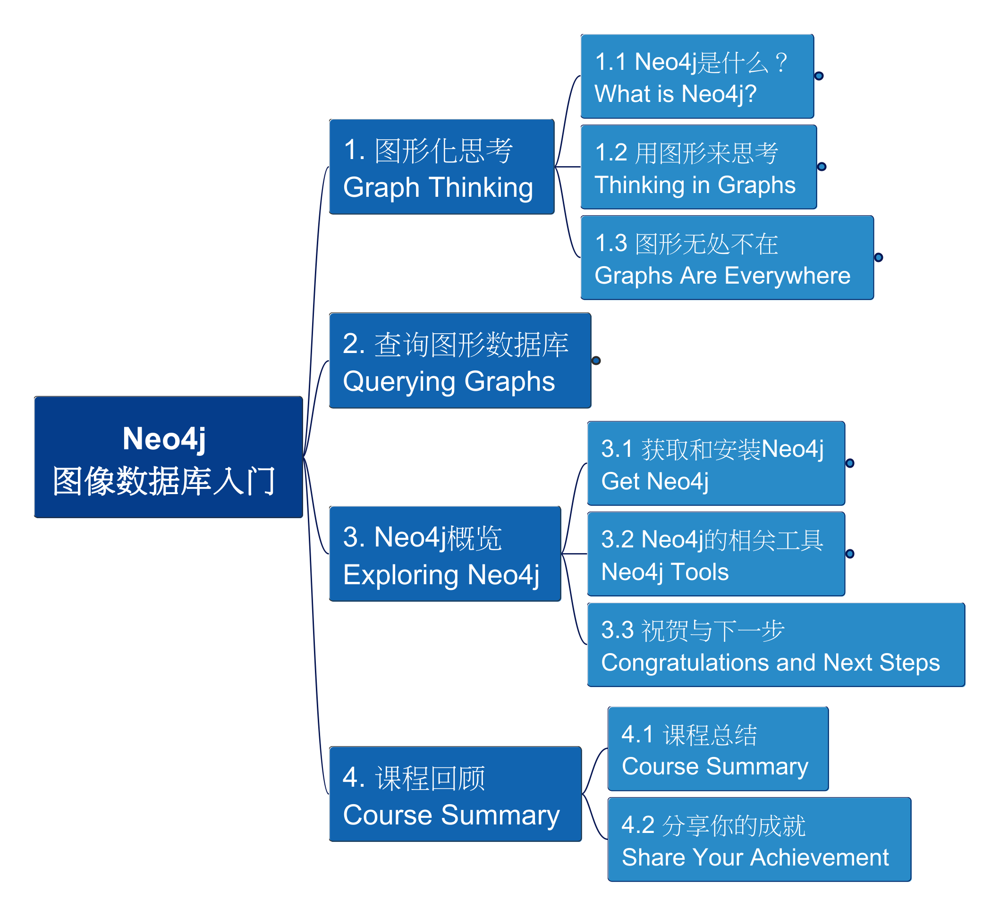

# Neo4j 图像数据库入门基础

基于Neo4j的在线课程：[Neo4j Fundamentals](https://graphacademy.neo4j.com/courses/neo4j-fundamentals/), 以中文语言逐点给出讲解与演示，助你快速掌握Neo4j的基础知识与图像数据库的构建技能。

下面是用FreePlane制作的课程脉络:

The most effective learning is act with your hands, so, do not just read and watch, prepare the tool and type all querying code together with me.

You may find that I'll also make mistakes, however, that's the GOLDEN chance to learn more!

这是Neo4j和图像数据库的系列课程的第一个课题，欢迎学习！

Here you may find the key information as well as Cypher queries per chapter:

- [1. Graph Thinking](./1_Graph_Thinking.md)
- [2. Querying Graphs](./2_Querying_Graphs.md)
- [3. Exploring Neo4j](./3_Exploring_Neo4j.md)

---

Updated at: Oct 3rd, 2025