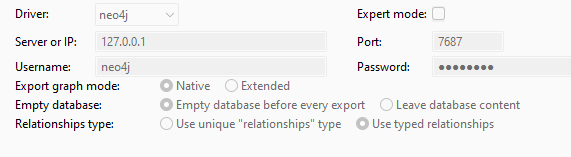
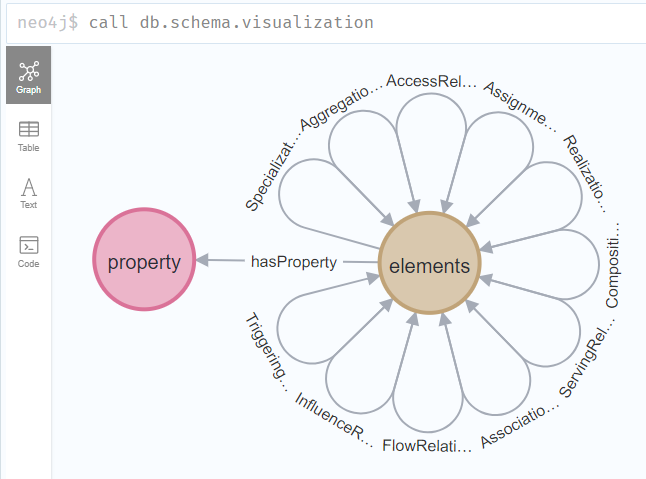

# Bloom saved queries for Archi Model

## Neo4j DB Export Setting in Archi tool



Name: Show visualization schema

```sql
call db.schema.visualization
```

View of the schema - "Flower Schema":



Name: Customer Journey Mapping with Application

```sql
match
(a:elements {class:'ApplicationComponent'})-[r:RealizationRelationships]->(c:elements {class:'Capability'})-[s:ServingRelationships]->(j:elements {class:'ValueStream'})-[hasProperty]->(p:property {name:'BizArch Domain'})
return a,r,c,s,j
```